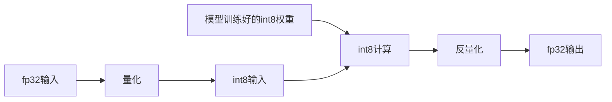
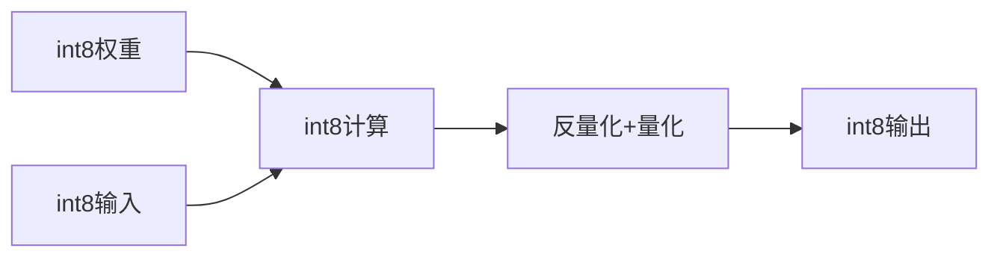
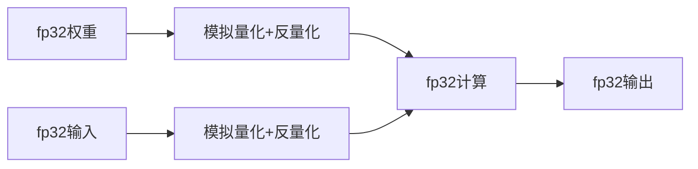

    <h1>阅读笔记</h1>

### 基础知识

#### 概念:

**量化**：把Float类型(FP32,FP16)的模型参数和激活值，用整数(Int8,Int4)来代替，同时尽可能减少量化后模型推理的误差
$$
x1_f \to quant \to x1_q
$$

**反量化**:把量化后的结果转化为浮点结果
$$
x1_q\to dequant \to x2_f
$$

**量化映射**:通用公式为:$r = S(q-Z)$,其中r表示量化前数据的真实值，q表示量化后的数值，Z表示零点

**对称量化**:

在量化前后保持零点一致:
$$
S = \frac{|r_{max}|}{|q_{max}|}\\
q = Round(\frac{r}{S})
$$
其中，Round表示取整。

对称量化是非饱和量化，即量化后的数据是非饱和的，有一部分区域不存在量化的数据，但是计算量小

**非对称量化**：

非对称量化需要一个偏移量Z来完成零点的映射，即量化前后零点不一致。
$$
S = \frac{r_{max} - r_{min}}{q_{max} - q_{min}}\\
Z = q_{max} - Round(\frac{r_{max}}{S})\\
q = Round(\frac{r}{S}+Z)
$$
非对称量化引入了偏移量，增大了计算，但是量化后的数据饱和，量化前的最小/大值对应量化后的最小/大值

**神经网络量化**：

首先解释一下为什么量化对神经网络精度影响不大：

1. 权重以及输入都会经过Normalization，基本数值范围都不大
2. 激活函数，数值影响会被平滑
3. 在大模型中，绝大多数的网络都是进行分类，最后都是概率值，只要最后某种类别的概率高于其他类别就可以，无需绝对数值

对于神经网路的量化，是针对每一层而言的，每一层进行量化计算，每一层输出时进行反量化

**训练后动态量化**：

其大致流程如下：

首先将训练好的模型权重量化为int8，并保存量化参数，然后在模型推理时，对每一层输入的fp32激活值，动态进行量化为int8；在每一层对量化后的int8权重和int8激活值进行计算。最后在输出时将结果反量化为fp32，将fp32的激活值传入到下一层。

训练后动态量化的问题:

1. 每一次推理每一层都要对输入统计量化参数，耗时
2. 每一层计算完都要转化为fp32,存入显存，占用显存带宽

**训练后静态量化**：

静态量化是动态量化的两个问题的优化。

<b>Q:</b> 每一次推理每一层都要对输入统计量化参数，耗时

对于这个问题可以采用有代表性的输入数据跑一遍整个网络，通过统计得到每层大概的量化参数

<b>Q:</b> 每一层计算完都转化为fp32，存入显存，占用显存带宽

对于这个问题，这一层的输出是下一层的输入，下一层还要量化，不如在这一层直接量化好再传给下一层

流程如下:

首先将训练好的模型权重量化为int8，并保存量化参数。接下来进行**校准**，用一些有代表性的数据进行模型推理，用这些数据在神经网络每一层产生的激活值估算出激活值的量化参数。这样就不用推理时每次根据实际激活值计算量化参数。在每一层对量化后的int8权重和int8激活值进行计算。**在每一层输出时将结果反量化为fp32，同时根据校准产生的激活值量化参数，把激活值量化为int8，把量化参数放入量化后的激活值中。**最后，将int8的激活值和它的量化参数传入到下一层

**量化感知训练**

<b>Q:</b> 精度损失问题是否可以通过神经网络来解决？

神经网络最擅长的便是减少误差，可以通过量化感知训练的方式在训练过程中就能调整参数，让它更适合量化，提高量化后模型的精度

量化感知训练的流程如下：

首先加载fp32的模型参数，输入fp32的激活值。通过**在网络里插入模拟量化节点(fake\_quantization)来分别对模型参数和激活值进行量化和反量化**。从而引入量化误差。模型在fp32精度下进行计算，计算后的激活值传入下一层

