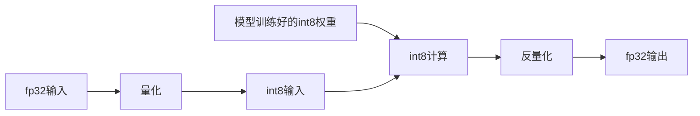
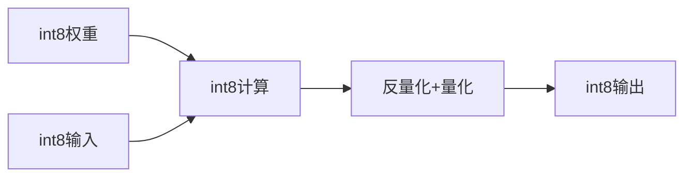
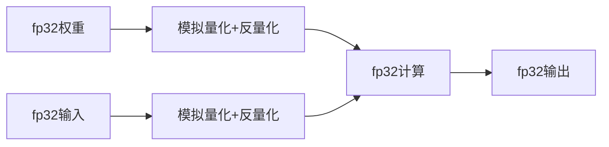

    <h1>阅读笔记</h1>

### 基础知识

#### 概念:

**量化**：把Float类型(FP32,FP16)的模型参数和激活值，用整数(Int8,Int4)来代替，同时尽可能减少量化后模型推理的误差
$$
x1_f \to quant \to x1_q
$$

**反量化**:把量化后的结果转化为浮点结果
$$
x1_q\to dequant \to x2_f
$$

**量化映射**:通用公式为:$r = S(q-Z)$,其中r表示量化前数据的真实值，q表示量化后的数值，Z表示零点

**对称量化**:

在量化前后保持零点一致:
$$
S = \frac{|r_{max}|}{|q_{max}|}\\
q = Round(\frac{r}{S})
$$
其中，Round表示取整。

对称量化是非饱和量化，即量化后的数据是非饱和的，有一部分区域不存在量化的数据，但是计算量小

**非对称量化**：

非对称量化需要一个偏移量Z来完成零点的映射，即量化前后零点不一致。
$$
S = \frac{r_{max} - r_{min}}{q_{max} - q_{min}}\\
Z = q_{max} - Round(\frac{r_{max}}{S})\\
q = Round(\frac{r}{S}+Z)
$$
非对称量化引入了偏移量，增大了计算，但是量化后的数据饱和，量化前的最小/大值对应量化后的最小/大值

**神经网络量化**：

首先解释一下为什么量化对神经网络精度影响不大：

1. 权重以及输入都会经过Normalization，基本数值范围都不大
2. 激活函数，数值影响会被平滑
3. 在大模型中，绝大多数的网络都是进行分类，最后都是概率值，只要最后某种类别的概率高于其他类别就可以，无需绝对数值

对于神经网路的量化，是针对每一层而言的，每一层进行量化计算，每一层输出时进行反量化

**训练后动态量化(PTQ)**：

其大致流程如下：

首先将训练好的模型权重量化为int8，并保存量化参数，然后在模型推理时，对每一层输入的fp32激活值，动态进行量化为int8；在每一层对量化后的int8权重和int8激活值进行计算。最后在输出时将结果反量化为fp32，将fp32的激活值传入到下一层。

训练后动态量化的问题:

1. 每一次推理每一层都要对输入统计量化参数，耗时
2. 每一层计算完都要转化为fp32,存入显存，占用显存带宽

**训练后静态量化(PTQ)**：

静态量化是动态量化的两个问题的优化。

<b>Q:</b> 每一次推理每一层都要对输入统计量化参数，耗时

对于这个问题可以采用有代表性的输入数据跑一遍整个网络，通过统计得到每层大概的量化参数

<b>Q:</b> 每一层计算完都转化为fp32，存入显存，占用显存带宽

对于这个问题，这一层的输出是下一层的输入，下一层还要量化，不如在这一层直接量化好再传给下一层

流程如下:

首先将训练好的模型权重量化为int8，并保存量化参数。接下来进行**校准**，用一些有代表性的数据进行模型推理，用这些数据在神经网络每一层产生的激活值估算出激活值的量化参数。这样就不用推理时每次根据实际激活值计算量化参数。在每一层对量化后的int8权重和int8激活值进行计算。**在每一层输出时将结果反量化为fp32，同时根据校准产生的激活值量化参数，把激活值量化为int8，把量化参数放入量化后的激活值中。**最后，将int8的激活值和它的量化参数传入到下一层

**量化感知训练（QAT）**

<b>Q:</b> 精度损失问题是否可以通过神经网络来解决？

神经网络最擅长的便是减少误差，可以通过量化感知训练的方式在训练过程中就能调整参数，让它更适合量化，提高量化后模型的精度

量化感知训练的流程如下：

首先加载fp32的模型参数，输入fp32的激活值。通过**在网络里插入模拟量化节点(fake\_quantization)来分别对模型参数和激活值进行量化和反量化**。从而引入量化误差。模型在fp32精度下进行计算，计算后的激活值传入下一层

### 论文阅读

**AdaQuant：Accurate Post Training Quantization With Small Calibration Sets**

**总结**：本篇文章的主要贡献在于提出了一个基于小数据集（校验集）的训练后量化方法AdaQuant，AdaQuant通过提出一个block/layer-wise的损失函数，通过在校验集上的训练学习量化参数(重点包括了一个最优的权重扰动，类似于AdaRound来避免四舍五入的不足),实现了减少量化的精度损失；提出了基于PI(整数规划)的bit精度分配方案，但是并没有解释精确损失的累加合理性；提出量化对BN融合造成的统计量偏移问题，并提出了PN(Para-Normalization)来解决这个问题。并在Bert-base网络上实现了不到1%的损失(4-8bit)

<b>吐槽:</b> 这篇文章作者(符号和表达)有点混乱，得多读几遍才能理解作者想表达什么.中间bit分配假设成立存疑

在一般的Post-training 量化中，我们的优化目标可以用下式表示:
$$
\hat\Delta = \arg \min_{\Delta}||X - Q_{\Delta}(X)||^2\\
Q_{\Delta}(x) = \Delta[\frac{X}{\Delta}]
$$
其中，$Q(\cdot)$是量化方程。这种方法对所有的量化损失都是平等处罚的，但是事实上我们更应该对影响分类的量化损失进行更多的惩罚。量化感知训练可以缓解这个问题但是它存在计算开销大的问题。

基于此，作者提出了AdaQuant，其核心思想是采用一个block/layer-wise的优化误差函数:
$$
(\hat\Delta_{w}\hat\Delta_x,\hat V) = \arg\min_{\Delta_w,\Delta_x,V}||WX-Q_{\Delta_w}(W')Q_{\Delta_x}(X)||^2
$$
其中，$W' = W + V$,这里V是引入的一个连续的可学习的“补偿”张量。被量化的对象是进行补偿后的权重W':$W_q = Q_{\Delta_w}(W') = Q_{\hat\Delta_w}(W+V)$.

这里其实有点类似于AdaRound的思想了，因为AdaRound主张的是在量化时直接采用四舍五入是一个不明智地选择，因此这里采用一个补偿张量V来做这个选择

由于量化参数的得到依赖的是上一层全精度的激活值输出作为输入，因此各个网络之间互不干扰，所以可以并行处理。

但是在实际的推理过程中，网络的输入是上一层量化后的激活值（见训练后静态量化），因此，作者提出了串行版本的AdaQuant，此时它的优化误差函数为
$$
(\hat\Delta_{w_l},\hat\Delta_{x_l},\hat V_l) = \arg\min_{\Delta_{w_l},\Delta_{x_l},V_l}||W_lX_l - Q_{\Delta_{w_l}}(W_l')\cdot Q_{\Delta_{x_l}}(X_l^q)||^2\\
X^q_l = \sigma(Q_{\Delta_{w_{l-1}}}(W'_{l-1})\cdot Q_{\Delta_{x_l}}(X_{l-1}^q) )
$$
其中，$\sigma(\cdot)$是激活函数

需要注意的是，串行版本的AdaQuant得在比特分配之后进行，这是因为它的优化依赖于上一层的输入。

为了在性能和精度之间做权衡，在量化时我们往往会给不同层的网络分配不同的bit精度。AdaQuant在此思想上，提出了采用整数规划(PI)的方式。

作者将网路的bit分配描述为这样一个问题：

给定L层的神经网络。对于每一层l，我们都有需要与前一层$X_{l-1}$的激活值相乘的权重$W_l$。令$W_l^k$和$X_{l-1}^n$表示$W_l,X_{l-1}$精度为k和n位的量化版本。对于每一层i，低位宽乘法$W_l^k X_{l-1}^k$会带来$\Delta L_l^{k,n}$的准确损失和$\Delta P_{l}^{k,n}$的性能提升。

作者假设了准确损失以及性能提升是满足可加性的。

这里存疑，因为l-1层的准确损失势必会影响l层的准确损失，不能简单做加法来描述整个网络的准确性退化

那么问题可以描述为，在不超过总网络退化$\Delta L$的前提下，最大化总性能提升。我们设示性函数$I_l^{k,n}$来表示第l层是否采用k，n位量化版本（1表示使用）。问题可以被符号表示为:
$$
\max \sum_{l = 0}^{L-1}\Delta P_l\\
Subject\ to\ \sum_{l}\Delta L_{l}\leq \Delta L\\
\forall l\in \{1,\dots,L\}:\Delta P_l = \sum_{k,n}I_l^{k,n}\cdot \Delta P_{l}^{k,n},\Delta L_l = \sum_{k,n}I_{l}^{k,n}\cdot L_{l}^{k,n}\\
\forall l\in \{1,\dots,L\}:\sum_{k,n}I_l^{k,n}=1,I_l^{k,n}\in\{0,1\}
$$

BatchNormalization在部署时，通常会与前面的卷积/全连接层进行融合，这样可以减少推理时的计算量。(这是因为BN的线性变换乘$\gamma/\sqrt{\sigma^2+\epsilon}$，加$\beta-\gamma\mu/\sqrt{\sigma^2+\epsilon}$可以直接合并到权重和偏置中)

然而当网络量化后，会导致激活值的分布发生偏移，即统计量均值$\mu$和方差$\sigma^2$会偏离在全精度模型中应有的值。但是由于BN层已经被融合到了前面的层中，这个偏移无法被校准。基于此，作者采用了一个名为Para-Normalization(PN)的方法来更新BN的统计量，以补偿这种偏差。

具体而言，假设我们知道了原始的BN参数$\gamma_0,\beta_0$.然后我们初始化一个新的BN层，初始化$\mu,\sigma^2$以及BN参数$\gamma_r,\beta_r$以便重建BN，使其满足:
$$
BN_r(x) = \gamma_r \frac{x - \mu}{\sqrt{\sigma^2 + \epsilon}} + \beta_r \approx x\\
\mu = \beta_r = \beta_0;\sigma^2 = \gamma_0^2;\gamma_r = \sqrt{\gamma_0^2+\epsilon}
$$
然后在校准集上收集运行时均值和方差更新$\mu,\sigma^2$,需要注意的是$\beta_r,\gamma_r$是不变的，因为不进行反向传播。

收集到新的均值和方差后，我们重新将BN进行融合，收集到的统计数据可以按以下方式融合回当前的量化尺度：
$$
W_i' = W_i\frac{\gamma_r}{\sigma};b_i' = \frac{\gamma_r}{\sigma}(b_i - \mu) + \beta_r;\Delta_{w_i}' = \frac{\gamma_r}{\sigma}\Delta_{w_i}
$$
