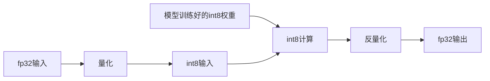
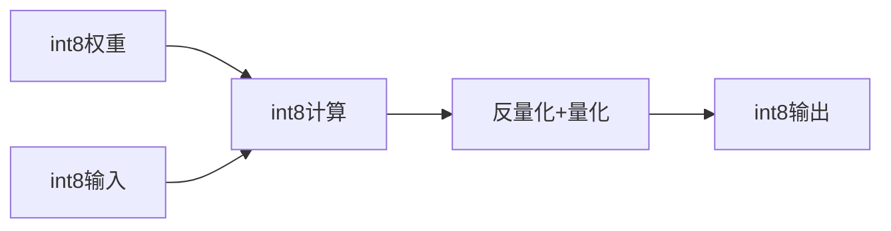
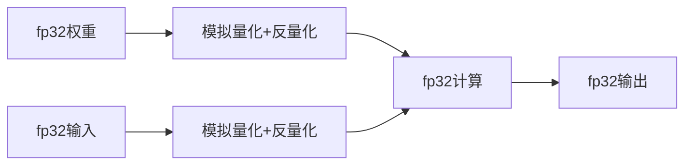
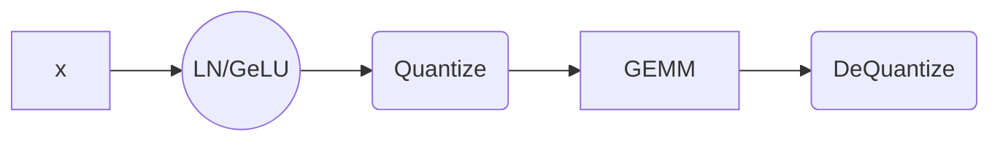
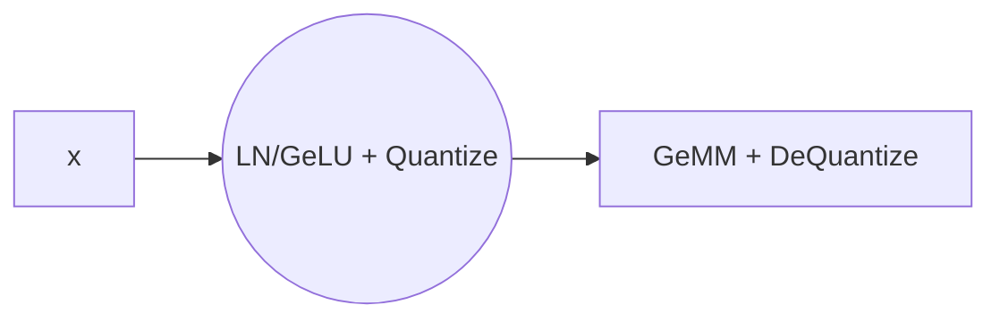
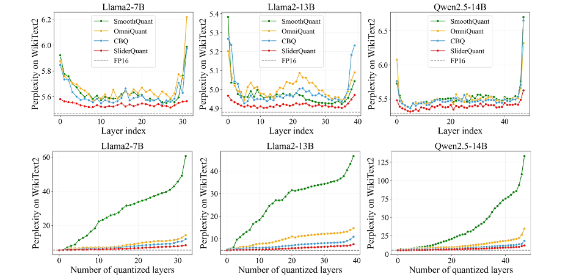
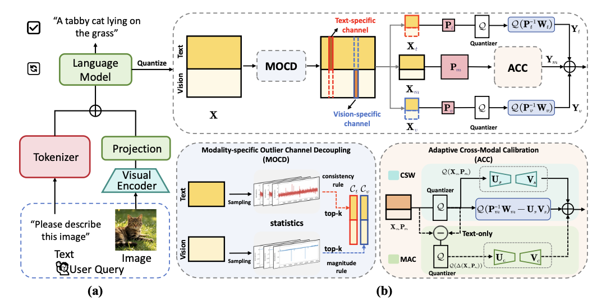
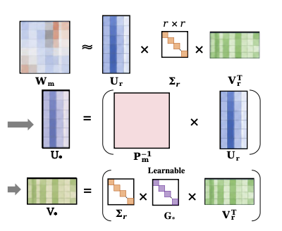

    <h1>阅读笔记</h1>

### 基础知识

#### 基础概念:

**量化**：把Float类型(FP32,FP16)的模型参数和激活值，用整数(Int8,Int4)来代替，同时尽可能减少量化后模型推理的误差
$$
x1_f \to quant \to x1_q
$$

**反量化**:把量化后的结果转化为浮点结果
$$
x1_q\to dequant \to x2_f
$$

**量化映射**:通用公式为:$r = S(q-Z)$,其中r表示量化前数据的真实值，q表示量化后的数值，Z表示零点

**对称量化**:

在量化前后保持零点一致:
$$
S = \frac{|r_{max}|}{|q_{max}|}\\
q = Round(\frac{r}{S})
$$
其中，Round表示取整。

对称量化是非饱和量化，即量化后的数据是非饱和的，有一部分区域不存在量化的数据，但是计算量小

**非对称量化**：

非对称量化需要一个偏移量Z来完成零点的映射，即量化前后零点不一致。
$$
S = \frac{r_{max} - r_{min}}{q_{max} - q_{min}}\\
Z = q_{max} - Round(\frac{r_{max}}{S})\\
q = Round(\frac{r}{S}+Z)
$$
非对称量化引入了偏移量，增大了计算，但是量化后的数据饱和，量化前的最小/大值对应量化后的最小/大值

#### 神经网络量化

首先解释一下为什么量化对神经网络精度影响不大：

1. 权重以及输入都会经过Normalization，基本数值范围都不大
2. 激活函数，数值影响会被平滑
3. 在大模型中，绝大多数的网络都是进行分类，最后都是概率值，只要最后某种类别的概率高于其他类别就可以，无需绝对数值

对于神经网路的量化，是针对每一层而言的，每一层进行量化计算，每一层输出时进行反量化

**训练后动态量化(PTQ)**：

其大致流程如下：

首先将训练好的模型权重量化为int8，并保存量化参数，然后在模型推理时，对每一层输入的fp32激活值，动态进行量化为int8；在每一层对量化后的int8权重和int8激活值进行计算。最后在输出时将结果反量化为fp32，将fp32的激活值传入到下一层。

```mermaid
flowchart LR
	A[模型训练好的int8权重] --> B[int8计算]
	C[fp32输入]--> D[量化]
	D --> E[int8输入]
	E --> B
	B --> F[反量化]
	F --> G[fp32输出]
```

训练后动态量化的问题:

1. 每一次推理每一层都要对输入统计量化参数，耗时
2. 每一层计算完都要转化为fp32,存入显存，占用显存带宽

**训练后静态量化(PTQ)**：

静态量化是动态量化的两个问题的优化。

<b>Q:</b> 每一次推理每一层都要对输入统计量化参数，耗时

对于这个问题可以采用有代表性的输入数据跑一遍整个网络，通过统计得到每层大概的量化参数

<b>Q:</b> 每一层计算完都转化为fp32，存入显存，占用显存带宽

对于这个问题，这一层的输出是下一层的输入，下一层还要量化，不如在这一层直接量化好再传给下一层

流程如下:

首先将训练好的模型权重量化为int8，并保存量化参数。接下来进行**校准**，用一些有代表性的数据进行模型推理，用这些数据在神经网络每一层产生的激活值估算出激活值的量化参数。这样就不用推理时每次根据实际激活值计算量化参数。在每一层对量化后的int8权重和int8激活值进行计算。**在每一层输出时将结果反量化为fp32，同时根据校准产生的激活值量化参数，把激活值量化为int8，把量化参数放入量化后的激活值中。**最后，将int8的激活值和它的量化参数传入到下一层

```mermaid
flowchart LR
A[int8权重] --> B[int8计算]
C[int8输入] --> B
B --> D[反量化+量化]
D --> E[int8输出]
```

**量化感知训练（QAT）**

<b>Q:</b> 精度损失问题是否可以通过神经网络来解决？

神经网络最擅长的便是减少误差，可以通过量化感知训练的方式在训练过程中就能调整参数，让它更适合量化，提高量化后模型的精度

量化感知训练的流程如下：

首先加载fp32的模型参数，输入fp32的激活值。通过**在网络里插入模拟量化节点(fake\_quantization)来分别对模型参数和激活值进行量化和反量化**。从而引入量化误差。模型在fp32精度下进行计算，计算后的激活值传入下一层

```mermaid
flowchart LR
A[fp32权重]-->B[模拟量化+反量化]
B-->C[fp32计算]
C-->D[fp32输出]
E[模拟量化+反量化]-->C
F[fp32输入]-->E
```

**量化的粒度**

我们通过模型量化的粒度来描述模型**每层**量化参数(缩放因子s和zero-point)被共享的范围。

- Per-Tensor 量化

  整个张量共用一组量化参数。这种方式计算简单，存储开销小，硬件适配性高。但是对精度的损失较大，特别是不同通道的动态范围差异较大的时候

- Per-channel量化

​	每个通道拥有独立的量化参数。这种方式精度更高，能适应每个通道不同的统计分布。但是每层需要存储多个量化参数，计算较为复杂，硬件要求高

- Group 量化(由ZeroQuant提出)

​	将整个tensor中不同的通道进行分组，各组内采用同样的量化参数。

**Hessian矩阵(根据AdaRound论文补充)**

模型的量化前后精度损失在本质上是由于对模型权重$w_i$上加一个小的扰动$\Delta w_i$:
$$
\hat w_i = w_i + \Delta w_i
$$
而我们关心的是量化前后的损失变化，我们由泰勒展开有:
$$
L(w + \Delta w)\approx L(w) + \nabla L(w)^\top \Delta w + \frac{1}{2}\Delta w^{\top} H(w)\Delta w\\
\Delta L \approx \nabla L^{\top}\Delta w + \frac{1}{2}\Delta w^\top H\Delta w
$$
其中第一项为线性近似，由于在训练结束时梯度近似为0因此，影响不大，因此量化的损失的敏感性主要由Hessian项描述，其中H为Hessian矩阵。

下面对Hessian矩阵的一些性质以及计算做一些简单介绍

Hessian矩阵被定义为:
$$
H = [\frac{\partial^2 L}{\partial w_i\partial w_j}]_{i,j}
$$
由于对于连续二阶可微函数，满足混合偏导数相等，因此Hession矩阵是一个对称矩阵

想要计算Hessian矩阵是困难的，这是因为这是一个$O(W^2)$的过程，但是在模型参数数量一般是M级别的，因此在实际中，我们通常采用近似计算办法。

- 对角近似

  我们只保留Hessian矩阵的对角线元素$H_{i,i}$，把非对角线元素置为0.(这个方法在很大程度可以可以方便求逆)

  

  对于神经网络中的第j个神经元的输入$a_j$对应权重为$w_{ji}$:
  $$
  \frac{\partial^2 E_n}{\partial w_{ji}^2} = \frac{\partial^2 E_n}{\partial a_j^2}z_i^2
  $$
  其中$z_i$是上一层神经元的输出。

  而$\frac{\partial^2 E_n}{\partial a_j^2}$可以通过链式法则递归计算(类似于反向传播):
  $$
  \frac{\partial^2 E_n}{\partial a_j^2} = \underbrace{\frac{\partial}{\partial a_j}[h'(a_j)\sum_{k}w_{kj}\frac{\partial E_n}{\partial a_k}]}_{链式法则}=h'(a_j)^2 \sum_{k,k'}w_{kj}w_{k'j}\frac{\partial^2 E_n}{\partial w_k\partial w_{k'}} + h''(a_j)\sum_k w_{kj}\frac{\partial E_n}{\partial a_n}
  $$
  忽略二阶导中的非对角线项$k\neq k'$:
  $$
  \frac{\partial^2 E_n}{\partial a_j^2}\approx \underbrace{h'(a_j)^2\sum_k w_{kj}^2 \frac{\partial^2 E_n}{\partial a_k^2}}_{链式法则} + \underbrace{h''(a_j)\sum_{k}w_{kj}\frac{\partial E_n}{\partial a_k}}_{链式法则}
  $$
  从而一次反向传播便可以计算出来，时间复杂度为$O(W)$

- 外积近似

​	在神经网络应用于回归问题时，通常采用下面形式的平方和误差
$$
E = \frac{1}{2}\sum_{n=1}^N(y_n-t_n)^2
$$
​	那么Hessian矩阵可以写成如下形式:
$$
H = \nabla\nabla E = \nabla(\sum_{n=1}^N (y_n-t_n)\nabla y_n) = \sum_{n = 1}^N \nabla y_n(\nabla y_n)^\top + \sum_{n=1}^N(y_n-t)\nabla\nabla y_n
$$
​	在网络已经训练好的情况下，输出$y_n$与$t_n$接近，因此第二项可以忽略，由此我们得到了Hessian矩阵的外积近似
$$
H\approx \sum_{n=1}^N b_n b_n^\top
$$
​	其中，$b_n = \nabla y_n = \nabla a_n$(输出单元的激活函数就是恒等函数)。这种方法中的Hessian矩阵可以跟随反向传播算法在$O(W)$个步骤内高效地求出误差函数地一阶导数。再通过简单地乘法就可以在$O(W^2)$步骤内求出矩阵元素。

#### 硬件基础

下图展示了在神经网络加速器中是如何计算矩阵-向量乘法$y = \mathbf{W}x+b$的。这是一切神经网路的基础。该NN加速器的两个基本组件是处理单元$C_{n,m}$和累加器$A_n$.

计算开始时，将累加器加载有偏差值$b_n$。然后我们将权重值$W_{n,m}$和输入值$x_m$加载到数组中，并在相应的处理器单元$C_{n,m} = w_{n,m}x_m$中计算他们的乘积，在单个周期内并行执行。然后他们的结果在累加器中相加。
$$
A_n = b_n + \sum_{m}C_{n,m}
$$
我们称这个操作为乘累加(MAC).对于较大的矩阵向量乘法，这个步骤会重复多次。当所有周期完成后，累加器中的值会被移回内存，用于下一层的网络输入。

由此可见，神经网络的计算开销主要是在MAC操作以及数据传输两部分。通过量化，数据由FP32转化为INT8等低比特的表达形式，不仅可以减少数据传输的开销，还可以减少MAC操作的大小和开销。（这是因为数字运算的成本通常随着所使用的位数线性扩展到二次方，并且因为定点加法比其浮 点数对应物更高效）

而当我们引入了量化以后，会加入权重值以及激活值的缩放因子$s_w,s_x$作为输入。我们可以写出此时乘累加的方程：
$$
\hat A_{n} = \hat b_{n} + \sum_{m}\hat {\mathbf{W}}_{n,m}\hat x_{m} = \hat b_n + \sum_{m}(s_w \mathbf{W}_{n,m}^{int})(s_x x_{m}^{int}) = \hat b_n + s_ws_x\sum_{m}\mathbf{W}_{n,m}^{int}x_m^{int}
$$
我们一般对bias进行更特别量化，因为它通常存储在更高的位宽中，量化因子往往取决于$s_{w},s_x$(可以见博客)。累加器我们采用高位宽(32位)，因为在计算过程中积累更多乘积时，有风险因为溢出而导致损失。

存储在累加器中的激活值需要在下一层使用之前写入内存。为了减少数据传输的开销，激活值往往会被量化位8bit,因此这里需要一个新的量化操作。

#### 常见量化策略

**Batch Normalization（BN）折叠**

我们可以通过这个式子来描述Batch Normalization(BN):
$$
\text{BatchNorm}(x) = \gamma(\frac{x - \mu}{\sqrt{\sigma^2 + \epsilon}}) + \beta
$$
其中$\mu,\sigma$是Batch数据的均值和方差。

如果在线性层中之后应用BN:$y_k = BN(\mathbf{W}_{k,:}x)$,$\mathbf{W}\in \mathbb{R}^{n\times m}$那么我们可以写作:
$$
y_k = BN(\mathbf{W}_{k,:}x) = \gamma_k(\frac{\mathbf{W}_{k,:}x-\mu_k}{\sqrt{\sigma^2+\epsilon}}) + \beta_k
$$
那么我们可以将其写作
$$
y_k = \frac{\gamma_kW_{k,:}}{\sqrt{\sigma^2 + \epsilon}}x + (\beta_k - \frac{\gamma_k \mu_k}{\sqrt{\sigma^2 + \epsilon}}) = \hat {\mathbf{W}}_{k,:}x + \hat b_k
$$
在AdaQuant中有提到量化对BN融合带来的统计量偏移问题，以及一个利用校准集实现的校准方案.

**激活函数融合**

激活值的重新量化通常发生在矩阵乘法或卷积输出值得计算之后。然而实际上，我们通常会在一个线性操作之后直接加上一个非线性操作。

但是把激活值先写入内存然后再重新加载回计算核心以应用非线性操作是非常浪费的。因此，很多硬件解决方案都带有在重新量化步骤之前应用非线性的硬件单元。如果是这种情况，我们只需要模拟非线性操作之后的重新量化。

举个例子：
例如$\text{Relu}(x)$,就是在正半轴不变，而负半轴截断为0，也就试clip到0，所以我们量化的时候把最小值设为0，最大值按照正常值计算得到。自然而然就模拟了ReLu这个非线性操作。

一些更加复杂的激活函数如sigmoid等则需要更多的专门的支持（一部分硬件对这类复杂的函数会采用泰勒展开，然后计算几次方内的结果，还有些就是直接查表实现）如果没有专门的支持那我们就需要在非线性操作之前和之后各自添加一个量化操作。这个操作可能会对模型的准确性产生比较大的影响，虽然像swish这类比较新颖的激活函数可能会提高一些浮点下的精度。但这部分提高可能会在量化后消失，或者是在定点硬件上部署时推理效率降低。

**其他层的量化**

Max-Pooling:不需要对激活值进行量化，因为输入和输出的范围一致

Avg-Pooling:整数的平均值不一定是整数，因此需要在平均之后增加一个量化步骤。但是我们对输入和输出采用同样的量化器，因为求平均不会显著改变量化后值得范围。

Element-wise 求和：在计算的时候两个向量的量化的范围必须完全匹配。要么在相加前增加一个反量化步骤，另外一种方案是绑定多个输入的量化器从而一致的输入，这样虽然可以省去反量化但是需要进行一定的fine-tuning

Concat：被连接的两个向量通常不共享量化参数，因此反量化是必要的。与Element-wise求和一样，可以对网络进行fine-tuning以使得多个连接分支可以共享量化参数

#### 一些常见的线性代数方法

- LoRa(低秩近似)

### 论文阅读

#### AdaQuant：Accurate Post Training Quantization With Small Calibration Sets

**总结**：本篇文章的主要贡献在于提出了一个基于小数据集（校验集）的训练后量化方法AdaQuant，AdaQuant通过提出一个block/layer-wise的损失函数，通过在校验集上的训练学习量化参数(重点包括了一个最优的权重扰动，类似于AdaRound来避免四舍五入的不足),实现了减少量化的精度损失；提出了基于PI(整数规划)的bit精度分配方案，但是并没有解释精确损失的累加合理性；提出量化对BN融合造成的统计量偏移问题，并提出了PN(Para-Normalization)来解决这个问题。并在Bert-base网络上实现了不到1%的损失(4-8bit)

<b>吐槽:</b> 这篇文章作者(符号和表达)有点混乱，得多读几遍才能理解作者想表达什么.中间bit分配假设成立存疑

在一般的Post-training 量化中，我们的优化目标可以用下式表示:
$$
\hat\Delta = \arg \min_{\Delta}||X - Q_{\Delta}(X)||^2\\
Q_{\Delta}(x) = \Delta[\frac{X}{\Delta}]
$$
其中，$Q(\cdot)$是量化方程。这种方法对所有的量化损失都是平等处罚的，但是事实上我们更应该对影响分类的量化损失进行更多的惩罚。量化感知训练可以缓解这个问题但是它存在计算开销大的问题。

基于此，作者提出了AdaQuant，其核心思想是采用一个block/layer-wise的优化误差函数:
$$
(\hat\Delta_{w}\hat\Delta_x,\hat V) = \arg\min_{\Delta_w,\Delta_x,V}||WX-Q_{\Delta_w}(W')Q_{\Delta_x}(X)||^2
$$
其中，$W' = W + V$,这里V是引入的一个连续的可学习的“补偿”张量。被量化的对象是进行补偿后的权重W':$W_q = Q_{\Delta_w}(W') = Q_{\hat\Delta_w}(W+V)$.

这里其实有点类似于AdaRound的思想了，因为AdaRound主张的是在量化时直接采用四舍五入是一个不明智地选择，因此这里采用一个补偿张量V来做这个选择

由于量化参数的得到依赖的是上一层全精度的激活值输出作为输入，因此各个网络之间互不干扰，所以可以并行处理。

但是在实际的推理过程中，网络的输入是上一层量化后的激活值（见训练后静态量化），因此，作者提出了串行版本的AdaQuant，此时它的优化误差函数为
$$
(\hat\Delta_{w_l},\hat\Delta_{x_l},\hat V_l) = \arg\min_{\Delta_{w_l},\Delta_{x_l},V_l}||W_lX_l - Q_{\Delta_{w_l}}(W_l')\cdot Q_{\Delta_{x_l}}(X_l^q)||^2\\
X^q_l = \sigma(Q_{\Delta_{w_{l-1}}}(W'_{l-1})\cdot Q_{\Delta_{x_l}}(X_{l-1}^q) )
$$
其中，$\sigma(\cdot)$是激活函数

需要注意的是，串行版本的AdaQuant得在比特分配之后进行，这是因为它的优化依赖于上一层的输入。

为了在性能和精度之间做权衡，在量化时我们往往会给不同层的网络分配不同的bit精度。AdaQuant在此思想上，提出了采用整数规划(PI)的方式。

作者将网路的bit分配描述为这样一个问题：

给定L层的神经网络。对于每一层l，我们都有需要与前一层$X_{l-1}$的激活值相乘的权重$W_l$。令$W_l^k$和$X_{l-1}^n$表示$W_l,X_{l-1}$精度为k和n位的量化版本。对于每一层i，低位宽乘法$W_l^k X_{l-1}^k$会带来$\Delta L_l^{k,n}$的准确损失和$\Delta P_{l}^{k,n}$的性能提升。

作者假设了准确损失以及性能提升是满足可加性的。

这里存疑，因为l-1层的准确损失势必会影响l层的准确损失，不能简单做加法来描述整个网络的准确性退化

那么问题可以描述为，在不超过总网络退化$\Delta L$的前提下，最大化总性能提升。我们设示性函数$I_l^{k,n}$来表示第l层是否采用k，n位量化版本（1表示使用）。问题可以被符号表示为:
$$
\max \sum_{l = 0}^{L-1}\Delta P_l\\
Subject\ to\ \sum_{l}\Delta L_{l}\leq \Delta L\\
\forall l\in \{1,\dots,L\}:\Delta P_l = \sum_{k,n}I_l^{k,n}\cdot \Delta P_{l}^{k,n},\Delta L_l = \sum_{k,n}I_{l}^{k,n}\cdot L_{l}^{k,n}\\
\forall l\in \{1,\dots,L\}:\sum_{k,n}I_l^{k,n}=1,I_l^{k,n}\in\{0,1\}
$$

BatchNormalization在部署时，通常会与前面的卷积/全连接层进行融合，这样可以减少推理时的计算量。(这是因为BN的线性变换乘$\gamma/\sqrt{\sigma^2+\epsilon}$，加$\beta-\gamma\mu/\sqrt{\sigma^2+\epsilon}$可以直接合并到权重和偏置中)

然而当网络量化后，会导致激活值的分布发生偏移，即统计量均值$\mu$和方差$\sigma^2$会偏离在全精度模型中应有的值。但是由于BN层已经被融合到了前面的层中，这个偏移无法被校准。基于此，作者采用了一个名为Para-Normalization(PN)的方法来更新BN的统计量，以补偿这种偏差。

具体而言，假设我们知道了原始的BN参数$\gamma_0,\beta_0$.然后我们初始化一个新的BN层，初始化$\mu,\sigma^2$以及BN参数$\gamma_r,\beta_r$以便重建BN，使其满足:
$$
BN_r(x) = \gamma_r \frac{x - \mu}{\sqrt{\sigma^2 + \epsilon}} + \beta_r \approx x\\
\mu = \beta_r = \beta_0;\sigma^2 = \gamma_0^2;\gamma_r = \sqrt{\gamma_0^2+\epsilon}
$$
然后在校准集上收集运行时均值和方差更新$\mu,\sigma^2$,需要注意的是$\beta_r,\gamma_r$是不变的，因为不进行反向传播。

收集到新的均值和方差后，我们重新将BN进行融合，收集到的统计数据可以按以下方式融合回当前的量化尺度：
$$
W_i' = W_i\frac{\gamma_r}{\sigma};b_i' = \frac{\gamma_r}{\sigma}(b_i - \mu) + \beta_r;\Delta_{w_i}' = \frac{\gamma_r}{\sigma}\Delta_{w_i}
$$
#### AdaRound:Up or Down? Adaptive Rounding for Post-Training Quantization

**总结**:本篇文章作者首先从数学角度证明了在模型量化过程中，直接将浮点数进行四舍五入round到最近定点数的方法并不是精度最优的。并且通过了一个简单的实验验证了猜想，随后基于此作者进行一系列的数学推导和数学近似推导除了最终的优化目标:最小化由于量化在预激活值中引入的均方误差，从而提出了自适应的Round方法:AdaRound.这种方法在进行量化时，自适应地决定将浮点值转到最近右定点还是左定点值。AdaRound可以在不需要QAT or finetune的情况下仅使用少量无标签的校准数据在精度上达到SOTA，甚至4bit量化也可以保留较好的精度。

    <b>个人评价</b>:这篇文章的行文流惯，公式推导顶级，从完全理论的方式推导出了大部分量化论文中量化目标函数。

首先作者将量化过程定义为了一个对预训练模型权重w的微小扰动$\Delta w$.我们的目标为最小化这个扰动对损失函数$L(w)$造成的影响，即最小化$E[L(w+\Delta w)-L(w)]$,为了近似这个损失，采用了二阶泰勒展开有:
$$
L(w + \Delta w)\approx L(w) + \nabla L(w)^\top \Delta w + \frac{1}{2}\Delta w^{\top} H(w)\Delta w\\
\Delta L \approx \nabla L^{\top}\Delta w + \frac{1}{2}\Delta w^\top H\Delta w
$$
由于模型经过预训练损失函数的梯度很小，可以忽略，而高阶项只要扰动$\Delta w$不是特别大，二阶近似往往就是准确的。对于4-bit或更高精度而言这个是成立的。

因此我们可以认为影响模型精度的主要是$\Delta w$以及损失函数的曲率$H(w)$相关。

令$\Delta w^\top = [\Delta w_1,\Delta w_2]$,$H^{(w)} = \begin{bmatrix}1 & 0.5\\0.5 &1\end{bmatrix} $,那么由此我们可以计算出，量化导致的损失为:
$$
\Delta w^\top H^{(w)}\Delta w = \Delta w_1^2 + \Delta w_2^2 + \Delta w_1\Delta w_2
$$
对于对角线项$\Delta w_1^2,\Delta w_2^2$而言四舍五入是最优的，最小化了误差，但是对于非对角线项$\Delta w_1\Delta w_2$采用四舍五入就不一定最优了。例如若二者符号取反乘积为负就可以抵消一部分损失的增量。

因此从理论上分析出了四舍五入方法的局限性。后续也从实验上进行了论证，作者采用四舍五入，全部向上，全部向下，随机舍入进行比较，发现在随机舍入中存在比四舍五入高出10%的取舍法，说明在取舍办法中，存在更优的方法。

这个取舍办法的选取可以通过如下问题描述。

假设每层权重量化，量化后的权重为$\hat w_i^{(l)}$
$$
\hat w_i^{(l)}\in \{w_i^{(l),floor},w_i^{(l),ceil}\}
$$
$\Delta w_i^{(l)} = w^{(l)} - \hat w_i^{(l)}$,由此，最优的舍入过程可以描述为以下二元优化问题:
$$
\arg \min_{\Delta w} \mathbb{E}[L(x,y,w+\Delta w) - L(x,y,w)]
$$
直接对这个式子进行优化并不现实，因为，每次调整$\Delta w$都需要进行一次前向传播，计算成本太高，我们采用前面理论分析时的泰勒展开近似。此外，忽略属于不同层之间权重的交互。优化目标近似为：
$$
\arg \min_{\Delta w^{(l)}} \mathbb{E}[\Delta w^{(l)}H^{(w^{(l)})}\Delta w^{(l)}] 
$$
但是这个优化过程受限于Hessian矩阵的计算困难以及问题本身是一个NP-Hard问题。因此无法将这个作为最终的优化目标。

我们从Hessian矩阵计算的复杂性来分析
$$
\frac{\partial^2 L}{\partial W^{(l)}_{i,j}\partial W^{(l)}_{m,o}} = \frac{\partial}{\partial W_{m,o}^{(l)}}[\frac{\partial L}{\partial z_i^{(l)}}\cdot x_j^{(l-1)}] = \frac{\partial^2 L}{\partial z^{(l)}_i\partial z_m^{(l)}}\cdot x_j^{(l-1)}x_i^{(l-1)}
$$
写作矩阵的形式
$$
H(w^{(l)}) = \mathbb{E}[x^{(l-1)} x^{(l-1)\top}⊗ \nabla^2_{z^{(l)}}L]
$$
其中⊗为Kronecker积。由此看出Hessian矩阵的复杂性主要来于二阶导的求取，它需要通过网路的后续层反向传播二阶导数(见对角近似)。

为了解决这个问题，我们采用Hessian矩阵的对角近似，即将其近似为对角矩阵，记作$diag(\Delta^2_{z^{(l)}}L)$。
$$
H(w^{(l)}) = \mathbb{E}[x^{(l-1)} x^{(l-1)\top}⊗ diag(\nabla^2_{z^{(l)}}L)]
$$
将这个近似带入优化方程中有：
$$
\arg \min_{\Delta W_{k,:}^{(l)}} \mathbb{E}[\nabla^2_{z^{(l)}}L_{k,k}\cdot \Delta W_{k,:}^{(l)}x^{(l-1)}x^{(l-1)\top}\Delta W_{k,:}^{(l)\top}]\\
=\arg\min_{\Delta W_{k,:}^{(l)}} \Delta W_{k,:}^{(l)}\mathbb{E}[x^{(l-1)}x^{(l-1)\top}]\Delta W_{k,:}^{(l)\top}\\
=\arg \min_{\Delta W_{k,:}^{(l)}} \mathbb{E}[(\Delta W_{k,:}^{(l)}x^{(l-1)})^2]
$$
这里是认为$\nabla^2_{z^{(l)}}L_{i,i}$是一个与输入样本数据无关的常量结果。

由此我们推导出，我们只要最小化由于量化而在激活函数$z^{(l)}$中引入的均方误差。这与大部分量化的论文中的结论一致（如AdaQuant）

想要通过直接求解上面的优化方程仍然是一件困难的事情，因为它是NP-Hard的，因此作者将优化目标放宽为如下形式
$$
\arg \min_{V}||Wx-\hat Wx||^2_{F}+\lambda f_{reg}(V)
$$
其中$||\cdot||^2_F$为F范数，$\hat W$为优化的软量化权重
$$
\hat W = s\cdot clip([\frac{W}{s}] + h(V),n,p)
$$
$h(V_{i,j})$可以是任何在0和1之间取值的可微函数，$f_{reg}(V)$是一个可微正则项，用于鼓励$h(V_{i,j})$收敛到0或1.

但是这个方法存在一个缺陷，无法避免量化误差的不断积累且没有考虑到激活函数，所以做了进一步优化
$$
\arg \min_{V}||f_a(Wx)-f_a(\hat W\hat x)||_F^2 + \lambda f_{reg}(V)
$$
其中$fa(\cdot)$为激活函数$\hat x$为当前层的反量化输入，x为当前层的浮点输入 

#### ZeroQuant: Efficient and Affordable Post-Training Quantization for Large-Scale Transformers

<b>评价:</b> 这篇文章比较Solid，考虑了硬件适配的问题，这是模型量化中一个老大难的问题尤其是混合精度。但是实验的模型都是参数规模较小的模型，在大模型上的效果有待考究。

**总结**：这篇文章指出，低比特量化在大型 Transformer 架构模型中精度受限的主要原因是激活值和权重矩阵的值分布方差较大。针对这一问题，提出了 ZeroQuant 方案。该方案主要包括：对权重采用 Group-wise 量化、对激活值采用 Token-wise 量化，这种方法既能适配硬件架构，又能保持较高的精度；同时，通过 Layer-wise 知识蒸馏方法来减少量化带来的精度损失。

文章指出，在大模型的量化中，采用PTQ会面临以下挑战。

- 激活分布动态性强

  论文通过展示每一层的激活值在不同Token语义下的分布，发现了其范围随输入token的语义上下文变化极大的特点。这一特点使得难以对所有的token使用固定的量化范围。

- 权重矩阵范围差异大

​	通过同样的方式，展示了不同层行权重的范围。同样可以看到权重矩阵的神经元范围差异较大。

这两个挑战使得Per-Tensor粒度的量化很难在大模型的量化中使用，而采用Per-channel粒度的量化会面临大的计算存储开销，且会导致在硬件级别的矩阵乘法优化难以执行。基于此作者提出采用Group-wise量化旨在对精度和实用性做出权衡。

对于权重矩阵而言，Group-wise量化就是将$W\in R^{n\times m}$划分为g个组，每个组单独量化。但是在最先提出这个量化方法的Q-BERT中仅将其用于QAT且没有考虑硬件效率约束，以及系统后端支持。基于此作者团队考虑了GPU的架构（Ampere架构）的硬件约束，特别是将Group-size与Tensor Core中的计算单元对齐。

具体而言，Tensor Core允许16\*16大小的矩阵块在一个warp中并行处理，从而加速矩阵乘法和其他张量操作。如果我们让Group-size为16或32这样与Tensor core中矩阵乘法相适配的大小，这样就能在降低延迟的同时保持模型精度。

**注**：这部分文章在附录D中有详细介绍，简单来说Group-wise的group size是通过CUTLASS库和Profiler工具，根据输入尺寸和硬件特性动态确定的，以优化Tensor Core的计算效率。

对于激活值而言，在挑战中我们已经阐明了在不同的Token上下文语义下，激活值的范围存在巨大方差，因此解决这个问题的一个自然而然的想法是采用Token-wise的量化策略。但是直接采用DL框架中的Token级量化会导致显著的量化和反量化成本，因为引入了额外的操作。基于此作者采用了算子融合的方法等一系列优化。

知识蒸馏是缓解模型压缩后精度下降的最强大的办法之一。因此，论文提出了一种逐层的知识蒸馏技术来避免低比特量化带来的精度损失。

具体而言，在传统的知识蒸馏中，教师模型和学生模型的输出通常是整个模型的输出，但在逐层知识蒸馏(LKD)中，蒸馏的学习目标是逐层的，即学生模型要学习教师模型每一层的中间激活值。

假设我们要量化的是$L_k$层，其量化版本为$\hat L_k$,然后我们使用$L_{k-1}$层的输出作为$L_k,\hat L_k$的输入，测量差异，并更新模型
$$
L_{LKD,k} = MSE(L_kL_{k-1}\dots L_1(X)-\hat L_k L_{k-1}\dots L_1(X))
$$
因为使用相同的前k-1层，所以无需单独保留一个单独的教师模型，因此额外的模型成本仅仅是$L_k$。而每次只对一层进行蒸馏，所以内存和计算开销非常小，并且无需原始训练数据。

在前面Token-wise的量化处我们提到，作者对Kernel做了对应的优化，下面我们详细展开。

首先是针对Token-wise 的激活值量化做了一系列的kernel融合。作者将激活值量化与其相关的逐元素和或基于reduction的操作（如bias，GELU,LayerNorm等）的kernel进行了融合。这样减少了数据转移的开销。而将反量化与矩阵乘法做了相应的融合。具体而言见下面的流程图

```mermaid
flowchart LR
x -->B((LN/GeLU))
B --> C(Quantize)
C --> D[GEMM]
D --> E(DeQuantize)
```

经优化后

```mermaid
flowchart LR
x --> A((LN/GeLU + Quantize))
A --> B[GeMM + DeQuantize]
```

#### OWQ:Outlier-Aware Weight Quantization for Efficient Fine-Tuning and Inference of Large Language Models

**总结**：本文提出了一个异常感知的权重量化方法OWQ，利用LLMs中的异常激活值挑选出Weak Column，对其采用全精度的方式在牺牲很小的性能的情况下提升了巨大的精度。此外为进一步提升其性能做了一定的硬件适配并提出了一个基于OWQ的WTC方案，简单来说就是在OWQ量化模型上微调只更新Weak Column的参数。

<b>评价:</b> 这篇文章思路很新颖，从大模型中间激活值的异常出发，结合Hessian矩阵分析，提出了一个简单但高校的方法，似乎可以进一步提升？

本文基于这样一个发现，LLMs在中间激活中表现出一些异常值，其值显著大于其他值，并且这些异常值集中在特定的特征维度上。保留这些异常值的值已知对于在激活量化之后保持准确性至关重要。此外，作者团队还发现激活异常值仍然会影响权重量化的敏感性。基于此，作者提出了一种称为异常值感知权重量化的概念(OWQ).

我们知道逐层权重量化的过程，实际上进行如下优化过程:

给定输入特征$X\in R^{C_{i,n} \times N}$,其中$C_{i,n}$表示输入的通道数，N是输入的序列长度，用于$C_{out}$输出特征的完整精度权重矩阵$W \in R^{c_{out}\times C_{i,n}}$被映射到低精度。
$$
\arg \min_{W} E= \arg \min_{\hat W}||WX - \hat W\hat x||^2_2 
$$
在量化时我们从输入到输出逐层量化。此外大模型的量化中，Embedding层以及LM Head的权重通常不被量化，因为前者的权重量化误差会随着网络的传播不断放大，且Token向量较为稀疏而LM Head层直接决定logits，而Top-k词之间的分数差往往较小，低比特改写会对排序以及argmax产生显著影响。

接下来阐释权重敏感性和激活异常值之间的关系。

（这里与原论文中的证明方式不一致，原论文只考虑了对量化误差$$||WX - \hat W\hat X||$$的论证，这是单层量化误差，但是忽略了误差随着网络的放大的影响）

在AdaRound文章中有提到，对于权重的量化产生的误差我们有如下基于泰勒展开的近似:
$$
\mathbb{E}[L(x,y,w+\Delta w) - L(x,y,w)] =\Delta L \approx \nabla L^{\top}\Delta w + \frac{1}{2}\Delta w^\top H\Delta w \approx \Delta W^\top H\Delta W
$$
由此我们知道，输出误差可以直接与海森矩阵和权重扰动的幅度相关。

将Hessian矩阵写作Kronecker积的矩阵形式，我们得到
$$
H(w^{(l)}) = \mathbb{E}[x^{(l-1)} x^{(l-1)\top}⊗ \nabla^2_{z^{(l)}}L]
$$
由此我们可以从全局的视角看到，异常激活值(激活值的激增)使Hessian矩阵H的某些元素具有异常大的值。Hessian矩阵的这种异常激增增加了相应权重通道对量化的敏感性。具体来说，即使在相同的权重扰动下，由于一些H的一些大元素，输出的变化也会相当大。我们可以将这些易受量化影响的权重称为Weak Column，特别是那些与特定输入通道中的激活值异常值相关联的权重。

OWQ为了解决这个问题，实现了如下技术：首先，识别Weak Column并将他们从量化中排除。随后使用精心调整的量化参数将剩余的权重量化为极低的bit。

对于Weak Column的检索，OWQ遵循如下方法:

我们定义j-th权重列的敏感性为:
$$
sensitivity_j = \lambda_j||\Delta W_{:,j}||_2^2
$$
其中$\lambda_j$是Hessian矩阵的第j个对角元素。

(若考虑的Hessian矩阵是层内重构误差的，那么这里$\lambda_j = (X^\top X)_{j,j} = 2\sum_{n}x_{j,n}^2$)

可以注意到在我们写的Hessian矩阵是针对全局损失而言的，那么这个场景下的$\lambda_j$就有所改变。虽然在这个场景下我们无法像论文里一样因为layer-wise量化误差输出通道之间没有Hessian交互，从而Hessian是对角矩阵。

但是将其作对角近似是合理的。因为在这样一个大的模型下，进行Hessian矩阵的精确计算是不可行的。

在此场景下我们有:

对于神经网络中的第j个神经元的输入$a_j$对应权重为$w_{ji}$:
$$
\frac{\partial^2 E_n}{\partial w_{ji}^2} = \frac{\partial^2 E_n}{\partial a_j^2}z_i^2
$$
其中$z_i$是上一层神经元的输出。

而$\frac{\partial^2 E_n}{\partial a_j^2}$可以通过链式法则递归计算(类似于反向传播):
$$
\frac{\partial^2 E_n}{\partial a_j^2} = \underbrace{\frac{\partial}{\partial a_j}[h'(a_j)\sum_{k}w_{kj}\frac{\partial E_n}{\partial a_k}]}_{链式法则}=h'(a_j)^2 \sum_{k,k'}w_{kj}w_{k'j}\frac{\partial^2 E_n}{\partial w_k\partial w_{k'}} + h''(a_j)\sum_k w_{kj}\frac{\partial E_n}{\partial a_n}
$$

忽略二阶导中的非对角线项$k\neq k'$:
$$
\frac{\partial^2 E_n}{\partial a_j^2}\approx \underbrace{h'(a_j)^2\sum_k w_{kj}^2 \frac{\partial^2 E_n}{\partial a_k^2}}_{链式法则} + \underbrace{h''(a_j)\sum_{k}w_{kj}\frac{\partial E_n}{\partial a_k}}_{链式法则}
$$
从而一次反向传播便可以计算出来，时间复杂度为$O(W)$

由此我们可以计算出在全局损失下的$\lambda_j$

在实际的计算中，同样也是只需要一个小批量的校验集，但是坏处是要多进行一次反向传播得到曲率。这样的Trade off得到的性能提升应该不小，因为它会真正识别出在全局下的 Real Weak Column

我们根据权重列的敏感性挑选出top-k个作为weak column。然后其余权重被量化为低精度。（这里可以采用任何的量化方法）论文中采用了OPTQ的方法。

作者团队对OPTQ进行了重要修改，使用二维网格搜索来搜索量化配置，包括步长以及零点。通过四舍五入到最接近的截断来搜索使量化前后差异最小的参数的最优值。

文章指出了一个利用Weak Column进一步减轻误差的方法:将高精度的Weak Column重新排列到权重的末尾，OPTQ过程中其他列的量化误差可以主要由Weak Column得到补偿

在此之后，我们将Weak Column存储为fp16，并为每一列使用一个额外的整数，该整数用于索引Weak Column。此外存储一个低精度矩阵，其中Weak Column的位置采用0填充。

此外，作者还对OWQ格式在真实GPU上提供了专门的加速以及WTC微调方案。

具体而言，这个微调方案会将OWQ的量化模型进行微调但只对Weak Column进行参数更新。因为weak column的数量很少，所以总体微调参数量很少，同时又因为weak column的权重使用fp16进行存储，因此微调空间较大，能够实现较好的微调效果。

#### GPTQ: accurate post-trainning quantization for generative pre-trained transformers

这个文章是OWQ的前身，借着对这篇文章的分析，我们梳理一下这一系列的文章的intuition。
大概的分析顺序为:
$$
\text{OBD} \to \text{OBS} \to \text{OBC} \to \text{GPTQ}
$$

首先是OBD，这是由Yann LeCun在1990年提出的神经网络剪枝算法。该算法基于二阶导数信息，旨在通过去除目标函数影响较小的参数来降低模型复杂度，提高泛化能力。

具体而言，就是希望去除目标函数对目标函数E(即Loss)影响小的参数，我们记去除了若干参数的模型的参数为$\hat W = W + \Delta w$,有:
$$
\Delta E = L(x,y,W) - L(x,y,W + \Delta w) = 
\sum_{i}g_i \Delta w_i + \frac{1}{2}\sum_{i}h_{i,i}\Delta w_{i}^2 + \frac{1}{2}\sum_{i\neq j}h_{i,j}\Delta w_i\Delta w_j + O(\Delta w^3)
$$
其中$g_i = \nabla L$,$h_{i,j}$为Hessian矩阵$H_{L}$的一个元素

其中由于剪枝发生在对于已经训练好的神经网络，因此一阶导项可以忽略不计，而高阶项由于模型会进行归一化，因此$\Delta w$较小，可以忽略不计。

此外，OBD做了一个有争议的假设，即删除任意一个参数后，其他参数对目标函数的影响不变，也就是说每个参数对目标函数的影响是独立的，因此可以忽略交叉项:

那么我们可以得到简化后的公式:
$$
\Delta E = \frac{1}{2}\sum_{i}h_{i,i}\Delta w_i^2
$$
因此，对神经网络进行剪枝，删除参数时，参数对目标函数的影响可以通过海森矩阵的对角项进行衡量。我们只需要在剪枝时求出海森矩阵，按对角项从小到大排序，即可确定参数剪枝的次序。

可以注意到，OBD的这个认为参数对目标函数的影响是独立的假设是很强的。OBS认为参数之间的独立性不成立，如果考虑交叉项，可以写作矩阵形式
$$
\Delta E = \frac{1}{2}\Delta w^\top H\Delta w
$$
OBS希望在W每次迭代找到一个位置q(即准备剪枝的位置，后续会将该位置的$w_q = 0$),以及在获得位置q的同时，计算处一个与之相关的$\Delta w$对w进行补偿，使得$L(w+\Delta w)-L(w)$尽量小。

那么这个流程可以描述为一个带约束的凸优化问题:
$$
\arg \min_q \frac{1}{2}\Delta w^\top H \Delta w\\
s.t.\ e_q^\top\Delta w + w_q = 0
$$
这里$e^\top_q$是第q个值为1的列向量。

采用Lagrange乘子法进行求解:
$$
\mathcal{L} = \frac{1}{2}\Delta w^\top H \Delta w + \lambda(e^\top_q \Delta w + w_q)
$$
对$\lambda$并置为0得到:
$$
e_q^\top \Delta w + w_q = 0\\
\Delta w^\top e_q + w_q = 0
$$
对$\Delta w$求导并置为0有:
$$
\Delta w^\top H + \lambda e^\top_q = 0\\
\Delta w^\top H H^{-1} + \lambda e_q^\top H^{-1}=0\\
\Delta w^\top + \lambda e^\top_q H^{-1} = 0
$$
有
$$
w_q = \lambda e_q^\top H^{-1} e_q\\
\lambda = \frac{w_q}{[H^{-1}]_{qq}}
$$
其中用到了等式$e_q^\top H^{-1}e_q = [H^{-1}]_{qq}$

将$\lambda = \frac{w_q}{[H^{-1}]_{qq}}$带入等式$\Delta w^\top H + \lambda e_q^\top = 0$,得到
$$
\Delta w^{\top} = -\frac{w_q}{[H^{-1}]_{qq}}e_{q}^\top H^{-1}\\
\Delta w = -\frac{w_q}{[H^{-1}]_{qq}}(H^{-1})^\top e_q \\
\Delta w = -\frac{w_q}{[H^{-1}]_{qq}}H_{:,q}^{-1}
$$
其中$H_{:,q}^{-1}$表示$H^{-1}$的第q列,且Hessian矩阵是一个对称矩阵.

将$\Delta w$带入$\Delta \mathcal{L}$我们有:
$$
\Delta\mathcal{L} = \frac{1}{2}\Delta w^\top H \Delta w = \frac{1}{2}(-\frac{w_q}{[H^{-1}]_{qq}}e_q^\top H^{-1})H(-\frac{w_q}{[H^{-1}]_{qq}}H^{-1}e_q)\\
=\frac{1}{2}(\frac{w_q}{[H^{-1}]_{qq}})^2e_q^\top H^{-1}e_q\\
=\frac{1}{2}(\frac{w_q}{[H^{-1}]_{qq}})^2[H^{-1}]_{qq}\\
=\frac{1}{2}\frac{w_q^2}{[H^{-1}]_{qq}}
$$
由此我们得到:
$$
q = \arg \min_q \frac{w_q^2}{[H^{-1}]_{qq}}
$$

我们不难发现，要进行k次剪枝，每一次剪枝都要求一次Hessian矩阵的逆(时间复杂度为$O(d^3)$),这样的时间复杂度明显是不能实际应用的，因此OBC对其进行了进一步的优化。

OBC主要做了两点优化，一个是对原始问题进行了拆分，另一个是对Hessian矩阵的计算进行了简化。

首先是对原始问题的拆分，对于Layer-wise的量化/剪枝而言，通常将对整个网络进行的量化/剪枝拆分为每一层独立的子问题。在先前对AdaQuant的分析中我们有提到，这种Layer-wise的拆分是高度可并行的。

在Layer-wise的量化/剪枝下，参数变化带来的损失可以描述为以下形式:
$$
\Delta \mathcal{L} = ||W_lX_l - \hat W_l X_l||_2^2
$$
其中$\hat W$表示经过量化/剪枝后的参数。

OBC将这个损失函数进行了按行拆分，即认为删掉某个权重$w_{ij}$只影响该行的输出，行与行之间的Hessian矩阵元素是没有耦合的。(这两个都是对按行拆分合理性的解释，前者是直观解释，后者是数学解释)

对于第一点，我们知道，改变某个权重$w_{ij}$它只会对输出的某一行的结果产生影响，即$Y_{i,:} = W_{i,:}X$,那么既然只对某一行的输出产生影响,那么对于整体误差而言,也只对这一行的误差产生影响,而误差是可以按行拆分的:
$$
\Delta \mathcal{L} = ||WX - \hat W X||_2^2 = \sum_{i=1}^{d_{row}}||W_{i,:}X-\hat W_{i,:}X||_2^2
$$
因此剪枝/量化是可以按行拆分并行处理的。

由于是Layer-wise的量化/剪枝，我们在这个尺度下的进行单行损失函数(二阶范数)的Hessian矩阵的计算从而对第二点进行证明，我们有:
$$
H_{pq} = \frac{\partial^2\Delta \mathcal{L}_l}{\partial w_{lp}\partial{w_{lq}}} = \frac{\partial}{\partial w_{lp}}\sum_{k=1}^N 2(\sum_{j=1}^{d_{col}}(w_{lj}-\hat w_{lj})x_{jk})\frac{\partial}{\partial w_{lq}} \sum_{j = 1}^{d_{col}}(w_{lj}-\hat{w_{lj}})x_{jk}\\
=\frac{\partial}{\partial w_{lp}}\sum_{k=1}^N2(\sum_{j=1}^{d_{col}}(w_{lj}-\hat w_{lj})x_{jk})x_{qk}\\
=2\sum_{k=1}^N x_{pk}x_{qk}
$$
写成矩阵的形式就是
$$
H = 2XX^\top
$$
发现每一行的损失的Hessian矩阵只跟输入数据X有关且相等，而与模型权重无关，因此我们认为行与行之间的Hessian矩阵元素是没有耦合的。

而我们知道通过泰勒展开可以得到参数变化对损失函数的影响的近似表示$\Delta w^\top H \Delta w$,那么结合上式我们可以知道行与行之间的损失是相互独立的(对于行而言$\Delta w$,行与行之间互相独立,对于Hessian矩阵而言，行与行之间相等且互不影响),由此可以从数学上说明按行拆分进行单独处理的方式是合理的。

有了这个证明，我们可以对每行进行单独处理进行量化剪枝。这种方式为我们提供了一个更加简单的Hessian矩阵形式$2X^\top X$但是每次更新参数仍然需要对其求逆，因此OBC提供了一个高效的求逆方法:

  给定一个可逆矩阵H以及其逆矩阵$H^{-1}$,我们希望高效地计算删除H第q行第q列(删除权重$w_q$)后的逆矩阵$H^{-1}_{-q}$:
$$
  H_{-q}^{-1} = (H^{-1} - \frac{1}{[H^{-1}]_{qq}}H^{-1}_{:,q}H^{-1}_{q,:})_{-q}
$$
  这个定理证明较为复杂，将在博客上更新详细证明与intuition。

  接下来我们来描述OBC剪枝的完整流程:

  给定一个神经网络层的权重行向量$w \in \mathbb{R}^d$,以及其对应的Hessian矩阵的逆$H^{-1}\in \mathbb{R}^{d\times d}$,要求切除其中k个权重，同时最小化输出误差。

   - 初始化
      $M \leftarrow \{0,1,2,\dots,d-1\}$,为尚未被剪枝的权重索引集合。
   - 重复执行k次:

    首先选择当前最优的剪枝目标q:$q \leftarrow \arg\min_{q\in M}\frac{w_q^2}{[H^{-1}]_{qq}}$,接着弥补剪掉$w_p$带来的误差$\Delta w \leftarrow \Delta w - \frac{w_q}{[H^{-1}]_{qq}}(H^{-1}_{:,q})^\top$,然后更新$H^{-1}\leftarrow H^{-1}_{-q}$,从候选集中移除该索引$M\leftarrow M - \{q\}$

  而对于量化而言(OBQ)，相对剪枝我们需要做一些调整。首先是之前的最优化问题的限制条件需要改为:
$$
  \Delta w \cdot e_q + w_q - \text{quant}(w_q) = 0
$$
  同样使用Lanrange乘子法进行求解:
$$
  \mathcal{L} = \frac{1}{2}\Delta w^\top H \Delta w + \lambda(\Delta w \cdot e_q + w_q - \text{quant}(w_q))
$$
  对$\Delta w$求导并置为0可以得到:
$$
  \Delta w^\top H + \lambda e_q = 0\\
  \Delta w^\top = -\lambda e_q H^{-1}\\
  \Delta w = -\lambda H^{-1}e_{q}^\top
$$
  对$\lambda$求导并置为0可以得到:
$$
  \Delta w\cdot e_q + w_q - \text{quant}(w_q) = 0\\
  w_q - \text{quant}(w_q) = \lambda H^{-1}e_q^\top e_q\\
  \lambda = \frac{w_q - \text{quant}(w_q)}{[H^{-1}]_{qq}}
$$
  得到:
$$
  \Delta w = -\frac{w_q - \text{quant}(w_q)}{[H^{-1}]_{qq}}(H^{-1}_{:,q})^\top\\
  q = \arg \min_{q} \frac{(w_q-\text{quant}(w_q))^2}{[H^{-1}]_{qq}}
$$
  用上式替换OBC剪枝的流程，便可以得到量化流程。

  GPTQ则是对OBQ进行了改进，GPTQ发现，在对权重的每一行量化时，按照贪心策略选择量化的q和按照任意固定顺序来量化每一行的权重最终的误差是相差不大的，那么可以直接让所有行都按照列序(0 $\rightarrow$ col),这样可以提高计算效率与存储效率。

  这样做的另一个好处在于：每行的顺序一样，那么每一行对应的Hessian矩阵都是相同的，每次Hessian矩阵的逆只需要计算一次！

  在固定量化顺序的前提下，我们不再需要求解$q = \arg\min_q$只需要关心$\Delta w$,此时$\Delta w$的更新公式为:
$$
  \Delta w = -\frac{w_q - \text{quant}(w_q)}{[H_{q:,q:}]^{-1}_{0,0}}([H_{q:,q:}]^{-1}_{:,0})^\top
$$
  这个式子我们对比在贪心策略下的式子便不难发现，这个式子就是贪心策略式子在每次删除当前候选集里的第一个q时的式子的等价形式，同样地我们也能给出Hessian矩阵的逆的更新形式:
$$
  [H_{q:,q:}]^{-1} = ([H_{q-1:,q-1:}]^{-1} - \frac{1}{[H_{q-1:,q-1:}^{-1}]_{0,0}}[H^{-1}_{q-1:,q-1:}]_{:,0}[H_{q-1:,q-1:}^{-1}]_{0,:})_{1:,1:}
$$
  从矩阵的角度来看我们在做的是这样一个变换:
$$
  (H^{-1})^{(k)} = 
  \left[
    \begin{matrix}
    I_{k-1} & 0 & 0^\top\\
    0 & a_{k,k} & b_{k}^\top\\
    0 & b_k & B'^{(k)}
    \end{matrix}
  \right]\to (H^{-1})^{(k+1)} = 
  \left[
\begin{matrix}
I_{k} & 0 & 0\\
0 & a_{k+1,k+1} & b_{k+1}^\top\\
0 & b_{k+1} & B''^{(k+1)} 
\end{matrix}
  \right]
$$

  若我们不断更新Hessian的逆总会产生非正定的Hessian逆矩阵,其原因可能是由于数值误差的累积。为了解决这个问题，作者注意到每次从$H^{(-1)}$中删除一行一列，本质上和对称正定矩阵的Cholesky分解的逐步过程类似，因此作者对初始的$H^{-1}$进行了Cholesky分解，得到了一个上三角矩阵$T$。

Cholesky分解:假设一个正定矩阵$A\in \mathbb{R}^{n\times n}$是正定对称矩阵，那么必然存在一个对角元素为正数的下三角矩阵$L\in \mathbb{R}^{n\times n}$满足$A = LL^\top$

我们尝试模拟一次这个分解过程:
$$
A = \left[
  \begin{matrix}
  a_{11} & A_{21}^\top\\
  A_{21} & A_{22}
  \end{matrix}
\right],L = \left[
\begin{matrix}
l_{11} & 0\\
L_{21} & L_{22}
\end{matrix}
\right],L^\top = \left[
  \begin{matrix}
  l_{11} & L_{21}^\top\\
  0 & L_{22}^\top
  \end{matrix}
\right]
$$
由于$A = LL^\top$,我们有:
$$
l_{11} = \sqrt{a_{11}},L_{21} = \frac{1}{l_{11}}A_{21},L_{22}L_{22}^\top = A_{22} - L_{21}L_{21}^\top
$$

于是我们可以惊奇地发现$L_{22}L_{22}^\top$就是我们想要的$H_{q:,q:}^{-1}$!因此我们可以认为删去$[H_{q:,q:}^{-1}]$的第一行和第一列的过程与对该矩阵进行一次Cholesky分解是等价的。因为我们进行Cholesky分解得到的$L_{22}$恰好是更新了之后的$H^{-1}$进行Cholesky分解得到的下三角矩阵。

进一步地，GPTQ对初始的Hessian矩阵的逆进行了Cholesky分解得到一个上三角矩阵$L^\top$,这个矩阵还有一个特点在于，它的每一行刚好就等于逆矩阵每次更新迭代后的第一行乘以一个常数:
$$
C_qL_{q,q:}^\top = [H_{q:,q:}]^{-1}_{0,:}
$$
这个我们可以通过Cholesky分解的式子知道，因为分解得到的$L$是一个下三角矩阵，那么它的第一行就只有一个常数，而这个常数乘以$L^\top$便可以得到A的第一行。

而恰好我们发现，$\Delta w$的更新公式只需要用到当前Hessian矩阵的逆的第一行，那么我们有:
$$
\Delta w = -\frac{w_{:,q}- \text{quant}(w_{:,q})}{C_q T_{qq}}C_qT_{q,q:}
$$
其中常数可以直接约掉:
$$
\Delta w = -\frac{w_{:,q} - \text{quant}(w_{:,q})}{T_{qq}}T_{q,q:}
$$
因此我们在进行量化时不用每次都更新Hessian矩阵的逆，而是直接对$H^{-1}$进行Cholesky分解，得到它的每一行便可以进行参数的量化。

此外，如果每行的量化并行计算，那么每次更新都要读写一次参数矩阵。若参数矩阵的维度为$d_{row}\times d_{col}$，那么量化这个参数矩阵就要读写$d_{col}$次参数，总共的读写量高达$d_{row}\times d_{col}^2$.(因为我们量化第i列的时候，后面的列相应地也要补偿更新)

那这样大量的IO开销将会成为瓶颈，因此GPTQ采用了Lazy Batch-Update技术。我们注意到对于列i，最终的量化决策并不会受到尚未更新的列的影响。这使得我们可以将后续列的更新推迟到后续步骤中，从而减少不必要的内存操作。

具体步骤如下:

- 每次处理B列的一个小块，限制该列更新的补偿更新只影响块内的列

- 当前块的权重会在量化过程中被更新，而其影响暂时不传播到矩阵的其他部分

- 对当前块中的每一列进行量化，同时计算误差并更新当前块剩余的列

- 这些更新仅在当前块内进行，而不会影响整个矩阵

- 当一个块内的所有列完成量化后，将该块的更新结果批量应用到矩阵的剩余部分

这部分通过语言可能难以描述清楚，可以见下图:

****

#### TurboQuant: Online Vector Quantization with Near-optimal Distortion Rate

    <b>个人评价</b>:这篇文章主要是针对大模型的KV-Cache的压缩，虽然是同一作者不同方法的浓缩（PolarQuant+QJL），但是补充了在结合方法下的量化误差上下界。目前实验停留在纯语言模型阶段，也许可以拓广到多模态阶段。

总结：本文主要介绍了一种针对高维向量量化的创新方法，旨在通过大幅度压缩数据规模来优化AI模型推理，KV Cache管理以及向量数据库检索的效率。其核心在于结合了随机旋转技术和最优标量量化器，能在极低的比特位宽下实现接近理论极限的MSE。针对内积检索中的偏置问题，作者设计了一个两阶段架构，利用 1-比特 QJL 变换补偿余数，从而确保了内积估算的无偏性。实验数据表明，该算法在 Llama-3.1 等大语言模型的长文本测试中，仅需 2.5 至 3.5 比特即可保持与全精度近乎一致的性能。此外，相较于传统的乘积量化 (PQ) 技术，TurboQuant在保持高召回率的同时，将索引构建时间降低至接近于零，展现出卓越的加速器友好性。

简单来说，进行向量量化（VQ）的目的是最小化下列两个误差：
$$
D_{MSE} = \mathbb{E}_{Q}[||x-Q^{-1}(Q(x))||_2^2]\tag{1}
$$

$$
D_{prod} = \mathbb{E}_Q[|<y,x>-<y,Q^{-1}(Q(x))>|^2]\tag{2}
$$

此外，对于内积量化，在大模型推理中我们更希望向量的内积是无偏的，即满足：
$$
\mathbb{E}_Q[<y,Q^{-1}(Q(x))>]=<y,x>\tag{3}
$$
而这两个优化目标是难以兼顾的，因此在VQ中通常会设计两个Quantizer，分别是$Q_{MSE}$,$Q_{prod}$。对应到KV-Cache量化场景下就是对K向量用$Q_{prod}$，对V向量用$Q_{MSE}$。

对于$Q_{MSE}$，我们的目标就是最小化公式(1)。在此之前，我们有如下假设:

待量化向量满足$||x||^2 = 1$，即$x\in \mathbb{S}^{d-1}$,即分布在d维球面上。若不满足这个条件，在实际中可以通过存储L2范数进行Scale使向量满足条件。

我们有如下引理（Lemma 1）：

若$x\in \mathbb{S}^{d-1}$,是在单位超球面上均匀分布的**随机变量**，那么对任意$j\in [d]$,坐标$x_j$服从（缩放/平移后的）Beta型分布：
$$
x_j ～ f_X(x)=\frac{\Gamma(\frac{d}{2})}{\sqrt{\pi}\Gamma(\frac{d-1}{2})}(1-x^2)^{\frac{d-3}{2}},\quad x\in[-1,1]
$$
在高维情况下， 该分布收敛到正态分布：
$$
f_X(.)\to N(0,\frac{1}{d})
$$
证明略.

High-Level层面上可以理解为固定球上一点的一个坐标相当于用一个平面去截这个高维球面，那么此时其余坐标构成的截面是一个维度为d-2，半径为$\sqrt{1-x^2}$的球面。（可以想象一下三维球面被平面截得到圆），那么这个分布自然就是中间多（x=0），两边少（$x=\pm 1$）.

在这个引理的支持下，我们对原始的向量x乘以一个随机的旋转矩阵$\Pi $（**这里相当于做了一个极坐标变换**），使其成为在单位超球面上均匀分布的随机变量$z = \Pi x$。那么此时根据Lemma 1，z的每个坐标都可以认为符合上述Beta型分布，且在高维情况下收敛为正态分布。此外，在高维下，z不同坐标之间会变得近似独立，因此我们可以对每个坐标独立地应用最优标量量化器。于是我们的问题转变为：

为服从如下分布的随机变量设计一个标量量化器。
$$
x_j ～ f_X(x)=\frac{\Gamma(\frac{d}{2})}{\sqrt{\pi}\Gamma(\frac{d-1}{2})}(1-x^2)^{\frac{d-3}{2}},\quad x\in[-1,1]
$$
在随机变量分布给定的情况下的最优标量量化问题可以表述为一个一维连续K-means问题。更具体而言，我们希望把区间[-1,1]划分为$2^b$个簇。最优解需要满足：当所有质心按照升序排序时，区间边界应当是相邻质心的中间。因此，若记这些升序排序的质心为$c_i$那么，该标量量化问题可以描述为如下k-means优化问题：
$$
C(f_x,b) = \min_{-1 \leq c_1\leq c_2\leq \dots \leq c_{2^b}\leq 1}\sum_{1}^{2^b}|x-c_i|^2f_x(x)dx\tag{4}
$$
该问题可以通过迭代数值方法进行求解（Lloyd-Max量化器，本质和K-means相似，可以看作一维的K-means）。此外，我们只需要针对一组实际有效的bit-width b离线求解一次，然后把结果存储下来，供量化器之后重复使用。

至此，$Q_{MSE}$的做法很明确：先计算$z=\Pi x$,然后对z的每个坐标找到最近的质心，并存储该质心的索引。对应的反量化流程则通过读取这些索引对应的质心来重建旋转后的向量，再乘以$\Pi^\top$从而得到原始向量。

论文中还给出了该量化器损失的上界，理解起来并不困难，这里不做过多赘述。

之所以$Q_{MSE}$需要与$Q_{prod}$不能统一，是因为前者不满足内积无偏性的特性，即式(3)。（论文中给出了证明）

为了保证$Q_{prod}$的内积无偏性，作者提出了将$Q_{MSE}$与QJL相结合的方案。具体而言，设$Q_{MSE}$是对应于位宽 b−1 的$ Q_{mse} $的量化映射。对于任意$x\in \mathbb{S}^{d-1}$，我们定义残差向量：
$$
r := x - Q_{mse}^{-1}(Q_{mse}(x))
$$
其L2范数很小，即在期望意义下(见式（4）)
$$
\mathbb{E}[||r||]=\sqrt{C(f_X,b-1)}
$$
随后，我们可将QJL 的量化映射 $Q_{QJL}$ 应用于该残差向量，从而使总体位宽达到 b，并得到如下无偏内积估计器：
$$
<y,Q^{-1}_{MSE}(Q_{MSE}(x))> + ||r||^2\cdot<y,Q^{-1}_{qjl}(Q_{qjl}(r))>
$$
更形式化的来说，我们可以定义：
$$
Q_{prod}(x) = [Q_{MSE}(x),Q_{qjl}(x-Q^{-1}_{MSE}(Q_{MSE}(x))),||x-Q^{-1}_{MSE}(Q_{MSE}(x))||_2]
$$
论文还对该方法的误差下界进行了估计，具体的参考原文。

#### MASQuant: Modality-Aware Smoothing Quantization for Multimodal Large Language Models

    <b>个人评价</b>:很有价值的工作，从High-Level的角度来看，不同模态激活值的分布不同带来的量化挑战可以看作LLM Quant中激活值Outlier带来的挑战，因此从这个角度出发可以很好的理解文章的出发点。

总结：本文旨在解决基于通道级平滑的PTQ方法应用于多模态大模型时面临的一个核心挑战：Smoothing Misalignment。论文通过MAS为每个模态确定一个平滑因子来解决这个问题，并通过CMC方法来解决与之伴随而来的Cross-Modal Computation Invariance问题。

当将基于通道级（Per-channel）平滑的PTQ应用于多模态大模型（MLLMs）时会面临两个核心挑战：

1. Smoothing Misalignment（平滑错位）：不同模态的激活值幅度存在数量级的差异，例如视觉Token的激活范围通常比文本和音频大10-100倍。传统的Per-channel量化为每个通道计算单一的缩放因子，导致主导模态的较大激活决定平滑因子，而使非主导模态的激活被过度平滑，信号被严重压制，最终导致量化后的模型性能不佳。
2. Cross-Modal Computational Invariance（跨模态计算不变性）：直接为不同模态计算独立的平滑因子会破坏计算不变性（坐标系不同）。若严格保持模态特定的平滑，推理时需要为不同模态存储不同的量化权重矩阵，这违背了量化技术通过单一低精度权重表示来减少内存占用的根本目标。

论文提出了MASQuant框架来解决上述两个问题，该框架包含两个核心组件：MAS（Modality-Aware Smoothing）以及CMC（Cross-Modal Compensation ）

对于Smoothing Misalignment的问题，其核心还是在于不同模态的激活值幅度存在数量级的差异，因此MASQuant通过为每种模态维护模态特定的平滑因子来解决这个问题，从而从根本上解决了某一模态的主导效应。

(n这里有一点与SmoothQuant不同，MAS的平滑因子是通过学习得到的：

首先获得模态感知的平滑因子初始值如下
$$
S_m= \text{diag}(s_m),\quad s_{m,i} = \frac{\max_t |x_{t,i}^m|}{\max_j |w_{j,i}|},\quad m\in M
$$
随后，我们在模态特定的数据上最小化MAE损失来优化$S_m$。我们记$\{S_m\}_{m\in M}$为$\{S_m\}$,我们有:
$$
\{S_m^*\} = \arg \min_{\{S_m\}_{m\in M}}(\lambda_m \cdot \mathcal{L}_{\text{MAE}}(S_m,X_m,W))
$$
其中$\lambda_m$表示模态m的损失权重，对于模态m，量化重建的MAE损失为:
$$
\mathcal{L}_{\text{MAE}}=||Q(X_m S_m^{-1})Q(S_mW)-X_mW||
$$
这保证了$S_m^*$能捕获模态特定的统计特性，同时避免跨模态干扰。

此外，论文中还给出了通过信噪比量化的收益，可以证明相较于之前的统一平滑(Unified Smoothing)，MAS使用的最优平滑(Optimal Smoothing)二者差值：
$$
\Delta =10\log_{10}(\frac{\sum_{i=1}^d \frac{1}{\alpha_i^2}}{d\cdot (\max_i \frac{1}{\alpha})^2})\leq 0
$$
这说明，在任何情况下MAS的Optimal Smoothing都不会比Unified Smoothing更差（虽然这是显而易见的）

在MAS中，我们为每个模态都存储了一个$S_m$，那么这意味着我们模型中每一层的权重W，对于每一个模态都要维护一个量化矩阵$S_mW$，这显然是我们无法接受的。MAS为了保证在PTQ过程中所有的模态之间共享一个量化权重，采用了如下方法（CMC）：

首先，我们仅存储一个量化权重$Q(S_tW)$,以文本模态为参考，并通过lora矫正来补偿其他模块。以视觉输入为例：理想情况下，我们计算：
$$
X_vS_v^{-1}\cdot(S_vW)
$$
但使用共享权重则会产生残差：
$$
\Delta Y = X_vS_v^{-1}\cdot(\underbrace{S_vW-Q(S_tW)}_{\Delta W})
$$

那么我们可以对于每个非文本模态，我们都去存储这个残差，然后为了避免大矩阵的存储开销，我们可以使用低秩近似。

然而，我们不能直接对$\Delta W$使用SVD进行近似，因为事实上，我们需要近似的是残差$\Delta Y$,而非$\Delta W$（可以理解为$\Delta Y$是带权重的$\Delta W$）,且$\Delta W$不一定具有低秩结构（即前若干个大的奇异值不能解释大部分的能量）

我们现在来看我们的优化目标：
$$
\arg \min_{L} ||X_vS_v^{-1}(L-\Delta W)||^2_F
$$
为了符号简便起见，我们令$A = X_vS_v^{-1}$,那么我们可以把最小化目标拆开写作:
$$
\arg \min_L \text{tr}((\Delta W - L)^\top A^\top A (\Delta W - L))
$$
那么一个自然的想法就是考虑能否通过某种线性变换消去这个权重的影响。在线性代数中我们知道，可以通过对一个矩阵进行白化（可将数据的协方差变为单位矩阵I）来达成我们的目的。

我们通过如下方式计算白化变换：
$$
\text{SVD}(A^\top A) = P\Lambda P^\top,T = (P\Lambda^{\frac{1}{2}})^\top
$$
那么此时$AT^{-1}$是正交的。我们近似的目标可以描述为:
$$
\arg \min_L ||AT^{-1}T(\Delta W -L)||_F^2 = \arg \min_L ||T(\Delta W-L)||_F^2
$$
所以我们现在相当于在用一个rank为r的矩阵$TL$对矩阵$T\Delta W$进行逼近（经过实验验证，它具有低秩结构），因此我们可以对$T\Delta W$进行SVD截断:
$$
SVD(T(\Delta W)) = U\Sigma V^\top \approx U_r \Sigma_r V^\top_r
$$

那么我们对白化进行逆变换后就可以得到低秩修正项：
$$
\Delta W = L_1L_2 \quad L_1 = T^{-1}U_r \quad L_2 = \Sigma_r V_r^\top
$$
可以证明上述近似在秩r补偿近似下最优：

假设秩为r的矩阵$L = L_1L_2$,其中$L_1,L_2$由上式中定义的秩 r 截断 SVD 给出，它能够最小化重构损失。用形式化语言描述：
$$
\mathcal{L}=\sum_v ||X_vS_v^{-1}(\Delta W-L)||_F^2 \quad L^* = \arg \min_{\text{rank}(L)\leq r}\sum_v ||X_vS_v^{-1}(\Delta W-L)||_F^2
$$
证明如下：

只考虑两个模态，并且仅对权重进行量化，那么根据定义我们有：
$$
L^*=T^{-1}(\text{Trunc}_r(T\Delta W))
$$
由
$$
(X_vS^{-1}_v)^\top (X_vS_v^{-1}) = P\Lambda P^{\top}
$$
可以推出：
$$
X_vS_v^{-1}=U\Lambda^{\frac{1}{2}}P^{\top}=UT
$$
那么有
$$
\begin{align}
\mathcal{L}(L^*)
&= \left\| X_v S_v^{-1}(\Delta W - L^*) \right\|_F^2 \\
&= \left\| U T (\Delta W - L^*) \right\|_F^2 \\
&= \left\| U T \left(\Delta W - T^{-1}\operatorname{Trunc}_r(T\Delta W)\right) \right\|_F^2 \\
&= \left\| T\Delta W - \operatorname{Trunc}_r(T\Delta W) \right\|_F^2 \\
&= \sum_{i>r} \sigma_i(T\Delta W)^2 \\
&= \sum_{i>r} \sigma_i\!\left(U^{-1}X_vS_v^{-1}\Delta W\right)^2 \\
&= \sum_{i>r} \sigma_i\!\left(X_vS_v^{-1}\Delta W\right)^2 \\
&= L_{\min}^2.
\end{align}
$$

那么至此我们可以写出最终推理阶段将基础量化输出与模态特定修正结合起来：
$$
Y =\left
\{
\begin{aligned}
Q(X_mS_m^{-1})Q(S_tW), \quad m=\text{text}\\
Q(x_mS_m^{-1})Q(S_tW) + X_mS_m^{-1}\cdot L_1^mL_2^m,\quad m\neq \text{text}
\end{aligned}
\right.
$$
MAS完整的流程如下图

####  MBQ: Modality-Balanced Quantization for Large Vision-Language Models

    <b>个人评价</b>:文章的Insight很不错，不同模态Token的影响差异确实很显著，Method is Simple but benefit a lot

当我们直接使用大语言模型的量化的方法对多模态大模型进行量化时(如AWQ，GPTQ等)，往往会忽略不同模态激活值带来的差异，在论文中这种差异被描述为模态之间敏感度的差异。MBQ的思路是在量化过程中平衡这些差异，从而提高VLMs的准确性。

MBQ首先通过实验发现将\，作者认为这源于对不同模态一视同仁的处理方式。原因主要有两点:

1. 从数据角度来看，视觉数据具有较高的冗余性，因此对小扰动具有强抗干扰性。
2. 从模型角度来看，目前VLM生成的内容主要受预训练LLM的影响，而非输入的图像本身。

作者做了一个小实验来验证上述猜想，他们将图像-文本对作为VLM的输入，并计算并计算监督微调损失函数相对于语言token和视觉token的梯度。这些梯度反映了当对语言（文本）或视觉（图像）token特征施加微小扰动时，对输出语言token（caption）的影响。

如下图所示，可以发现,语言Token的平均绝对值比视觉的大了一个数量级。这也就意味着，在相同的扰动下，视觉token对SFT损失的影响仅为语言token的0.1倍，因此我们不能发把语言Token和视觉Token同等对待

为了展示在校准过程考虑模态差异的重要性，作者进行了一个简单的小实验:在CWE校准中，对视觉Token的重建损失施加一个0.1的模态平衡因子。此时优化目标可以写作:
$$
E^* = \arg \min_{E}[||Q(W\cdot E)(E^{-1}X_l)-W\cdot X_l||^2 + 0.1 *||Q(W\cdot E)Q(E^{-1}X_v)-W\cdot x_v||^2]
$$
实验结果表明:	即使仅使用一个启发式选择的模态平衡因子，balanced CWE 也能够显著超过原始 CWE 的性能。

为了进一步探索这个最优的平滑因子，论文提出了MBQ方法。

具体而言，该方法通过最小化SFT损失函数的变化，为每一层分配最优的模态平衡因子。具体而言，我们用下式描述每个线性层的输出激活Y收到一个小扰动$\Delta $时，SFT损失L的变化:
$$
\mathcal{L}(Y+\Delta W) \simeq \mathcal{L} + g^\top \cdot \Delta
$$
其中$g^\top$表示输出激活Y的梯度。那么由量化引起的SFT损失可以表示为：
$$
\begin{align}
||\mathcal{L}(\hat Y)-\mathcal{L}(Y)||\simeq ||g^\top \cdot \Delta||\\
=||g_v^\top \cdot \Delta_v + g_l^\top \cdot \Delta_l||\\
\leq ||g_v^\top \cdot \Delta_v|| + ||g_l^\top \cdot \Delta_l||\\
\leq |g_v^\top|\cdot |\Delta_v| + |g_l^\top|\cdot |\Delta_l|\\
=\overline{|g_v|}\cdot ||\hat Y_v - Y_v|| + \overline{|g_l|} \cdot ||\hat Y_l - Y_l||
\end{align}
$$
在一般的大语言模型的量化中，通常会分为两个阶段采用不同粒度的量化:

- Prefill阶段：这个阶段主要是将整个Prompt并行地计算每一层的hidden state（即计算KV，并得到KV-Cache），这个阶段整个Prompt一次性并行计算，矩阵乘法很大，算力利用率很高。这时候如果把 权重和激活都量化，就能直接减少 GEMM 的计算/带宽开销，所以 W8A8 / FP8 W8A8 往往比较合适。
- Decode阶段：decode阶段是逐token生成，其瓶颈不在于计算，而是权重的访存，因此通常只会对权重进行量化

在MBQ中遵循了同样的方式，在Prefill阶段进行权重-激活值的量化，在Decode阶段进行权重的量化。二者的优化目标均为:
$$
\min_E{\mathbb{E}}[\overline{|g_v|}\cdot ||WX_v-Q(W\cdot E)Q(E^{-1}\cdot X_v)|| + \overline{|g_l|}\cdot ||WX_l-Q(W\cdot E)Q(E^{-1}X_l)||]
$$
需要注意的是，这里的重建损失函数是基于MAE而非MSE的。

#### Fine-Grained Post-Training Quantization for Large Vision Language Modelswith Quantization-Aware Integrated Gradients

    <b>个人评价</b>:比较有意思的研究思路，从MBQ的Modality-Specific出发，通过实验发现，相较于Modality-Specific，更加细粒度的Token-Wise进行区分效果会更好。基于此研究了多种Token敏感度估计方法，最终采用基于公理化归因的积分梯度方法进行规约，取得不错的效果。但是问题在于文章对理论的分析严重不足！

假设你阅读过MBQ，它是按照模态去对优化目标进行加权的，那么我们可以仔细想想，不同模态最终都会以Token的形式输入模型，既然不同模态之间存在对量化噪声敏感性差异，那么我们其实可以说本质上是Token内部就存在差异，这个差异不仅仅存在于不同模态之间，还可能存在同一个模态之中。那么也就是说，我们完全可以仿照MBQ的思路去做更加细粒度的加权。

一般而言，衡量这种Token之间的差异，可以通过敏感性估计进行。作者在文章中尝试了三种敏感性估计方式:

- 基于梯度:和MBQ一致，依据Token关于量化损失的梯度
- 基于注意力:用Attention Score
- 基于扰动:人为扰动token，然后观察block输出变化有多大。

注:实验方法大概是像MBQ一样对不同的Token对量化损失进行加权，然后在VizWiz数据集上进行测试。

最后结果表明，Token-Level的扰动法的效果在不同敏感度估计下表现最优(0.36%的微弱优势)

基于上述分析，我们知道，按Token的细粒度量化方法可能会有更好的效果。因此作者声称基于公理化归因的启发。下面简单介绍一下公理化归因，这个方法来源于可解释AI。

我们从经典的积分梯度（IG）出发。IG用来衡量从参考输入x'到真实输入x的真实路径上，每个Token的累积贡献，其中$f(\cdot,\cdot)$表示该Block的输出：
$$
\text{IG}(x) = (x - x')\int_{0}^{1}\frac{\partial f(x^\alpha ,w)}{\partial x^{\alpha}}d\alpha \tag{QIG 1}
$$
其中$x^\alpha = \alpha(x-x')$,而$f(\cdot,w)$表示全精度模型。

我简单介绍一下这个是怎么来的吧，本质上我们是想知道某个输入的Token发生变化后会对模型的输出产生怎样的变化。由导数的定义我们知道:
$$
f(x)-f(x') = \int_{x'}^x\frac{\partial f(t)}{\partial t}dt
$$
在一维的情况下，因为只有一个变量，因此我们上式就是该Token的归约。当我们将输入扩展到多维，我们自然想知道每个维度对变化的贡献。

IG的做法是，我们从参考输入x‘出发，沿一条直线走到真实输入x，可以将这条路径写作:
$$
x^\alpha = x' + \alpha(x - x'),\quad \alpha \in [0,1]
$$
那么此时，我们可以把函数写作按照路径变化的形式:
$$
F(\alpha) = f(x^\alpha)
$$
这是一个一维函数，自变量只有$\alpha$，于是输入变化带来的变化可以写作:
$$
f(x)-f(x') = F(1)-F(0)
$$
写作积分形式:
$$
F(1)-F(0) = \int_0^1 \frac{dF(\alpha)}{d\alpha}d\alpha = \int_{0}^1 \frac{\partial f(x^\alpha)}{\partial x^\alpha}\cdot \frac{\partial x^\alpha}{\partial \alpha}
$$
而:
$$
x_i^\alpha = x_i' + \alpha(x_i-x_i')
$$
故:
$$
\frac{\partial x_i^\alpha}{\partial \alpha} = x_i-x_i'
$$
代入有：
$$
\frac{dF(\alpha)}{d\alpha} = \sum_{i=1}^n \frac{\partial f(x^\alpha)}{\partial x^\alpha}(x_i-x_i')
$$
因此:
$$
f(x)-f(x') = \int_{0}^1 \sum_{i=1}^n\frac{\partial f(x^\alpha)}{\partial x^\alpha}(x_i-x_i') d\alpha = \sum_{i=1}^n (x_i-x_i')\int_{0}^1 \frac{\partial f(x^\alpha)}{\partial x^\alpha}d\alpha
$$
那么IG就定义第i维的规约为:
$$
\text{IG}_i(x) = (x_i-x_i')\int_{0}^1 \frac{\partial f(x^\alpha)}{\partial x^\alpha}d\alpha
$$
写作向量形式就是式子QIG(1)中的形式。

对应到量化场景，我们取原始输入$x'$为量化后的输入$x'=x^q$,那么可以写出量化感知积分梯度:
$$
\text{QIG} = (x-x_q)\int_{0}^1 \frac{\partial f(x^\alpha)}{\partial x^\alpha}d\alpha
$$
不过我们不能直接将QIG作为优化的权，因为它呈现了重尾分布，这会导致极少部分token主导优化过程。为了抑制这种现象，作者选择按照四分位距(IQR)进行裁剪，从而得到裁剪后的分数:
$$
C(QIG_i) = clip(QIG_i,Q_1-1.5\cdot IQR,Q_3+1.5\cdot IQR)
$$
其中$Q_1,Q_3$分别表示第一和第三四分位数，且$IQR=Q_3-Q_1$.随后对这些分数进行归一化，得到最终的token重要系数:
$$
\lambda_i = \frac{C(QIG_i)}{\sum C(QIG_i)}
$$
之后按照类似于MBQ的思路，将这个加权融入量化优化的目标函数即可。

#### VLMQ: Efficient Post-Training Quantization for Large Vision-Language Models via Hessian Augmentation

    <b>个人评价</b>:文章引出给不同token分配重要性的方式特别好，值得学习！后面的方法就和MBQ，QIG大同小异了

文章提出在VLM中，视觉被过度表征是一个被广泛接受的观点，然而目前基于Hessian的PTQ方法没有利用这种冗余性，而我们知道在GPTQ中近似Hessian是通过激活值的内积近似得到的，这就会导致GPTQ等基于Hessian的量化方法直接应用于VLM上时，构建的Hessian矩阵大部分贡献来自于视觉冗余Token，从而表现不佳。因此，给各个Token分配不同的重要性是至关重要的。

那么视觉token是如何影响Hessian的估计和模型精度的呢？ 

论文作者发现：

1. 在对VLM进行量化时，视觉Token的纳入是必要的
2. 过量的视觉Token可能会导致量化性能下降，为冗余token赋予较低的重要性，可以缓解由此带来的性能衰退

作者对这两个发现给出了一定的解释：

性能的波动实际上可以归因于Hessian的特征偏移，如下图所示

可以看到，当仅有文本输入时，Hessian矩阵的主成分空间中的分布较为紧凑，而加入了视觉Token后，校准分布变得更加多样化，这有助于缓解量化与推理之间的差距。然而，由于视觉过度表征问题，过量引入视觉 token 会带来 Hessian 向冗余视觉特征偏置的风险（即周围稀疏的点)。

为了解决这个问题，作者提出了一种面向VLM的精确PTQ方法，该方法主要由两方面组成:

1. 重要性感知的量化目标
2. 建立了分块损失扰动与逐层输出误差之间的理论联系，从而能够仅通过一次分块反向传播，高效计算由梯度驱动的重要性分数。

重要性感知的量化目标实际上就是我们先前阅读过的MBQ，QIG等方法使用的量化目标，即Token-Wise的加权。VLMQ的Token重要性通过矩阵形式给出:

令$G\in \mathbb{R}^{N\times N}$,其中G为对角矩阵，第i个对角元素表示分配给输出token$Z_{:,i}$的重要性。

将其纳入目标函数后，我们得到了如下改进形式的目标函数：
$$
\arg \min_\hat w ||(\Delta w X-r)\sqrt{G}||_2^2 \quad s.t. \Delta w e_q^\top +w_q - \hat w_q = 0
$$
利用拉格朗日算子法，我们有：
$$
L = ||(\Delta w X -r)\sqrt{G}||_2^2 +\lambda(\Delta w e_q^\top + w_q - \hat w_q)
$$
解得:
$$
\Delta w = \frac{\hat w_q - w_q}{\hat H_{qq}^{-1}}\cdot \hat H_{q,:}^{-1} + \hat r \hat X^\top \hat H_{-q,:}^{-1}
$$
其中$\hat H = XGX^\top ,\quad \hat r = r\sqrt{G} ,\quad \hat X = X\sqrt{G}$

该形式与原始的GPTAQ方式对齐，因此可以复用其中的效率技巧如Cholesky等。

那么重要性是如何得到的呢？

参见MBQ中的推导，可以得知，最终使用的是:
$$
G = \text{diag}([\overline{|P|}_0,\overline{|P|}_1,\dots,\overline{|P|}_{N-1}])
$$
其中第 n个 token 的重要性定义为梯度中第 n 列的 ℓ1 范数
$$
|P|_n = \sum_{i=0}^{C_0 - 1}|P|_{i,n}
$$
#### QAPruner: Quantization-Aware Vision Token Pruning for Multimodal Large Language Models

    <b>个人评价</b>:方法特别简单，就是在剪枝的时候考虑量化的影响

当我们简单地将基于语义的token剪枝应用于经PTQ优化的模型时，会丢弃对数值稳定性至关重要的激活异常值，从而在低比特位制度（如W4A4）下显著加剧量化误差。

论文提出的解决思路是提出一种量化感知的视觉Token剪枝方法QAPruner，具体而言，方法如下：

我们考虑构建一个联合考虑语义相关性和量化鲁棒性的Token选择机制。

对于每个视觉token，$v_i \in \mathbb{R}^{D}$，我们通过融合两个互相正交的指标来计算其敏感度:分组量化模拟和全局异常值强度。

在目前主流的PTQ量化方法中，通常会将激活值重新分组为若干个更小的组，以便计算局部缩放因子，从而减轻通道异常值的影响。为了模拟这个过程，我们将token特征重排为$M = D / G$个组，其中第i个token的第m组记为$v_{i,m}\in\mathbb{R}^{G}$。假设采用INT4量化，则局部缩放因子$s_{i,m}$及其量化后的表示$\hat{v_{i,m}}$可以写作：
$$
s_{i,m} = \frac{\max(|v_{i,m}|)}{7}\\
\hat{v_{i,m}} = \text{Round}(\frac{v_{i,m}}{s_{i,m}+\epsilon})\cdot s_{i,m}
$$
随后将所有的$v_{i,m}$进行拼接得到$\hat{v_i}\in \mathbb{R}^{D}$。那么第i个Token的分组量化误差记为:$E_i$:
$$
E_i = ||v_i - \hat{v_i}||_2^2
$$
具有较高$E_i $的 token 在局部层面上本质上更难量化，并会遭受显著的信息损失，因此是应当优先保留的关键候选。

尽管上述指标$E_i$可以捕获局部量化困难，但是它可能无法显式惩罚那些包含极端全局异常值的token被移除的情况。这类携带异常值的token决定了整个张量的最大激活范围，对于保持大语言模型的涌现特性至关重要。

为了显式保护这些结构性异常值，我们将第 i 个 token 的**全局异常值强度** $R_i$定义为其在全部 D 个通道上的激活值跨度：
$$
R_i = \max_{j\in\{1,\dots,D\}}(v_{i,j})-\min_{j\in\{1,\dots,D\}}(v_{i,j})
$$
较大的 $R_i$ 表明该 token 中存在严重的激活异常值，因此一旦被丢弃，就会对量化后的数值分布造成更大的扰动。

为了构建一个能够兼顾局部细节保留和全局异常值保护的综合度量，我们首先在一个 batch 内，对 N个视觉 token 的这两个指标分别独立归一化到 [0,1] 区间。最终的量化敏感度分数 $S_i^Q$定义为两项归一化指标的等权和：
$$
S_i^Q = \frac{1}{2}\cdot \frac{E_i - \min(E)}{\max(E)-\min(E)} + \frac{1}{2}\cdot \frac{R_i -\min(R)}{\max(R)-\min(R)}
$$
最后，我们将这一量化敏感度与传统的视觉token剪枝方法得到的分数$S_i^P$结合起来，共同指导token的选择过程。为此，我们引入了超参数$\alpha \in [0,1]$,用于控制语义对齐和数值稳定性之间的权衡：
$$
S_i^{Final} = \alpha S_i^P + (1-\alpha)S_i^Q
$$
通过这种方法重新校准了 token 选择准则，使得剪枝后的视觉序列不仅在语义上对查询保持足够的信息性，同时也能更好地抵抗低比特 PTQ 所带来的性能退化。

#### Towards Joint Quantization and Token Pruning of Vision-Language Models

    <b>个人评价</b>:其实和QAPruner大同小异，就多了一个层预算分配的问题，以及打分的依据不同

现有的两阶段量化剪枝方法，如先剪枝后量化或先量化后剪枝往往会低比特校准流形与剪枝执行形式之间引入不匹配，具体到实验中就是这种方法的效果不佳。

一种可能的解释是量化的噪声会干扰Token重要性信号的估计，而剪枝则会改变激活的统计特性，可能使低比特算子依赖的校准假设失效。且目前的剪枝方法没有充分考虑量化对重要性信号评估的可靠性的影响

对应上述问题，论文提出了一个协作式量化与剪枝框架，通过QUOTA机制将低比特校准敏感度转换为层级的Token分配计划，并在统一的低比特推理流程（包括量化KV缓存）中执行确定性剪枝，从而确保剪枝决策与部署时的量化操作制度保持一致。

首先需要解决的是剪枝候选层$L_c$的确定问题。论文中选择在校准集上对逐层注意力集中度和视觉Token冗余度进行分析。其中逐层注意力集中度从多模态注意力图中模态间注意力块测得，具体使用从文本query到视觉token的top-10注意力分数的中位数，并结合样本间的四分位距进行衡量。结果表明前两层的集中度较低，随后急剧上升，这表明从该深度开始，基于注意力的重要性排序变得更加可靠。与此同时，基于视觉 token 两两余弦相似度中位数的冗余度代理指标在早期模块中仍然较低，并且显著低于最后几个模块，这说明视觉 token 在该阶段仍具有较高多样性。基于这些趋势，我们排除前两层，选择一个连续的早期层范围作为 LcLc，并避免在最后几个模块中进行剪枝，因为此时累积节省较小，且 token 移除更加脆弱。所得 $L_c$ 将用于后续的预算分配和 token 选择步骤。

给定$L_c$后，QUOTA在低比特校准过程中通过分析校准集上的量化敏感度来推导逐层token预算。对于每个$l\in L_c$，我们将敏感度定义为全精度激活$x_l$与在部署的低比特算子下计算得到的低比特激活值$x_l^q$之间的相对偏差
$$
S_l = \text{median}_{x\sim D_{cal}}\frac{||x_l^q-x_l||^2}{||x_l||^2+\epsilon}
$$
较大的$S_l$说明在低比特下该层更加敏感，因此会分配更大的token预算。

原始的敏感度在不同层之间可能呈现出重尾分布，因此采用基于百分位数的裁剪和归一化。
$$
\hat{S_l} =\text{clip}(\frac{S_l-P_{10}}{P_{90}-P_{10}},0.1,0.9)
$$
接下来我们将$\hat S_{l}$映射为逐层保留比例调度。通过一个温度控制的softmax实现:
$$
\pi_i = \frac{\exp(\frac{1-\hat S_{l_i}}{\tau})}{\sum_{j=1}^m \exp(\frac{1-\hat S_{l_j}}{\tau})}
$$
为了确保鲁棒性和单调调度，我们设置保留比例下限 $p_{\min}$，并令总丢弃预算 $B = 1-p_{\min}$。我们分配 $d_i=Bπ_i$，并形成一个非递增的保留比例表：
$$
r_{l_i} = \max(p_\min,1-\sum_{j=1}^{i} d_j)
$$
接下来问题就转变为了给定逐层保留比例$\{r_l\}_{l\in L_c}$,我们在每个候选层执行带预算约束的token选择。我们遵循量化的一致性原则:

所有重要性信号都在实际部署的低比特算子下计算。随后，我们可以得到一个确定性的综合评分，并应用$Top-K_l$选择：

在候选层$l\in L_c$处，令:
$$
V_l = \{v_i^l\}_{i=1}^{N_l}
$$
和$T_l$分别表示视觉Token表征和文本Token表征。令$V_0$表示经过projector后的参考视觉Token长度，该长度在校准阶段测量，并存储在剪枝策略中。逐层预算定义为:
$$
K_l = [r_lV_0]
$$
我们保留按照下述评分排序后排名前 $K_l$的视觉 token。对于每个视觉 token $V_{l_i}$，我们从实际部署的量化前向传播中计算四种重要性指标。我们约定注意力权重 $A_{qk}$按查询 token q 和键 token k索引。具体而言，
$$
m_{i,l}^{\text{mag}}=||v_i^l||_2,\quad m_{i,l}^{\text{inter}}=\frac{1}{H}\sum_{h=1}^H\sum_{j\in T}A_{ji}^{\text{inter},h}(l),\\
m_{i,l}^{res}=||Q(v_i^l)-v_i^l||_2,\quad m_{i,l}^{\text{intra}}=\frac{1}{H}\sum_{h=1}^H\sum_{k\in V}A_{ki}^{\text{intra},h}(l)
$$
由于这些指标具有不同尺度，并且可能受到离群值影响，我们采用基于百分位裁剪与重缩放的逐层鲁棒归一化算子 GG。对于每一种指标类型：
$$
m \in \{\text{mag,inter,res,intra}\}\\
\hat{m_{i,l}}^{(m)}=G(m_{i,l}^{(m)})
$$
其中，GG 在每一层 ℓℓ 上独立应用，将数值映射到可比较的范围，同时降低极端 token 的影响。随后，我们使用层间共享的加权和来构造综合重要性评分：
$$
\text{score}_{i,l} = \sum_{m\in \{\text{mag,inter,res,intra}\}}w_m \hat m_{i,l}^{(m)}
$$
然后选出Top—K。

#### Task-related token compression  in multi-modal large language  models from an ex-plainability perspective

    <b>个人评价</b>:很有意思的一篇文章，出发点是发现了一种较好的可解释性的剪枝方法，但是剪枝决策需要在推理完成后得到，因此通过加入可学习模块的方式进行改良。

现有的MLLMs通常将视觉token和文本token一起输入到LLM中进行跨模态对齐和整合。然而，这种方法由于视觉token数量庞大（尤其是处理高分辨率图像或高帧率视频时），导致了巨大的内存和计算开销。因此，迫切需要有效的token压缩技术来提高模型的效率。

基于此，论文作者提出了一种可解释性Token剪枝方法:

我们假设MLLMs一共有L层，并将生成的文本token序列记为:
$$
Y=\{y_0,y_1,\dots,y_{T-1}\}
$$
具体而言，我们从最终生成的token来回溯原始视觉输入的贡献。对于第t个生成步骤中的每个$y_t$，首先将相关性图$R_t$初始化为单位矩阵，然后在各层之间迭代更新。

记$A_t^l,\nabla A_t^l$分别为第l层中的Multi-Head Attention Map以及对应的梯度，它们分别在前向反向传播中获取。那么$R_t$的迭代方式如下:
$$
R_t = R_t + E_h((A_t^l\odot \nabla A_t^l)^+)\cdot R_t \tag{1}
$$
其中，$\odot$ 表示Hadamard积，$E_h$表示沿注意力头维度取平均。该更新从第0层一直进行到最后一层。

最终，可以通过索引$R_t$最后一行中相应位置来提取$y_t$与视觉信号之间的相关性，即:
$$
R_t[-1,N_s:N_s+N_v]
$$
最后，我们对所有时间步 t的视觉相关性取平均，从而得到相对于当前响应的整体视觉相关性分数：
$$
R_v\in \mathbb{R}^{1\times N_v}
$$
接下来可以根据

下面对式(1)进行简单的理论解释:

该式来源于**Generic Attention Explainability, GAE** 框架。这是一个用于解释Transformer架构预测结果的强大方法。

GAE之所以选择将Attention Map和其梯度的Hadamard积是因为:

1. Attention Map可以反映每个token从其他token接受了多少注意力
2. 梯度可以反映哪些 token 需要获得更多注意力，才能有效影响当前输出

从数学上我们有:

对某一层、第 h 个注意力头来说，注意力矩阵可以写成：
$$
A_h^l \in \mathbb{R}^{N\times N}
$$

我们把输出分数$s_t$看作是注意力矩阵的函数:
$$
s_t = f(A_h^l)
$$
假设我们对某个注意力权重$A_{h,ij}^l$做一个小扰动，根据一阶泰勒展开我们有:
$$
\Delta s_t \approx \frac{\partial s_t}{\partial A_{h,ij}^l}\Delta A_{h,ij}^l
$$
而在剪枝场景中，扰动量就是其本身，那么我们就可以把贡献写作:
$$
A_{h,ij}^l\odot \nabla A_{h,ij}^l
$$
这就是式子(1)中采用Hadamard积的原因。

实验表明，使用这种方法作为剪枝依据，可以在仅保留50%视觉Token的情况下，保留99%的性能

然而在实际应用中却存在一个局限，$R_v$是输出已经生成后得到的，这与我们进行剪枝的初衷相违背。为了解决这一限制，作者提出了一个独立于MLLM训练的单独模块来近似$R_v$。

整体而言，模型架构如下：

在式子(1)中，我们的相关性图是通过聚合Attention Map得到的，这表明从Attention Map到相关性图的映射是有前景的。

作者通过实验发现仅对第一层注意力应用一个简单的卷积网络就足够了。形式上，令$A^0$表示第一层Attention Map，因为我们是对视觉Token进行剪枝，我们更加关心文本token对于视觉Token的注意力，因此，我们取其子图:$A_{u\to v}^0\in \mathbb{R}^{N_{u}\times N_v}$

随后，我们对每个视觉token的$N_v$个分数取平均，得到一个紧凑表示$A_v^0 \in \mathbb{R}^{1\times N_v}$

该平均注意力向量$A_v^0$随后被输入到一个一维卷积模型$f_{\theta}$中，用于预测视觉相关性:
$$
\hat R_{v} = f_{\theta}(A_v^0)
$$
训练时，我们将真实计算出来的$R_v$处理成为$R_v^*$来作为GT：首先按照上面介绍的方法，屏蔽掉最低的50%的数值，然后将剩余部分归一化为概率分布。作者为了避免原始分数接近，softmax 产生近似均匀的数值，而采用将每个分数除以总和来进行归一化。

最后给定$R_v^*,\hat R_v$，通过KL散度来计算Loss。

#### SliderQuant: Accurate Post-Training Quantization for LLMs

现有的PTQ通常采用顺序量化框架，将预训练模型分割为相同大小的部分并依次量化，且对所有层一视同仁。在低比特情况下，这种平等处理方式存在如下缺陷：

1. 层间敏感度差异被忽略:实证研究表明，浅层和深层通常比中间层对量化更敏感，且第一层和最后一层的量化误差显著大于其他层
2. 量化误差跨层累积:随着逐层量化进行，误差逐渐放大，而现有方法缺乏有效的跨层协同机制来抑制此问题

具体而言，作者做了两个简单的实验

将某个模型的特定层量化，来比较量化不同层带来的影响，以及量化不同数量的层数，来比较量化误差的积累效应，结果如下：

可以看到无论模型大小，对量化最敏感的永远是第一层和最后一层，且随着量化层数的增加，量化误差的积累也越来越明显。

为了解决上述问题，论文提出了SliderQuant框架，其核心包括:

1. Inter-layer sliding quantization: 针对浅层，中间层和深层分别设计自适应滑动窗口，建立跨层的智能化接力机制
2. Intra-layer sliding quantization: 在每个量化窗口内采用增量式量化策略，实现局部到全局的参数协同。

**Inter-layer sliding quantization**

一般的PTQ量化普遍选择Layer-Wise的量化，因此误差会随着层数加深而逐渐累积。作者选择使用滑动窗口的方式进行量化，每次在整个窗口中的layer会被当作一个block进行量化。为了减少跨层量化误差，总会保证两个连续的窗口之间存在重叠即$s-i\geq 1$。（size，stride）

然而使用固定大小的滑动窗口时，预训练大语言模型的所有层都会以相同的窗口大小和每一步相同的移动间隔进行量化。也就是说，浅层、中间层和深层在很大程度上仍然被同等对待，这与我们期望的量化设计之间仍存在较大差距。

因此SliderQuant选用的方式为:

对于$L_s$个浅层，采用渐进扩展滑动窗口。具体而言，从仅量化第一层开始，窗口大小被设置为1；随后以第一层作为锚定层，每一步将窗口大小增加1，直到窗口覆盖所有浅层$L_s$

对于$L_D$个深层，采用渐进收缩滑动窗口。具体而言，从量化所有深层开始，然后每一步将窗口大小减少 1，直到窗口中只包含最后一层。最后一层始终作为锚定层，并参与每一个收缩后的滑动窗口的量化过程。

对于中间$L_i$个中间层，采用固定大小的滑动窗口，其中设置$\{s=2,i=1\}$,并保证各层具有均匀的优化频率。具体而言，在浅层和中间层之间设置一个重叠层，同时在中间层和深层之间也设置一个重叠层。

根据消融实验得到$L_s = L_D =4$可以在效率和精度之间达到平衡

可以参考下面的gif

**Intra-Layer Sliding Quantization**

为了进一步利用之前发现两个性质，论文提出了一个与Inter-layer sliding 互补的组件。

具体而言，它将逐步扩展的滑动设计进一步扩展到层间滑动量化的每一个窗口内部。在窗口内，s个层会沿着权重和激活维度，以比例$\gamma$并行地执行逐步扩展滑动。因此，所有 s个层的联合量化会在$N = \frac{1}{\gamma}$个滑动阶段完成。

这里从语言上描述比较抽象，可以参考下面的GIF，简单来说就是对于权重/激活值矩阵，沿着某个维度逐渐进行量化（而非一次性量化）。

层内滑动量化在层间滑动量化当前滑动窗口内部，建立了一种从局部到全局的跨层参数协同关系，从而降低量化误差。

在层内对激活值和权重进行量化时，采用如下策略，该策略参考了目前主流的通道缩放以及低秩近似：

设$W_i \in \mathbb{R}^{n\times m}$表示滑动窗口中第i层的权重矩阵，$X_i \in \mathbb{R}^{k\times n}$表示其对应于一小组校准样本的输入特征，其中校准样本数为c，默认设置c=128,那么，量化过程定义为:
$$
\hat{X_i} = X_i \oslash \alpha_i\\
\hat{W_i} = W_i \odot \alpha_i + A_iB_i \\
\hat{X_{i+1}} = \text{quantizer}(\hat X_i)\cdot \text{quantizer}(\hat{W_i})
$$
其中$\alpha_i$表示一个可学习的通道缩放参数，$A_i,B_i$为两个低秩矩阵。

#### OSAQ: Outlier Self-Absorption for Accurate Low-bit LLM Quantization

目前针对大语言模型中存在的系统性异常值问题，现有方法主要依赖层内乘法变换来抑制异常值，包括:

1. 缩放:如AWQ，SmoothQuant等方法通过激活分布特征对权重进行缩放
2. 旋转:如QuIP等方法通过正交矩阵旋转权重矩阵

然而这些方法在极低比特量化时，性能仍远未达到理想水平，表明单一乘法策略在根本上不足以充分处理异常值问题。

本方法基于如下发现:

即任务损失关于权重的Hessian矩阵具有低秩一致性，即

- 特征值沿特定方向趋于0零
- 对应的特征向量构成稳定的零空间
- 该零空间在不同输入样本间保持高度一致

而我们知道，通过泰勒展开，我们可以知道权重收到扰动时，任务损失L关于权重的二阶泰勒展开可以写作:
$$
\mathbb{E}[L(w+\Delta w)-L(w)]\approx\frac{1}{2}\Delta w^\top H_w \Delta w
$$
而我们又发现$H_w$具有低秩一致性，因此根据零空间的定义，用$H_w$乘以零空间中的任意向量都会得到零。因此，通过对这些零空间向量进行加权组合，我们可以构造出$\Delta w$。这使得一种加性变换成为可能，并且保证损失保持不变:
$$
W' = W +\Delta W\quad s.t. \quad \Delta w^\top H_w \Delta w = 0
$$
基于这个发现，我们旨在构建一个由低秩结构引导的$\Delta w$，对权重执行加性变换，从而实现异常值的子吸收，同时保持模型的性能。

给定一个权重矩阵$W\in \mathbb{R}^{M\times N}$,其中M表示输出通道维度，N表示输入通道维度，$\Delta W$的构造过程如下所述:

1. 零空间提取: 首先我们对Hessian矩阵$H_w$进行特征分解，并按照特征值幅度的非递减顺序进行排序，如下所示:

$$
H_w = V \text{diag}(\lambda_1,\dots,\lambda_N)V^\top,\quad 0\leq \abs{\lambda_1}\leq \abs{\lambda_2}\leq \dots \leq \abs{\lambda_N}
$$

其中$V\in \mathbb{R}^{N\times N}$是特征矩阵,$\lambda_1 ,\dots,\lambda_N$是矩阵的特征值。我们采取尾部能量累积的策略，从最小的特征值开始累加，得到前缀能量，并将零空间维度确定为满足累积尾部能量达到预设阈值时的最小K:
$$
\mathcal{N}=V^\top_{[:,0:K-1]},\text{where}\quad K=\min_k \{\sum_{i=1}^k \abs{\lambda_i} \geq \gamma \sum_{i=1}^N\}
$$
其中$\gamma \in (0,1)$是尾部能量阈值，$\mathcal{N}\in \mathbb{R}^{N\times K}$表示矩阵$H_w$的零空间，其中每一行对应一个特征方向，在该方向上$H_w$表现出近似消失的曲率。

2. $\text{softmax}-\infty$目标近似：在获取了Hessian矩阵的零空间后，我们引入了一个权重系数矩阵$\beta \in \mathbb{R}^{N\times K}$,用于为每个零空间中的每个向量分配权重，从而构造$\Delta w$：

$$
\Delta W = \beta \mathcal{N}
$$

​	我们希望构造出来的$\Delta W$能够最小化施加加性扰动后权重的数值范围，我们可以通过最小化下式达到目标:
$$
\min_{\beta}||W+\Delta W||_{\infty} = \min_{\beta}||W+\beta \mathcal{N}||_{\infty}
$$
其中$x=[x_1,\dots,x_n]^\top,\quad ||x||_{\infty} = \max_{1\leq i \leq n}\abs{x_i}$.显然无穷范数不可微，为了解决这个问题，我们采用$\text{softmax}-\infty$近似:

我们沿着输出通道维度应用softmax操作:
$$
s_{ij} = \frac{\exp{(\abs{W_{ij}}/\tau)}}{\sum_{t=1}^N \exp(\abs{W_{it}}/\tau)}
$$
其中,$i=1,\dots,M,\quad \tau > 0$是温度系数。当它较大时，它能够捕捉所有分量的平均行为；而当$\tau \to 0^+$时，它会越来越强调极端峰值。

在这种情况下，对这些被“峰值强调”的参数施加$\mathcal{l}_2$范数，便可以作为$l_{\infty}$的一种近似，从而有效地识别并抑制异常值。

3. $\beta$的显式解: 接下来我们来显式解决上述优化问题。经过$\text{softmax}-\infty$近似后我们可以把优化目标写作如下形式，特别地，由于量化的scale和zero-point都是沿着输出通道维度计算的，因此我们给出每个输出通道对应的$\mathcal{l}_2$范数优化目标:

$$
\min_{b_i}\frac{1}{2}\sum_{j=1}^{N}s_{ij}(W_{ij}+b_i^\top \mathcal{n}_j)^2 + \frac{\mu_1}{2}||b_i||_2 + \frac{\mu_2}{2}(b_i^\top v)^2
$$

​	其中:
$$
b_i = \beta[i,:] \in \mathbb{R}^{K},\\
n_j = \mathcal{N}[:,j] \in \mathbb{R}^{K},\\
v = \mathcal{N}1_{N} \in \mathbb{R}^{K}
$$
上式中第一项是主要的优化目标，作用是最小化施加加性扰动后权重的数值范围；第二项是关于$b_i$的正则化项，防止过大的修正；第三项施加了一个反平移约束，用于惩罚整个通道沿同一方向发生一致平移。

**Remark**：这个第三项约束是为了避免第 i 个输出通道的整行权重整体发生同方向平移。它希望$\sum_{j=1}^N \Delta w_{ij} \approx 0$

求解上述最优化方程（对$b_i$求导，并令一阶最优性条件为零），可以得到:
$$
A_ib_i = -\rho_i
$$
其中
$$
A_i^* = \sum_{j=1}^N s_{ij}n_j n_j^\top + \mu_1 I_K +\mu_2 v v^\top,\quad \rho_i = \sum_{j=1}^N s_{ij}W_{ij}n_j
$$
因此，我们可以得到最优的系数矩阵$\beta$：
$$
\beta^* = [b_1^*,\dots,b_M^*]^\top,\quad b_i = -A_i^{-1}\rho_i,i = 1,\dots,M
$$

#### SERQ: Saliency-Aware Low-Rank Error Reconstruction For LLM Quantization

这篇文章将LLM PTQ做到了W4A4，是通过低秩误差重建的方式做到的。

传统的W4A4量化方法一般是通过Rotation-Based的方式进行的，这种方式虽然有效，但是一方面可能不存在鲁棒性，另一方面校准/训练成本高。

相较于Rotation-Base的PTQ方法， 基于低秩误差重建的方法有不用重训练太多，也不需要复杂在线层的优势，但仅在W4A8下表现优异，在W4A4下会呈现出明显的性能损失。更加关键的是，传统低秩补偿是两个矩阵$L_1,L_2$,推理时需要进行:
$$
X_qW_q + X_qL_1L_2
$$
这意味着第二项$X_qL_1L_2$我们除了要对$X_q$进行量化以外，我们还需要在线对$X_qL_1$的结果进行在线量化，这带来的额外开销对低精度的kernel而言并不友好。

可以见下图:

此外，传统的低秩误差重构方法通常对整个误差矩阵$E = W - Q(W)$做截断SVD，这带来的问题是固定 rank budget 会被分散到整个矩阵的所有行列上，而造成真正大影响的可能只是少数几个权重，这样会稀释低秩补偿能力。

基于上述问题，论文提出了SERQ方法，一种显著性感知的误差重构算法，它在单个低秩矩阵中同时考虑权重显著性和激活显著性。

具体而言该方法的步骤如下：

- 静态激活平滑

激活值量化通常因为异常值的存在而十分脆弱，通常的方法是通过旋转变换或者辅助层对异常值进行在线处理，这些方法虽然有效，但是会引入额外的推理时延，因此这里选用的是SmoothQuant的方式，即采用静态的逐通道缩放来平滑激活分布。

具体来说，激活会被一个缩放因子s缩放，同时对应的缩放因子会被折叠进权重中。因此，线性层中的操作可以表示为：
$$
Y = XW = (X\cdot \text{diag}(S^{-1}))(\text{diag}(S)\cdot W) = XW
$$
这些缩放因子在校准阶段获得，并在线下合并到相邻层中，因此不会带来运行时开销。

- 显著性感知的误差重建

逐通道静态平滑过程会把激活离群值的尺度转移到对应的权重中。假设原始权重符合正态分布，那么在折叠后的权重中，显著行可以直接通过它们的尺度来识别。

这些显著行在反复与激活矩阵相乘时，会累积较大的量化误差。为了缓解这一问题，我们引入了一个低秩补偿矩阵:
$$
R \in \mathbb{R}^{r \times d}
$$
它用于修正r个显著权重行中的量化误差，记这些显著权重行为$W_s$

考虑将权重行按照显著性降序排列，即通过置换矩阵P进行重排，则折叠后的矩阵W和显著性感知的低秩矩阵R可以定义为:
$$
W = P\cdot \text{diag}(S)\cdot W = P\cdot W = [W_s;W_r]\\
R = W_s - Q(W_s)
$$
其中$W_r$表示剩余的非显著行

随后，整体线性操作可以描述为:
$$
Y = (X\cdot \text{diag}(s^{-1})\cdot P^{-1})(P\cdot \text{diag}(s)W) = XW\\
Q(X)\cdot Q(W)=Q([X_s;X_r])\cdot Q([W_s;W_r])+Q(X_s)\cdot R \approx X_q\cdot W_q + X_{s,q}\cdot Q(R)
$$
需要注意的是我们也会对低秩矩阵R进行量化，从而保证整个推理流程都可以使用低精度算子。

通过提取出敏感行的方法，我们将原本的在线量化成本省去，并保留了低秩乘法的便捷！此时残差分支只需要执行一个计算量较低的低秩乘法:
$$
\mathbb{R}^{s\times r}\times \mathbb{R}^{r\times d}
$$

- 离线置换权重

我们为了提取敏感行将激活值和权重通过置换矩阵P变换为了:
$$
X = [X_s;X_r]\quad W = [W_s;W_r]
$$
为了不引入额外的在线计算开销，会做一个简单的融合。

一共有两部分，一个是权重上的，$P\cdot \text{diag}(s)\cdot W$,那这个很简单，我们一般的做法是会把scale离线融到W中，按照同样的思路我们也把P融合进去。另一部分则是激活值上的$X\cdot \text{diag}(s^{-1})\cdot P^{-1}$因为激活值X在推理时才有，我们无法离线融合，因此选用的方法是不在当前层进行融合，而是把这个重排继续传播到前一层中。因为我们知道当前层l的激活值X:
$$
X = X^{l-1}W^{l-1}
$$
因此我们令:
$$
W^{l-1} = W^{l-1}\cdot \text{diag}(s^{-1})\cdot P^{-1}
$$
即可，这个操作可以离线执行，因此不会带来额外的计算开销

至此，完整的流程可见下图:

#### ReSpinQuant: Efficient Layer-Wise LLM Quantization via Subspace Residual Rotation Approximation

在LLM的权重-激活值量化中，目前的主流是基于旋转的方法，总体而言可以分为两类，一种是以SpinQuant，QuaRot为代表的全局旋转方法，另一种是以FlatQuant，OSTQuant为代表的layer-wise 变换方法。

二者的区别在于前者全局共享旋转矩阵，可以实现激活旋转与权重的离线融合，这种方式推理时无额外开销，效率高，但是表达能力有限；而Layer-Wise变换方法为每层分配独特的旋转矩阵，可以通过局部适应实现更优的异常值抑制，但是会产生额外的推理开销，因为这个旋转矩阵在激活侧无法融合进前一层的权重层。

ReSpinQuant克服了这一限制。实现了可融合的Layer-Wise Rotation base PTQ。

具体方法如下:

上图是respinquant应用于标准Transformer层时的完整架构。

我们设L表示总层数，对于第i层:

- $R_1^i$:用于旋转MHSA模块的激活输入，以及FFN模块的输出激活（来自于下一层）
- $R_2^i$:用于旋转FFN模块的输入，以及MHSA的输出。
- $R_3^i$:作用于注意力机制的中间旋转，如Value projection
- $R_4,R_5$:通过快速 Hadamard 变换实现的结构化旋转。与SpinQuant中保持一致。

上述旋转矩阵均可被MHSA，FFN内部的线性变换吸收，例如$W_v^i$会被融合为:$\hat W_v^i = {R_1^i}^\top W_v^i R_3^i$

上述吸收可以离线进行，因此基本上在保证计算不变性的同时，几乎没有带来额外的推理开销。

但是上述公式仅在Transfomer Block内部成立，当使用逐层旋转时，残差连接会带来挑战。

我们设$R_{in}$和$R_{out}$分别表示每个MHSA或FFN block的输入和输出所对应的最优逐层旋转矩阵。原始残差连接为:
$$
x_{out} = x_{in} + \text{Block}(x_{in})
$$
在旋转后，我们可以写作:
$$
\hat{x_{out}} = R_{out}R_{in}^{\top}\hat{x_{in}}+R_{out}\text{Block}(R_{in}^{\top}\hat{x_{in}})
$$
如果采用类似于SpinQuant的全局旋转策略，那么有$R_{out} = R_{in}$,此时:
$$
T = R_{out}R_{in}^\top  = I
$$
因此可以消除残差连接中的额外计算开销（也就是我们不需要显式计算）。然而，这会限制模型的表达能力，因为它强制所有层共享同一个旋转基。

为了解决这个问题，我们采用完整大小的逐层旋转矩阵，以最大化表达能力；同时，通过对子空间旋转近似来逼近残差旋转矩阵 T。

作者团队通过实验发现，用Hadamard矩阵初始化旋转矩阵，并通过Caley Optimizer对其进行优化，学习到的旋转矩阵$(R_1,R_2)$在收敛后并不会显著偏离初始的Hadamard结构。因此，残差旋转矩阵T表现出很强的对角占优特性:
$$
T = R_{out}R_{in}^\top\approx HH^\top = I
$$
我们将其相对于单位矩阵I的偏差记为:
$$
\Delta T = T - I
$$
随后，对偏差矩阵进行SVD分解,以识别基空间不匹配的主要方向（按照我们对SVD的理解，经过矩阵T的线性变换后，向量所在空间以Q为基底，也就是Q所在的线性空间）:
$$
Q,S,V^\top = \text{SVD}(T-I)
$$
我们截断分解，只保留前r个奇异向量，从而构造投影矩阵（即我们认为在空间上只有少数方向上残差不匹配）:
$$
Q \in \mathbb{R}^{D\times r}
$$
推理出这个子空间基后，我们便可以在子空间内推导最优旋转矩阵:
$$
\hat{R}_{sub}\in \mathbb{R}^{r\times r}
$$
首先，将完整的变换矩阵投影到该子空间中:
$$
T_{\text{sub}} = Q^\top T Q \in \mathbb{R}^{r\times r}
$$
由于投影操作不严格保持正交性，因此我们通过极分解提取最接近的正交矩阵。具体而言，我们对投影后的分量进行 SVD：
$$
U_{sub},\Sigma_{sub},V_{sub}^\top = \text{SVD}(T_{sub})
$$
由此得到正交化后的子空间旋转矩阵:
$$
\hat{R}_{\text{sub}} = U_{\text{sub}}V_{\text{sub}}^\top
$$
我们通过仅在识别出的子空间内施加变换，同时保持其正交补空间不变，来近似完整旋转矩阵T。近似后的变换矩阵$\hat T$定义为:
$$
\hat T = \underbrace{I-QQ^\top}_{(D-r)维恒等变换}+\underbrace{Q\hat R_{\text{sub}}Q^\top}_{子空间旋转}
$$
那么残差流的整体流程如下：

1. 投影: $y = Q^\top \hat x_{in} \in \mathbb{R}^{r}$
2. 子空间变换,在r维子空间内应用可学习的稠密变换，我们定义有效子空间矩阵：

$$
M = \hat{R_{\text{sub}}} - I_r
$$

以合并加法操作，因此有：
$$
z = My \in \mathbb{R}^{r}
$$

3. 重投影与残差相加:

将原始结果投影回原始维度，并与输入相加:
$$
\hat{x_{\text{out}}} = \hat{x_{in}}+Qz
$$

#### Breaking Modality Heterogeneity in Low-Bit Quantization for Large Vision-Language Models

作者团队通过可视化文本和视觉Token在不同通道分布上的分布，观察到以下现象:

1. 不同模态的激活分布存在本质差异:视觉激活通常呈现长尾分布，即只有少数通道包含幅值极大的激活，也就是需要谨慎处理的离群值。相比之下，文本激活中的离群值在通道之间分布得更加均匀。
2. 对于两种模态而言，离群通道都只占全部通道的一小部分
3. 更重要的是，文本模态和视觉模态的激活离群值位于不同的通道中。

由观察1，可以指导VLM量化的一个困难在于目前所有通道的激活都通过一个共享的变换矩阵P进行优化。然而，Modality-specific的离群通道会彼此显著干扰，导致该共享的变换矩阵不是最优的。

这里可以简单解释一下，目前基于变换矩阵的PTQ方法普遍通过最小化如下损失获取:
$$
P = \arg \min ||Q(XP)Q(P^{-1}W) - XW||_2^2
$$
而这种方式获取的P，往往会忽视不同模态Token之间的差异，以及不同通道之间的差异，因此论文提到这个共享的变换矩阵不是最优的。

而受第2，3点的启发，文章提出了一种Modality-specific 的离群通道解耦技术（MOCD）。该方法通过从所有通道分离出文本特定和视觉特定的离群通道，来解耦模态特定离群值之间的干扰。这样，通道被划分为了三组: 视觉特定通道，文本特定通道和模态兼容通道

形式化而言:

我们令:$C = \{0,1,\dots,D_{in}\}$,表示所有通道索引。MOCD将输入通道划分为三个互不相交的集合:
$$
C = C_m \cup C_t \cup C_v,\quad C_t\cap C_m = \emptyset,\quad C_v\cap C_m = \emptyset
$$
其中，$C_m,C_t,C_v$分别表示模态兼容通道，文本通道和视觉通道。由于离群通道数目远远小于$D_{in}$,他们还满足如下条件:
$$
\abs{C_m}\gg \abs{C_v},\quad \abs{C_m}\gg \abs{C_t}
$$
相应地，激活矩阵和权重矩阵被拆分为:
$$
X \to \{X_m,X_t,X_v\},\quad W\to \{W_m,W_t,W_v\}
$$
这三组矩阵对:
$$
\{X_m,W_m\},\quad \{X_v,W_v\},\quad \{X_t,W_t\}
$$
会通过学习不同的变换进行不同方式的处理。

模态特定通道的选取方式如下:

首先根据幅度值选择视觉特定的离群通道，然后通过一种基于一致性的校准代理指标来识别文本特定的离群通道。令$T_v$和$T_t$分别代表采样得到的视觉Token和文本Token，C代表完整的通道集合。

对于视觉token，我们使用每个通道上的最大绝对激活值作为该通道的分数:
$$
s_v(c) = \max_{i \in T_v}\abs{X_{i,c}}
$$
视觉特定的离群通道集合通过选择分数最高的$K_v$个通道得到:
$$
C_v = \text{TopK}_{c\in C}(s_v(c),K_v)
$$
记剩下的通道为:$C' = C - C_v$

对于文本Token而言，使用每个通道上的最大激活值作为通道分数并不合理，因为文本Token的离群通道更多与不同 token 之间不稳定的相对响应有关。因此，我们使用每个 token 内部的百分位排名作为一种对尺度不敏感的通道重要性度量：
$$
r_{i,c} = \frac{1}{\abs{C'}}\sum_{j\in C'}\mathbb{I}(\abs{X_{i,j}}\leq \abs{X_{i,c}}),\quad i\in T_t,c\in C'
$$
这种基于排名的度量可以抑制 token 之间的尺度变化，使得不同文本 token 之间的通道响应具有可比性。

对于每个通道，我们将其在所有文本 token 上的排名序列聚类为 K 组，并使用簇内方差作为响应不稳定性的度量。令$z_{i,c}$表示$r_{i,c}$的聚类分配，$\mu_{c,z_{i,c}}$表示对应的聚类中心，则:
$$
s_t(c) = \frac{1}{\abs{T_t}}\sum_{i\in T_t}(r_{i,c} - \mu_{c,z_{i,c}})^2
$$
更大的$s_t(c)$表明在该通道上，不同文本 token 之间的相对响应更加不稳定。我们选择$s_t(c)$最高的$K_t$个通道作为文本特定通道:
$$
C_t = \text{TopK}_{c\in C'}(s_t(c),K_t)
$$
剩余的通道构成模态兼容的通道:
$$
C_m = C - C_t - C_v
$$
接下来视觉和文本特定通道对应的矩阵对$\{W_v,X_v\},\quad \{W_t,X_t\}$会走各自的独立量化路径，而主通道路径则会走自适应跨模态校准(ACC)

我们令$\Delta M= M - Q(M)$,其中M为权重矩阵或激活值矩阵。

对于权重侧的量化误差，采用CWS,通过低秩分解吸收由跨模态偏移触发的权重变化:
$$
P_m^{-1}W_m = \underbrace{(P_m^{-1}W_m)-U_sV_s}_{\text{平滑后主权重}}+\underbrace{U_sV_s}_{\text{低秩自适应分量}}
$$
量化形式为:
$$
Y_m = \hat{X}_mQ(P_m^{-1}W_m-U_sV_s)+\hat{X}Q(U_s)Q(V_s)
$$
其中$U_s\in\mathbb{R}^{D_m\times r},\quad V_s\in\mathbb{R}^{r\times D_{out}}$为可学习低秩矩阵，用于隔离敏感跨模态成分，使主权重分布更加平滑。

而对于激活侧的激活残差，与静态权重不同，激活是输入相关的，并且会随模态动态变化。因此，很难通过结构分解来重新表示其量化敏感分量。

因此我们引入一个直接补偿分支，用于恢复由激活量化带来的输出偏差:
$$
\Delta Y_{m}^{\text{act}} = \Delta(X_mP_m)P_{m}^{-1}W_m
$$
而有研究表明:由于文本激活具有稠密语义特性，因此它们对量化噪声更加敏感；相比之下，视觉激活通常具有较强冗余性。因此，文本补偿通常能够捕获更关键的激活侧误差。

因此引入补偿分支恢复文本token的输出偏差,同时为了高效计算，我们用可学习的低秩矩阵$U_c,V_c$来近似权重映射。
$$
Y_{m}^{\text{text}}\leftarrow Y_{m}^{\text{text}}+Q(\Delta(X_mP_m)^{\text{text}})Q(U_c)Q(V_c)
$$
整体的框架如图所示:

激活侧和权重侧的补偿都依赖于低秩分支。然而，像 LoRA 或 QLoRA这样自由学习的参数很容易在小规模校准集上过拟合；而固定的基于 SVD 的分量又缺乏足够的灵活性，难以吸收由模态异构性导致的量化误差。

为了在两种选择之间平衡，避免自由参数过拟合，同时保持对跨模态异质性的适应能力，低秩矩阵采用锚定SVD结构：
$$
W_m \approx U_r\Sigma_r V_r^\top\\
U^* = P_m^{-1}W_m,V^*=\Sigma_rG_*V_r^\top,*\in \{s,c\}
$$
其中$G_* \in \mathbb{R}^{r\times r}$为可学习的对角门控矩阵，在保留SVD结构先验的同时实现奇异方向自适应重加权。

可以参考下图:

