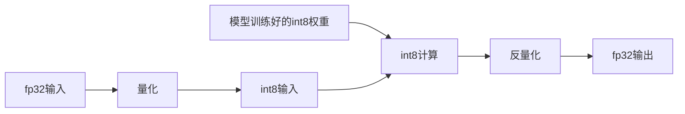
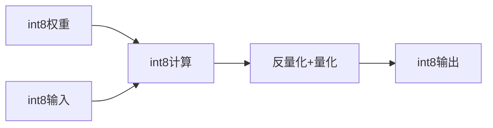
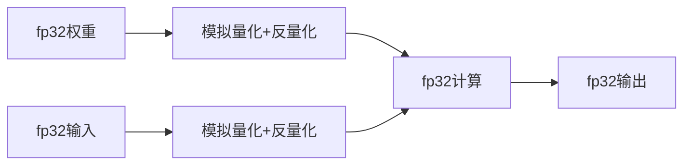
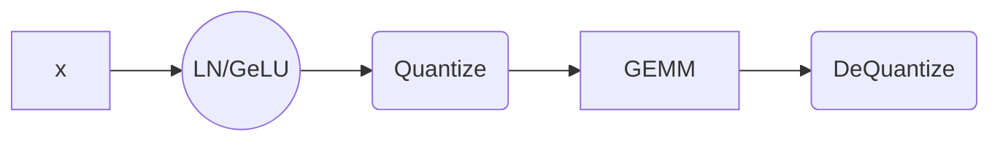
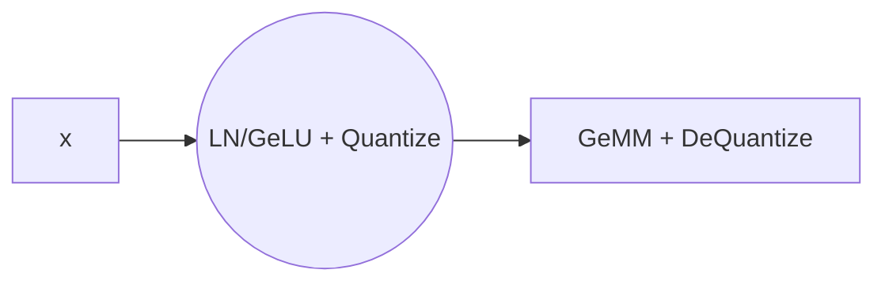
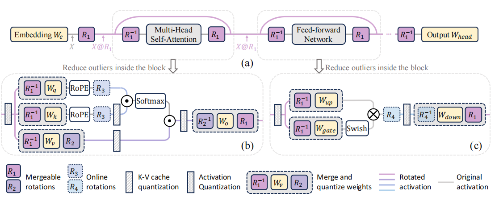

    <h1>阅读笔记</h1>

### 基础知识

#### 概念:

**量化**：把Float类型(FP32,FP16)的模型参数和激活值，用整数(Int8,Int4)来代替，同时尽可能减少量化后模型推理的误差
$$
x1_f \to quant \to x1_q
$$

**反量化**:把量化后的结果转化为浮点结果
$$
x1_q\to dequant \to x2_f
$$

**量化映射**:通用公式为:$r = S(q-Z)$,其中r表示量化前数据的真实值，q表示量化后的数值，Z表示零点

**对称量化**:

在量化前后保持零点一致:
$$
S = \frac{|r_{max}|}{|q_{max}|}\\
q = Round(\frac{r}{S})
$$
其中，Round表示取整。

对称量化是非饱和量化，即量化后的数据是非饱和的，有一部分区域不存在量化的数据，但是计算量小

**非对称量化**：

非对称量化需要一个偏移量Z来完成零点的映射，即量化前后零点不一致。
$$
S = \frac{r_{max} - r_{min}}{q_{max} - q_{min}}\\
Z = q_{max} - Round(\frac{r_{max}}{S})\\
q = Round(\frac{r}{S}+Z)
$$
非对称量化引入了偏移量，增大了计算，但是量化后的数据饱和，量化前的最小/大值对应量化后的最小/大值

**神经网络量化**：

首先解释一下为什么量化对神经网络精度影响不大：

1. 权重以及输入都会经过Normalization，基本数值范围都不大
2. 激活函数，数值影响会被平滑
3. 在大模型中，绝大多数的网络都是进行分类，最后都是概率值，只要最后某种类别的概率高于其他类别就可以，无需绝对数值

对于神经网路的量化，是针对每一层而言的，每一层进行量化计算，每一层输出时进行反量化

**训练后动态量化(PTQ)**：

其大致流程如下：

首先将训练好的模型权重量化为int8，并保存量化参数，然后在模型推理时，对每一层输入的fp32激活值，动态进行量化为int8；在每一层对量化后的int8权重和int8激活值进行计算。最后在输出时将结果反量化为fp32，将fp32的激活值传入到下一层。

```mermaid
flowchart LR
	A[模型训练好的int8权重] --> B[int8计算]
	C[fp32输入]--> D[量化]
	D --> E[int8输入]
	E --> B
	B --> F[反量化]
	F --> G[fp32输出]
```

训练后动态量化的问题:

1. 每一次推理每一层都要对输入统计量化参数，耗时
2. 每一层计算完都要转化为fp32,存入显存，占用显存带宽

**训练后静态量化(PTQ)**：

静态量化是动态量化的两个问题的优化。

<b>Q:</b> 每一次推理每一层都要对输入统计量化参数，耗时

对于这个问题可以采用有代表性的输入数据跑一遍整个网络，通过统计得到每层大概的量化参数

<b>Q:</b> 每一层计算完都转化为fp32，存入显存，占用显存带宽

对于这个问题，这一层的输出是下一层的输入，下一层还要量化，不如在这一层直接量化好再传给下一层

流程如下:

首先将训练好的模型权重量化为int8，并保存量化参数。接下来进行**校准**，用一些有代表性的数据进行模型推理，用这些数据在神经网络每一层产生的激活值估算出激活值的量化参数。这样就不用推理时每次根据实际激活值计算量化参数。在每一层对量化后的int8权重和int8激活值进行计算。**在每一层输出时将结果反量化为fp32，同时根据校准产生的激活值量化参数，把激活值量化为int8，把量化参数放入量化后的激活值中。**最后，将int8的激活值和它的量化参数传入到下一层

```mermaid
flowchart LR
A[int8权重] --> B[int8计算]
C[int8输入] --> B
B --> D[反量化+量化]
D --> E[int8输出]
```

**量化感知训练（QAT）**

<b>Q:</b> 精度损失问题是否可以通过神经网络来解决？

神经网络最擅长的便是减少误差，可以通过量化感知训练的方式在训练过程中就能调整参数，让它更适合量化，提高量化后模型的精度

量化感知训练的流程如下：

首先加载fp32的模型参数，输入fp32的激活值。通过**在网络里插入模拟量化节点(fake\_quantization)来分别对模型参数和激活值进行量化和反量化**。从而引入量化误差。模型在fp32精度下进行计算，计算后的激活值传入下一层

```mermaid
flowchart LR
A[fp32权重]-->B[模拟量化+反量化]
B-->C[fp32计算]
C-->D[fp32输出]
E[模拟量化+反量化]-->C
F[fp32输入]-->E
```

**量化的粒度**

我们通过模型量化的粒度来描述模型**每层**量化参数(缩放因子s和zero-point)被共享的范围。

- Per-Tensor 量化

  整个张量共用一组量化参数。这种方式计算简单，存储开销小，硬件适配性高。但是对精度的损失较大，特别是不同通道的动态范围差异较大的时候

- Per-channel量化

​	每个通道拥有独立的量化参数。这种方式精度更高，能适应每个通道不同的统计分布。但是每层需要存储多个量化参数，计算较为复杂，硬件要求高

- Group 量化(由ZeroQuant提出)

​	将整个tensor中不同的通道进行分组，各组内采用同样的量化参数。

**Hessian矩阵(根据AdaRound论文补充)**

模型的量化前后精度损失在本质上是由于对模型权重$w_i$上加一个小的扰动$\Delta w_i$:
$$
\hat w_i = w_i + \Delta w_i
$$
而我们关心的是量化前后的损失变化，我们由泰勒展开有:
$$
L(w + \Delta w)\approx L(w) + \nabla L(w)^\top \Delta w + \frac{1}{2}\Delta w^{\top} H(w)\Delta w\\
\Delta L \approx \nabla L^{\top}\Delta w + \frac{1}{2}\Delta w^\top H\Delta w
$$
其中第一项为线性近似，由于在训练结束时梯度近似为0因此，影响不大，因此量化的损失的敏感性主要由Hessian项描述，其中H为Hessian矩阵。

下面对Hessian矩阵的一些性质以及计算做一些简单介绍

Hessian矩阵被定义为:
$$
H = [\frac{\partial^2 L}{\partial w_i\partial w_j}]_{i,j}
$$
由于对于连续二阶可微函数，满足混合偏导数相等，因此Hession矩阵是一个对称矩阵

想要计算Hessian矩阵是困难的，这是因为这是一个$O(W^2)$的过程，但是在模型参数数量一般是M级别的，因此在实际中，我们通常采用近似计算办法。

- 对角近似

  我们只保留Hessian矩阵的对角线元素$H_{i,i}$，把非对角线元素置为0.(这个方法在很大程度可以可以方便求逆)

  

  对于神经网络中的第j个神经元的输入$a_j$对应权重为$w_{ji}$:
  $$
  \frac{\partial^2 E_n}{\partial w_{ji}^2} = \frac{\partial^2 E_n}{\partial a_j^2}z_i^2
  $$
  其中$z_i$是上一层神经元的输出。

  而$\frac{\partial^2 E_n}{\partial a_j^2}$可以通过链式法则递归计算(类似于反向传播):
  $$
  \frac{\partial^2 E_n}{\partial a_j^2} = \underbrace{\frac{\partial}{\partial a_j}[h'(a_j)\sum_{k}w_{kj}\frac{\partial E_n}{\partial a_k}]}_{链式法则}=h'(a_j)^2 \sum_{k,k'}w_{kj}w_{k'j}\frac{\partial^2 E_n}{\partial w_k\partial w_{k'}} + h''(a_j)\sum_k w_{kj}\frac{\partial E_n}{\partial a_n}
  $$
  忽略二阶导中的非对角线项$k\neq k'$:
  $$
  \frac{\partial^2 E_n}{\partial a_j^2}\approx \underbrace{h'(a_j)^2\sum_k w_{kj}^2 \frac{\partial^2 E_n}{\partial a_k^2}}_{链式法则} + \underbrace{h''(a_j)\sum_{k}w_{kj}\frac{\partial E_n}{\partial a_k}}_{链式法则}
  $$
  从而一次反向传播便可以计算出来，时间复杂度为$O(W)$

- 外积近似

​	在神经网络应用于回归问题时，通常采用下面形式的平方和误差
$$
E = \frac{1}{2}\sum_{n=1}^N(y_n-t_n)^2
$$
​	那么Hessian矩阵可以写成如下形式:
$$
H = \nabla\nabla E = \nabla(\sum_{n=1}^N (y_n-t_n)\nabla y_n) = \sum_{n = 1}^N \nabla y_n(\nabla y_n)^\top + \sum_{n=1}^N(y_n-t)\nabla\nabla y_n
$$
​	在网络已经训练好的情况下，输出$y_n$与$t_n$接近，因此第二项可以忽略，由此我们得到了Hessian矩阵的外积近似
$$
H\approx \sum_{n=1}^N b_n b_n^\top
$$
​	其中，$b_n = \nabla y_n = \nabla a_n$(输出单元的激活函数就是恒等函数)。这种方法中的Hessian矩阵可以跟随反向传播算法在$O(W)$个步骤内高效地求出误差函数地一阶导数。再通过简单地乘法就可以在$O(W^2)$步骤内求出矩阵元素。

**硬件基础**

下图展示了在神经网络加速器中是如何计算矩阵-向量乘法$y = \mathbf{W}x+b$的。这是一切神经网路的基础。该NN加速器的两个基本组件是处理单元$C_{n,m}$和累加器$A_n$.

计算开始时，将累加器加载有偏差值$b_n$。然后我们将权重值$W_{n,m}$和输入值$x_m$加载到数组中，并在相应的处理器单元$C_{n,m} = w_{n,m}x_m$中计算他们的乘积，在单个周期内并行执行。然后他们的结果在累加器中相加。
$$
A_n = b_n + \sum_{m}C_{n,m}
$$
我们称这个操作为乘累加(MAC).对于较大的矩阵向量乘法，这个步骤会重复多次。当所有周期完成后，累加器中的值会被移回内存，用于下一层的网络输入。

由此可见，神经网络的计算开销主要是在MAC操作以及数据传输两部分。通过量化，数据由FP32转化为INT8等低比特的表达形式，不仅可以减少数据传输的开销，还可以减少MAC操作的大小和开销。（这是因为数字运算的成本通常随着所使用的位数线性扩展到二次方，并且因为定点加法比其浮 点数对应物更高效）

而当我们引入了量化以后，会加入权重值以及激活值的缩放因子$s_w,s_x$作为输入。我们可以写出此时乘累加的方程：
$$
\hat A_{n} = \hat b_{n} + \sum_{m}\hat {\mathbf{W}}_{n,m}\hat x_{m} = \hat b_n + \sum_{m}(s_w \mathbf{W}_{n,m}^{int})(s_x x_{m}^{int}) = \hat b_n + s_ws_x\sum_{m}\mathbf{W}_{n,m}^{int}x_m^{int}
$$
我们一般对bias进行更特别量化，因为它通常存储在更高的位宽中，量化因子往往取决于$s_{w},s_x$(可以见博客)。累加器我们采用高位宽(32位)，因为在计算过程中积累更多乘积时，有风险因为溢出而导致损失。

存储在累加器中的激活值需要在下一层使用之前写入内存。为了减少数据传输的开销，激活值往往会被量化位8bit,因此这里需要一个新的量化操作。

**Batch Normalization（BN）折叠**

我们可以通过这个式子来描述Batch Normalization(BN):
$$
\text{BatchNorm}(x) = \gamma(\frac{x - \mu}{\sqrt{\sigma^2 + \epsilon}}) + \beta
$$
其中$\mu,\sigma$是Batch数据的均值和方差。

如果在线性层中之后应用BN:$y_k = BN(\mathbf{W}_{k,:}x)$,$\mathbf{W}\in \mathbb{R}^{n\times m}$那么我们可以写作:
$$
y_k = BN(\mathbf{W}_{k,:}x) = \gamma_k(\frac{\mathbf{W}_{k,:}x-\mu_k}{\sqrt{\sigma^2+\epsilon}}) + \beta_k
$$
那么我们可以将其写作
$$
y_k = \frac{\gamma_kW_{k,:}}{\sqrt{\sigma^2 + \epsilon}}x + (\beta_k - \frac{\gamma_k \mu_k}{\sqrt{\sigma^2 + \epsilon}}) = \hat {\mathbf{W}}_{k,:}x + \hat b_k
$$
在AdaQuant中有提到量化对BN融合带来的统计量偏移问题，以及一个利用校准集实现的校准方案.

**激活函数融合**

激活值的重新量化通常发生在矩阵乘法或卷积输出值得计算之后。然而实际上，我们通常会在一个线性操作之后直接加上一个非线性操作。

但是把激活值先写入内存然后再重新加载回计算核心以应用非线性操作是非常浪费的。因此，很多硬件解决方案都带有在重新量化步骤之前应用非线性的硬件单元。如果是这种情况，我们只需要模拟非线性操作之后的重新量化。

举个例子：
例如$\text{Relu}(x)$,就是在正半轴不变，而负半轴截断为0，也就试clip到0，所以我们量化的时候把最小值设为0，最大值按照正常值计算得到。自然而然就模拟了ReLu这个非线性操作。

一些更加复杂的激活函数如sigmoid等则需要更多的专门的支持（一部分硬件对这类复杂的函数会采用泰勒展开，然后计算几次方内的结果，还有些就是直接查表实现）如果没有专门的支持那我们就需要在非线性操作之前和之后各自添加一个量化操作。这个操作可能会对模型的准确性产生比较大的影响，虽然像swish这类比较新颖的激活函数可能会提高一些浮点下的精度。但这部分提高可能会在量化后消失，或者是在定点硬件上部署时推理效率降低。

**其他层的量化**

Max-Pooling:不需要对激活值进行量化，因为输入和输出的范围一致

Avg-Pooling:整数的平均值不一定是整数，因此需要在平均之后增加一个量化步骤。但是我们对输入和输出采用同样的量化器，因为求平均不会显著改变量化后值得范围。

Element-wise 求和：在计算的时候两个向量的量化的范围必须完全匹配。要么在相加前增加一个反量化步骤，另外一种方案是绑定多个输入的量化器从而一致的输入，这样虽然可以省去反量化但是需要进行一定的fine-tuning

Concat：被连接的两个向量通常不共享量化参数，因此反量化是必要的。与Element-wise求和一样，可以对网络进行fine-tuning以使得多个连接分支可以共享量化参数

### 论文阅读

**AdaQuant：Accurate Post Training Quantization With Small Calibration Sets**

**总结**：本篇文章的主要贡献在于提出了一个基于小数据集（校验集）的训练后量化方法AdaQuant，AdaQuant通过提出一个block/layer-wise的损失函数，通过在校验集上的训练学习量化参数(重点包括了一个最优的权重扰动，类似于AdaRound来避免四舍五入的不足),实现了减少量化的精度损失；提出了基于PI(整数规划)的bit精度分配方案，但是并没有解释精确损失的累加合理性；提出量化对BN融合造成的统计量偏移问题，并提出了PN(Para-Normalization)来解决这个问题。并在Bert-base网络上实现了不到1%的损失(4-8bit)

<b>吐槽:</b> 这篇文章作者(符号和表达)有点混乱，得多读几遍才能理解作者想表达什么.中间bit分配假设成立存疑

在一般的Post-training 量化中，我们的优化目标可以用下式表示:
$$
\hat\Delta = \arg \min_{\Delta}||X - Q_{\Delta}(X)||^2\\
Q_{\Delta}(x) = \Delta[\frac{X}{\Delta}]
$$
其中，$Q(\cdot)$是量化方程。这种方法对所有的量化损失都是平等处罚的，但是事实上我们更应该对影响分类的量化损失进行更多的惩罚。量化感知训练可以缓解这个问题但是它存在计算开销大的问题。

基于此，作者提出了AdaQuant，其核心思想是采用一个block/layer-wise的优化误差函数:
$$
(\hat\Delta_{w}\hat\Delta_x,\hat V) = \arg\min_{\Delta_w,\Delta_x,V}||WX-Q_{\Delta_w}(W')Q_{\Delta_x}(X)||^2
$$
其中，$W' = W + V$,这里V是引入的一个连续的可学习的“补偿”张量。被量化的对象是进行补偿后的权重W':$W_q = Q_{\Delta_w}(W') = Q_{\hat\Delta_w}(W+V)$.

这里其实有点类似于AdaRound的思想了，因为AdaRound主张的是在量化时直接采用四舍五入是一个不明智地选择，因此这里采用一个补偿张量V来做这个选择

由于量化参数的得到依赖的是上一层全精度的激活值输出作为输入，因此各个网络之间互不干扰，所以可以并行处理。

但是在实际的推理过程中，网络的输入是上一层量化后的激活值（见训练后静态量化），因此，作者提出了串行版本的AdaQuant，此时它的优化误差函数为
$$
(\hat\Delta_{w_l},\hat\Delta_{x_l},\hat V_l) = \arg\min_{\Delta_{w_l},\Delta_{x_l},V_l}||W_lX_l - Q_{\Delta_{w_l}}(W_l')\cdot Q_{\Delta_{x_l}}(X_l^q)||^2\\
X^q_l = \sigma(Q_{\Delta_{w_{l-1}}}(W'_{l-1})\cdot Q_{\Delta_{x_l}}(X_{l-1}^q) )
$$
其中，$\sigma(\cdot)$是激活函数

需要注意的是，串行版本的AdaQuant得在比特分配之后进行，这是因为它的优化依赖于上一层的输入。

为了在性能和精度之间做权衡，在量化时我们往往会给不同层的网络分配不同的bit精度。AdaQuant在此思想上，提出了采用整数规划(PI)的方式。

作者将网路的bit分配描述为这样一个问题：

给定L层的神经网络。对于每一层l，我们都有需要与前一层$X_{l-1}$的激活值相乘的权重$W_l$。令$W_l^k$和$X_{l-1}^n$表示$W_l,X_{l-1}$精度为k和n位的量化版本。对于每一层i，低位宽乘法$W_l^k X_{l-1}^k$会带来$\Delta L_l^{k,n}$的准确损失和$\Delta P_{l}^{k,n}$的性能提升。

作者假设了准确损失以及性能提升是满足可加性的。

这里存疑，因为l-1层的准确损失势必会影响l层的准确损失，不能简单做加法来描述整个网络的准确性退化

那么问题可以描述为，在不超过总网络退化$\Delta L$的前提下，最大化总性能提升。我们设示性函数$I_l^{k,n}$来表示第l层是否采用k，n位量化版本（1表示使用）。问题可以被符号表示为:
$$
\max \sum_{l = 0}^{L-1}\Delta P_l\\
Subject\ to\ \sum_{l}\Delta L_{l}\leq \Delta L\\
\forall l\in \{1,\dots,L\}:\Delta P_l = \sum_{k,n}I_l^{k,n}\cdot \Delta P_{l}^{k,n},\Delta L_l = \sum_{k,n}I_{l}^{k,n}\cdot L_{l}^{k,n}\\
\forall l\in \{1,\dots,L\}:\sum_{k,n}I_l^{k,n}=1,I_l^{k,n}\in\{0,1\}
$$

BatchNormalization在部署时，通常会与前面的卷积/全连接层进行融合，这样可以减少推理时的计算量。(这是因为BN的线性变换乘$\gamma/\sqrt{\sigma^2+\epsilon}$，加$\beta-\gamma\mu/\sqrt{\sigma^2+\epsilon}$可以直接合并到权重和偏置中)

然而当网络量化后，会导致激活值的分布发生偏移，即统计量均值$\mu$和方差$\sigma^2$会偏离在全精度模型中应有的值。但是由于BN层已经被融合到了前面的层中，这个偏移无法被校准。基于此，作者采用了一个名为Para-Normalization(PN)的方法来更新BN的统计量，以补偿这种偏差。

具体而言，假设我们知道了原始的BN参数$\gamma_0,\beta_0$.然后我们初始化一个新的BN层，初始化$\mu,\sigma^2$以及BN参数$\gamma_r,\beta_r$以便重建BN，使其满足:
$$
BN_r(x) = \gamma_r \frac{x - \mu}{\sqrt{\sigma^2 + \epsilon}} + \beta_r \approx x\\
\mu = \beta_r = \beta_0;\sigma^2 = \gamma_0^2;\gamma_r = \sqrt{\gamma_0^2+\epsilon}
$$
然后在校准集上收集运行时均值和方差更新$\mu,\sigma^2$,需要注意的是$\beta_r,\gamma_r$是不变的，因为不进行反向传播。

收集到新的均值和方差后，我们重新将BN进行融合，收集到的统计数据可以按以下方式融合回当前的量化尺度：
$$
W_i' = W_i\frac{\gamma_r}{\sigma};b_i' = \frac{\gamma_r}{\sigma}(b_i - \mu) + \beta_r;\Delta_{w_i}' = \frac{\gamma_r}{\sigma}\Delta_{w_i}
$$
**AdaRound:**Up or Down? Adaptive Rounding for Post-Training Quantization

**总结**:本篇文章作者首先从数学角度证明了在模型量化过程中，直接将浮点数进行四舍五入round到最近定点数的方法并不是精度最优的。并且通过了一个简单的实验验证了猜想，随后基于此作者进行一系列的数学推导和数学近似推导除了最终的优化目标:最小化由于量化在预激活值中引入的均方误差，从而提出了自适应的Round方法:AdaRound.这种方法在进行量化时，自适应地决定将浮点值转到最近右定点还是左定点值。AdaRound可以在不需要QAT or finetune的情况下仅使用少量无标签的校准数据在精度上达到SOTA，甚至4bit量化也可以保留较好的精度。

    <b>个人评价</b>:这篇文章的行文流惯，公式推导顶级，从完全理论的方式推导出了大部分量化论文中量化目标函数。

首先作者将量化过程定义为了一个对预训练模型权重w的微小扰动$\Delta w$.我们的目标为最小化这个扰动对损失函数$L(w)$造成的影响，即最小化$E[L(w+\Delta w)-L(w)]$,为了近似这个损失，采用了二阶泰勒展开有:
$$
L(w + \Delta w)\approx L(w) + \nabla L(w)^\top \Delta w + \frac{1}{2}\Delta w^{\top} H(w)\Delta w\\
\Delta L \approx \nabla L^{\top}\Delta w + \frac{1}{2}\Delta w^\top H\Delta w
$$
由于模型经过预训练损失函数的梯度很小，可以忽略，而高阶项只要扰动$\Delta w$不是特别大，二阶近似往往就是准确的。对于4-bit或更高精度而言这个是成立的。

因此我们可以认为影响模型精度的主要是$\Delta w$以及损失函数的曲率$H(w)$相关。

令$\Delta w^\top = [\Delta w_1,\Delta w_2]$,$H^{(w)} = \begin{bmatrix}1 & 0.5\\0.5 &1\end{bmatrix} $,那么由此我们可以计算出，量化导致的损失为:
$$
\Delta w^\top H^{(w)}\Delta w = \Delta w_1^2 + \Delta w_2^2 + \Delta w_1\Delta w_2
$$
对于对角线项$\Delta w_1^2,\Delta w_2^2$而言四舍五入是最优的，最小化了误差，但是对于非对角线项$\Delta w_1\Delta w_2$采用四舍五入就不一定最优了。例如若二者符号取反乘积为负就可以抵消一部分损失的增量。

因此从理论上分析出了四舍五入方法的局限性。后续也从实验上进行了论证，作者采用四舍五入，全部向上，全部向下，随机舍入进行比较，发现在随机舍入中存在比四舍五入高出10%的取舍法，说明在取舍办法中，存在更优的方法。

这个取舍办法的选取可以通过如下问题描述。

假设每层权重量化，量化后的权重为$\hat w_i^{(l)}$
$$
\hat w_i^{(l)}\in \{w_i^{(l),floor},w_i^{(l),ceil}\}
$$
$\Delta w_i^{(l)} = w^{(l)} - \hat w_i^{(l)}$,由此，最优的舍入过程可以描述为以下二元优化问题:
$$
\arg \min_{\Delta w} \mathbb{E}[L(x,y,w+\Delta w) - L(x,y,w)]
$$
直接对这个式子进行优化并不现实，因为，每次调整$\Delta w$都需要进行一次前向传播，计算成本太高，我们采用前面理论分析时的泰勒展开近似。此外，忽略属于不同层之间权重的交互。优化目标近似为：
$$
\arg \min_{\Delta w^{(l)}} \mathbb{E}[\Delta w^{(l)}H^{(w^{(l)})}\Delta w^{(l)}] 
$$
但是这个优化过程受限于Hessian矩阵的计算困难以及问题本身是一个NP-Hard问题。因此无法将这个作为最终的优化目标。

我们从Hessian矩阵计算的复杂性来分析
$$
\frac{\partial^2 L}{\partial W^{(l)}_{i,j}\partial W^{(l)}_{m,o}} = \frac{\partial}{\partial W_{m,o}^{(l)}}[\frac{\partial L}{\partial z_i^{(l)}}\cdot x_j^{(l-1)}] = \frac{\partial^2 L}{\partial z^{(l)}_i\partial z_m^{(l)}}\cdot x_j^{(l-1)}x_i^{(l-1)}
$$
写作矩阵的形式
$$
H(w^{(l)}) = \mathbb{E}[x^{(l-1)} x^{(l-1)\top}⊗ \nabla^2_{z^{(l)}}L]
$$
其中⊗为Kronecker积。由此看出Hessian矩阵的复杂性主要来于二阶导的求取，它需要通过网路的后续层反向传播二阶导数(见对角近似)。

为了解决这个问题，我们采用Hessian矩阵的对角近似，即将其近似为对角矩阵，记作$diag(\Delta^2_{z^{(l)}}L)$。
$$
H(w^{(l)}) = \mathbb{E}[x^{(l-1)} x^{(l-1)\top}⊗ diag(\nabla^2_{z^{(l)}}L)]
$$
将这个近似带入优化方程中有：
$$
\arg \min_{\Delta W_{k,:}^{(l)}} \mathbb{E}[\nabla^2_{z^{(l)}}L_{k,k}\cdot \Delta W_{k,:}^{(l)}x^{(l-1)}x^{(l-1)\top}\Delta W_{k,:}^{(l)\top}]\\
=\arg\min_{\Delta W_{k,:}^{(l)}} \Delta W_{k,:}^{(l)}\mathbb{E}[x^{(l-1)}x^{(l-1)\top}]\Delta W_{k,:}^{(l)\top}\\
=\arg \min_{\Delta W_{k,:}^{(l)}} \mathbb{E}[(\Delta W_{k,:}^{(l)}x^{(l-1)})^2]
$$
这里是认为$\nabla^2_{z^{(l)}}L_{i,i}$是一个与输入样本数据无关的常量结果。

由此我们推导出，我们只要最小化由于量化而在激活函数$z^{(l)}$中引入的均方误差。这与大部分量化的论文中的结论一致（如AdaQuant）

想要通过直接求解上面的优化方程仍然是一件困难的事情，因为它是NP-Hard的，因此作者将优化目标放宽为如下形式
$$
\arg \min_{V}||Wx-\hat Wx||^2_{F}+\lambda f_{reg}(V)
$$
其中$||\cdot||^2_F$为F范数，$\hat W$为优化的软量化权重
$$
\hat W = s\cdot clip([\frac{W}{s}] + h(V),n,p)
$$
$h(V_{i,j})$可以是任何在0和1之间取值的可微函数，$f_{reg}(V)$是一个可微正则项，用于鼓励$h(V_{i,j})$收敛到0或1.

但是这个方法存在一个缺陷，无法避免量化误差的不断积累且没有考虑到激活函数，所以做了进一步优化
$$
\arg \min_{V}||f_a(Wx)-f_a(\hat W\hat x)||_F^2 + \lambda f_{reg}(V)
$$
其中$fa(\cdot)$为激活函数$\hat x$为当前层的反量化输入，x为当前层的浮点输入 

**ZeroQuant: Efficient and Affordable Post-Training Quantization for Large-Scale Transformers**

<b>评价:</b> 这篇文章比较Solid，考虑了硬件适配的问题，这是模型量化中一个老大难的问题尤其是混合精度。但是实验的模型都是参数规模较小的模型，在大模型上的效果有待考究。

**总结**：这篇文章指出，低比特量化在大型 Transformer 架构模型中精度受限的主要原因是激活值和权重矩阵的值分布方差较大。针对这一问题，提出了 ZeroQuant 方案。该方案主要包括：对权重采用 Group-wise 量化、对激活值采用 Token-wise 量化，这种方法既能适配硬件架构，又能保持较高的精度；同时，通过 Layer-wise 知识蒸馏方法来减少量化带来的精度损失。

文章指出，在大模型的量化中，采用PTQ会面临以下挑战。

- 激活分布动态性强

  论文通过展示每一层的激活值在不同Token语义下的分布，发现了其范围随输入token的语义上下文变化极大的特点。这一特点使得难以对所有的token使用固定的量化范围。

- 权重矩阵范围差异大

​	通过同样的方式，展示了不同层行权重的范围。同样可以看到权重矩阵的神经元范围差异较大。

这两个挑战使得Per-Tensor粒度的量化很难在大模型的量化中使用，而采用Per-channel粒度的量化会面临大的计算存储开销，且会导致在硬件级别的矩阵乘法优化难以执行。基于此作者提出采用Group-wise量化旨在对精度和实用性做出权衡。

对于权重矩阵而言，Group-wise量化就是将$W\in R^{n\times m}$划分为g个组，每个组单独量化。但是在最先提出这个量化方法的Q-BERT中仅将其用于QAT且没有考虑硬件效率约束，以及系统后端支持。基于此作者团队考虑了GPU的架构（Ampere架构）的硬件约束，特别是将Group-size与Tensor Core中的计算单元对齐。

具体而言，Tensor Core允许16\*16大小的矩阵块在一个warp中并行处理，从而加速矩阵乘法和其他张量操作。如果我们让Group-size为16或32这样与Tensor core中矩阵乘法相适配的大小，这样就能在降低延迟的同时保持模型精度。

**注**：这部分文章在附录D中有详细介绍，简单来说Group-wise的group size是通过CUTLASS库和Profiler工具，根据输入尺寸和硬件特性动态确定的，以优化Tensor Core的计算效率。

对于激活值而言，在挑战中我们已经阐明了在不同的Token上下文语义下，激活值的范围存在巨大方差，因此解决这个问题的一个自然而然的想法是采用Token-wise的量化策略。但是直接采用DL框架中的Token级量化会导致显著的量化和反量化成本，因为引入了额外的操作。基于此作者采用了算子融合的方法等一系列优化。

知识蒸馏是缓解模型压缩后精度下降的最强大的办法之一。因此，论文提出了一种逐层的知识蒸馏技术来避免低比特量化带来的精度损失。

具体而言，在传统的知识蒸馏中，教师模型和学生模型的输出通常是整个模型的输出，但在逐层知识蒸馏(LKD)中，蒸馏的学习目标是逐层的，即学生模型要学习教师模型每一层的中间激活值。

假设我们要量化的是$L_k$层，其量化版本为$\hat L_k$,然后我们使用$L_{k-1}$层的输出作为$L_k,\hat L_k$的输入，测量差异，并更新模型
$$
L_{LKD,k} = MSE(L_kL_{k-1}\dots L_1(X)-\hat L_k L_{k-1}\dots L_1(X))
$$
因为使用相同的前k-1层，所以无需单独保留一个单独的教师模型，因此额外的模型成本仅仅是$L_k$。而每次只对一层进行蒸馏，所以内存和计算开销非常小，并且无需原始训练数据。

在前面Token-wise的量化处我们提到，作者对Kernel做了对应的优化，下面我们详细展开。

首先是针对Token-wise 的激活值量化做了一系列的kernel融合。作者将激活值量化与其相关的逐元素和或基于reduction的操作（如bias，GELU,LayerNorm等）的kernel进行了融合。这样减少了数据转移的开销。而将反量化与矩阵乘法做了相应的融合。具体而言见下面的流程图

```mermaid
flowchart LR
x -->B((LN/GeLU))
B --> C(Quantize)
C --> D[GEMM]
D --> E(DeQuantize)
```

经优化后

```mermaid
flowchart LR
x --> A((LN/GeLU + Quantize))
A --> B[GeMM + DeQuantize]
```

**OWQ:Outlier-Aware Weight Quantization for Efficient Fine-Tuning and Inference of Large Language Models**

**总结**：本文提出了一个异常感知的权重量化方法OWQ，利用LLMs中的异常激活值挑选出Weak Column，对其采用全精度的方式在牺牲很小的性能的情况下提升了巨大的精度。此外为进一步提升其性能做了一定的硬件适配并提出了一个基于OWQ的WTC方案，简单来说就是在OWQ量化模型上微调只更新Weak Column的参数。

<b>评价:</b> 这篇文章思路很新颖，从大模型中间激活值的异常出发，结合Hessian矩阵分析，提出了一个简单但高校的方法，似乎可以进一步提升？

本文基于这样一个发现，LLMs在中间激活中表现出一些异常值，其值显著大于其他值，并且这些异常值集中在特定的特征维度上。保留这些异常值的值已知对于在激活量化之后保持准确性至关重要。此外，作者团队还发现激活异常值仍然会影响权重量化的敏感性。基于此，作者提出了一种称为异常值感知权重量化的概念(OWQ).

我们知道逐层权重量化的过程，实际上进行如下优化过程:

给定输入特征$X\in R^{C_{i,n} \times N}$,其中$C_{i,n}$表示输入的通道数，N是输入的序列长度，用于$C_{out}$输出特征的完整精度权重矩阵$W \in R^{c_{out}\times C_{i,n}}$被映射到低精度。
$$
\arg \min_{W} E= \arg \min_{\hat W}||WX - \hat W\hat x||^2_2 
$$
在量化时我们从输入到输出逐层量化。此外大模型的量化中，Embedding层以及LM Head的权重通常不被量化，因为前者的权重量化误差会随着网络的传播不断放大，且Token向量较为稀疏而LM Head层直接决定logits，而Top-k词之间的分数差往往较小，低比特改写会对排序以及argmax产生显著影响。

接下来阐释权重敏感性和激活异常值之间的关系。

（这里与原论文中的证明方式不一致，原论文只考虑了对量化误差$$||WX - \hat W\hat X||$$的论证，这是单层量化误差，但是忽略了误差随着网络的放大的影响）

在AdaRound文章中有提到，对于权重的量化产生的误差我们有如下基于泰勒展开的近似:
$$
\mathbb{E}[L(x,y,w+\Delta w) - L(x,y,w)] =\Delta L \approx \nabla L^{\top}\Delta w + \frac{1}{2}\Delta w^\top H\Delta w \approx \Delta W^\top H\Delta W
$$
由此我们知道，输出误差可以直接与海森矩阵和权重扰动的幅度相关。

将Hessian矩阵写作Kronecker积的矩阵形式，我们得到
$$
H(w^{(l)}) = \mathbb{E}[x^{(l-1)} x^{(l-1)\top}⊗ \nabla^2_{z^{(l)}}L]
$$
由此我们可以从全局的视角看到，异常激活值(激活值的激增)使Hessian矩阵H的某些元素具有异常大的值。Hessian矩阵的这种异常激增增加了相应权重通道对量化的敏感性。具体来说，即使在相同的权重扰动下，由于一些H的一些大元素，输出的变化也会相当大。我们可以将这些易受量化影响的权重称为Weak Column，特别是那些与特定输入通道中的激活值异常值相关联的权重。

OWQ为了解决这个问题，实现了如下技术：首先，识别Weak Column并将他们从量化中排除。随后使用精心调整的量化参数将剩余的权重量化为极低的bit。

对于Weak Column的检索，OWQ遵循如下方法:

我们定义j-th权重列的敏感性为:
$$
sensitivity_j = \lambda_j||\Delta W_{:,j}||_2^2
$$
其中$\lambda_j$是Hessian矩阵的第j个对角元素。

(若考虑的Hessian矩阵是层内重构误差的，那么这里$\lambda_j = (X^\top X)_{j,j} = 2\sum_{n}x_{j,n}^2$)

可以注意到在我们写的Hessian矩阵是针对全局损失而言的，那么这个场景下的$\lambda_j$就有所改变。虽然在这个场景下我们无法像论文里一样因为layer-wise量化误差输出通道之间没有Hessian交互，从而Hessian是对角矩阵。

但是将其作对角近似是合理的。因为在这样一个大的模型下，进行Hessian矩阵的精确计算是不可行的。

在此场景下我们有:

对于神经网络中的第j个神经元的输入$a_j$对应权重为$w_{ji}$:
$$
\frac{\partial^2 E_n}{\partial w_{ji}^2} = \frac{\partial^2 E_n}{\partial a_j^2}z_i^2
$$
其中$z_i$是上一层神经元的输出。

而$\frac{\partial^2 E_n}{\partial a_j^2}$可以通过链式法则递归计算(类似于反向传播):
$$
\frac{\partial^2 E_n}{\partial a_j^2} = \underbrace{\frac{\partial}{\partial a_j}[h'(a_j)\sum_{k}w_{kj}\frac{\partial E_n}{\partial a_k}]}_{链式法则}=h'(a_j)^2 \sum_{k,k'}w_{kj}w_{k'j}\frac{\partial^2 E_n}{\partial w_k\partial w_{k'}} + h''(a_j)\sum_k w_{kj}\frac{\partial E_n}{\partial a_n}
$$

忽略二阶导中的非对角线项$k\neq k'$:
$$
\frac{\partial^2 E_n}{\partial a_j^2}\approx \underbrace{h'(a_j)^2\sum_k w_{kj}^2 \frac{\partial^2 E_n}{\partial a_k^2}}_{链式法则} + \underbrace{h''(a_j)\sum_{k}w_{kj}\frac{\partial E_n}{\partial a_k}}_{链式法则}
$$
从而一次反向传播便可以计算出来，时间复杂度为$O(W)$

由此我们可以计算出在全局损失下的$\lambda_j$

在实际的计算中，同样也是只需要一个小批量的校验集，但是坏处是要多进行一次反向传播得到曲率。这样的Trade off得到的性能提升应该不小，因为它会真正识别出在全局下的 Real Weak Column

我们根据权重列的敏感性挑选出top-k个作为weak column。然后其余权重被量化为低精度。（这里可以采用任何的量化方法）论文中采用了OPTQ的方法。

作者团队对OPTQ进行了重要修改，使用二维网格搜索来搜索量化配置，包括步长以及零点。通过四舍五入到最接近的截断来搜索使量化前后差异最小的参数的最优值。

文章指出了一个利用Weak Column进一步减轻误差的方法:将高精度的Weak Column重新排列到权重的末尾，OPTQ过程中其他列的量化误差可以主要由Weak Column得到补偿

在此之后，我们将Weak Column存储为fp16，并为每一列使用一个额外的整数，该整数用于索引Weak Column。此外存储一个低精度矩阵，其中Weak Column的位置采用0填充。

此外，作者还对OWQ格式在真实GPU上提供了专门的加速以及WTC微调方案。

具体而言，这个微调方案会将OWQ的量化模型进行微调但只对Weak Column进行参数更新。因为weak column的数量很少，所以总体微调参数量很少，同时又因为weak column的权重使用fp16进行存储，因此微调空间较大，能够实现较好的微调效果。

**GPTQ: accurate post-trainning quantization for generative pre-trained transformers**

这个文章是OWQ的前身，借着对这篇文章的分析，我们梳理一下这一系列的文章的intuition。
大概的分析顺序为:
$$
\text{OBD} \to \text{OBS} \to \text{OBC} \to \text{GPTQ}
$$

首先是OBD，这是由Yann LeCun在1990年提出的神经网络剪枝算法。该算法基于二阶导数信息，旨在通过去除目标函数影响较小的参数来降低模型复杂度，提高泛化能力。

具体而言，就是希望去除目标函数对目标函数E(即Loss)影响小的参数，我们记去除了若干参数的模型的参数为$\hat W = W + \Delta w$,有:
$$
\Delta E = L(x,y,W) - L(x,y,W + \Delta w) = 
\sum_{i}g_i \Delta w_i + \frac{1}{2}\sum_{i}h_{i,i}\Delta w_{i}^2 + \frac{1}{2}\sum_{i\neq j}h_{i,j}\Delta w_i\Delta w_j + O(\Delta w^3)
$$
其中$g_i = \nabla L$,$h_{i,j}$为Hessian矩阵$H_{L}$的一个元素

其中由于剪枝发生在对于已经训练好的神经网络，因此一阶导项可以忽略不计，而高阶项由于模型会进行归一化，因此$\Delta w$较小，可以忽略不计。

此外，OBD做了一个有争议的假设，即删除任意一个参数后，其他参数对目标函数的影响不变，也就是说每个参数对目标函数的影响是独立的，因此可以忽略交叉项:

那么我们可以得到简化后的公式:
$$
\Delta E = \frac{1}{2}\sum_{i}h_{i,i}\Delta w_i^2
$$
因此，对神经网络进行剪枝，删除参数时，参数对目标函数的影响可以通过海森矩阵的对角项进行衡量。我们只需要在剪枝时求出海森矩阵，按对角项从小到大排序，即可确定参数剪枝的次序。

可以注意到，OBD的这个认为参数对目标函数的影响是独立的假设是很强的。OBS认为参数之间的独立性不成立，如果考虑交叉项，可以写作矩阵形式
$$
\Delta E = \frac{1}{2}\Delta w^\top H\Delta w
$$
OBS希望在W每次迭代找到一个位置q(即准备剪枝的位置，后续会将该位置的$w_q = 0$),以及在获得位置q的同时，计算处一个与之相关的$\Delta w$对w进行补偿，使得$L(w+\Delta w)-L(w)$尽量小。

那么这个流程可以描述为一个带约束的凸优化问题:
$$
\arg \min_q \frac{1}{2}\Delta w^\top H \Delta w\\
s.t.\ e_q^\top\Delta w + w_q = 0
$$
这里$e^\top_q$是第q个值为1的列向量。

采用Lagrange乘子法进行求解:
$$
\mathcal{L} = \frac{1}{2}\Delta w^\top H \Delta w + \lambda(e^\top_q \Delta w + w_q)
$$
对$\lambda$并置为0得到:
$$
e_q^\top \Delta w + w_q = 0\\
\Delta w^\top e_q + w_q = 0
$$
对$\Delta w$求导并置为0有:
$$
\Delta w^\top H + \lambda e^\top_q = 0\\
\Delta w^\top H H^{-1} + \lambda e_q^\top H^{-1}=0\\
\Delta w^\top + \lambda e^\top_q H^{-1} = 0
$$
有
$$
w_q = \lambda e_q^\top H^{-1} e_q\\
\lambda = \frac{w_q}{[H^{-1}]_{qq}}
$$
其中用到了等式$e_q^\top H^{-1}e_q = [H^{-1}]_{qq}$

将$\lambda = \frac{w_q}{[H^{-1}]_{qq}}$带入等式$\Delta w^\top H + \lambda e_q^\top = 0$,得到
$$
\Delta w^{\top} = -\frac{w_q}{[H^{-1}]_{qq}}e_{q}^\top H^{-1}\\
\Delta w = -\frac{w_q}{[H^{-1}]_{qq}}(H^{-1})^\top e_q \\
\Delta w = -\frac{w_q}{[H^{-1}]_{qq}}H_{:,q}^{-1}
$$
其中$H_{:,q}^{-1}$表示$H^{-1}$的第q列,且Hessian矩阵是一个对称矩阵.

将$\Delta w$带入$\Delta \mathcal{L}$我们有:
$$
\Delta\mathcal{L} = \frac{1}{2}\Delta w^\top H \Delta w = \frac{1}{2}(-\frac{w_q}{[H^{-1}]_{qq}}e_q^\top H^{-1})H(-\frac{w_q}{[H^{-1}]_{qq}}H^{-1}e_q)\\
=\frac{1}{2}(\frac{w_q}{[H^{-1}]_{qq}})^2e_q^\top H^{-1}e_q\\
=\frac{1}{2}(\frac{w_q}{[H^{-1}]_{qq}})^2[H^{-1}]_{qq}\\
=\frac{1}{2}\frac{w_q^2}{[H^{-1}]_{qq}}
$$
由此我们得到:
$$
q = \arg \min_q \frac{w_q^2}{[H^{-1}]_{qq}}
$$

我们不难发现，要进行k次剪枝，每一次剪枝都要求一次Hessian矩阵的逆(时间复杂度为$O(d^3)$),这样的时间复杂度明显是不能实际应用的，因此OBC对其进行了进一步的优化。

OBC主要做了两点优化，一个是对原始问题进行了拆分，另一个是对Hessian矩阵的计算进行了简化。

首先是对原始问题的拆分，对于Layer-wise的量化/剪枝而言，通常将对整个网络进行的量化/剪枝拆分为每一层独立的子问题。在先前对AdaQuant的分析中我们有提到，这种Layer-wise的拆分是高度可并行的。

在Layer-wise的量化/剪枝下，参数变化带来的损失可以描述为以下形式:
$$
\Delta \mathcal{L} = ||W_lX_l - \hat W_l X_l||_2^2
$$
其中$\hat W$表示经过量化/剪枝后的参数。

OBC将这个损失函数进行了按行拆分，即认为删掉某个权重$w_{ij}$只影响该行的输出，行与行之间的Hessian矩阵元素是没有耦合的。(这两个都是对按行拆分合理性的解释，前者是直观解释，后者是数学解释)

对于第一点，我们知道，改变某个权重$w_{ij}$它只会对输出的某一行的结果产生影响，即$Y_{i,:} = W_{i,:}X$,那么既然只对某一行的输出产生影响,那么对于整体误差而言,也只对这一行的误差产生影响,而误差是可以按行拆分的:
$$
\Delta \mathcal{L} = ||WX - \hat W X||_2^2 = \sum_{i=1}^{d_{row}}||W_{i,:}X-\hat W_{i,:}X||_2^2
$$
因此剪枝/量化是可以按行拆分并行处理的。

由于是Layer-wise的量化/剪枝，我们在这个尺度下的进行单行损失函数(二阶范数)的Hessian矩阵的计算从而对第二点进行证明，我们有:
$$
H_{pq} = \frac{\partial^2\Delta \mathcal{L}_l}{\partial w_{lp}\partial{w_{lq}}} = \frac{\partial}{\partial w_{lp}}\sum_{k=1}^N 2(\sum_{j=1}^{d_{col}}(w_{lj}-\hat w_{lj})x_{jk})\frac{\partial}{\partial w_{lq}} \sum_{j = 1}^{d_{col}}(w_{lj}-\hat{w_{lj}})x_{jk}\\
=\frac{\partial}{\partial w_{lp}}\sum_{k=1}^N2(\sum_{j=1}^{d_{col}}(w_{lj}-\hat w_{lj})x_{jk})x_{qk}\\
=2\sum_{k=1}^N x_{pk}x_{qk}
$$
写成矩阵的形式就是
$$
H = 2XX^\top
$$
发现每一行的损失的Hessian矩阵只跟输入数据X有关且相等，而与模型权重无关，因此我们认为行与行之间的Hessian矩阵元素是没有耦合的。

而我们知道通过泰勒展开可以得到参数变化对损失函数的影响的近似表示$\Delta w^\top H \Delta w$,那么结合上式我们可以知道行与行之间的损失是相互独立的(对于行而言$\Delta w$,行与行之间互相独立,对于Hessian矩阵而言，行与行之间相等且互不影响),由此可以从数学上说明按行拆分进行单独处理的方式是合理的。

有了这个证明，我们可以对每行进行单独处理进行量化剪枝。这种方式为我们提供了一个更加简单的Hessian矩阵形式$2X^\top X$但是每次更新参数仍然需要对其求逆，因此OBC提供了一个高效的求逆方法:

  给定一个可逆矩阵H以及其逆矩阵$H^{-1}$,我们希望高效地计算删除H第q行第q列(删除权重$w_q$)后的逆矩阵$H^{-1}_{-q}$:
$$
  H_{-q}^{-1} = (H^{-1} - \frac{1}{[H^{-1}]_{qq}}H^{-1}_{:,q}H^{-1}_{q,:})_{-q}
$$
  这个定理证明较为复杂，将在博客上更新详细证明与intuition。

  接下来我们来描述OBC剪枝的完整流程:

  给定一个神经网络层的权重行向量$w \in \mathbb{R}^d$,以及其对应的Hessian矩阵的逆$H^{-1}\in \mathbb{R}^{d\times d}$,要求切除其中k个权重，同时最小化输出误差。

   - 初始化
      $M \leftarrow \{0,1,2,\dots,d-1\}$,为尚未被剪枝的权重索引集合。
   - 重复执行k次:

    首先选择当前最优的剪枝目标q:$q \leftarrow \arg\min_{q\in M}\frac{w_q^2}{[H^{-1}]_{qq}}$,接着弥补剪掉$w_p$带来的误差$\Delta w \leftarrow \Delta w - \frac{w_q}{[H^{-1}]_{qq}}(H^{-1}_{:,q})^\top$,然后更新$H^{-1}\leftarrow H^{-1}_{-q}$,从候选集中移除该索引$M\leftarrow M - \{q\}$

  而对于量化而言(OBQ)，相对剪枝我们需要做一些调整。首先是之前的最优化问题的限制条件需要改为:
$$
  \Delta w \cdot e_q + w_q - \text{quant}(w_q) = 0
$$
  同样使用Lanrange乘子法进行求解:
$$
  \mathcal{L} = \frac{1}{2}\Delta w^\top H \Delta w + \lambda(\Delta w \cdot e_q + w_q - \text{quant}(w_q))
$$
  对$\Delta w$求导并置为0可以得到:
$$
  \Delta w^\top H + \lambda e_q = 0\\
  \Delta w^\top = -\lambda e_q H^{-1}\\
  \Delta w = -\lambda H^{-1}e_{q}^\top
$$
  对$\lambda$求导并置为0可以得到:
$$
  \Delta w\cdot e_q + w_q - \text{quant}(w_q) = 0\\
  w_q - \text{quant}(w_q) = \lambda H^{-1}e_q^\top e_q\\
  \lambda = \frac{w_q - \text{quant}(w_q)}{[H^{-1}]_{qq}}
$$
  得到:
$$
  \Delta w = -\frac{w_q - \text{quant}(w_q)}{[H^{-1}]_{qq}}(H^{-1}_{:,q})^\top\\
  q = \arg \min_{q} \frac{(w_q-\text{quant}(w_q))^2}{[H^{-1}]_{qq}}
$$
  用上式替换OBC剪枝的流程，便可以得到量化流程。

  GPTQ则是对OBQ进行了改进，GPTQ发现，在对权重的每一行量化时，按照贪心策略选择量化的q和按照任意固定顺序来量化每一行的权重最终的误差是相差不大的，那么可以直接让所有行都按照列序(0 $\rightarrow$ col),这样可以提高计算效率与存储效率。

  这样做的另一个好处在于：每行的顺序一样，那么每一行对应的Hessian矩阵都是相同的，每次Hessian矩阵的逆只需要计算一次！

  在固定量化顺序的前提下，我们不再需要求解$q = \arg\min_q$只需要关心$\Delta w$,此时$\Delta w$的更新公式为:
$$
  \Delta w = -\frac{w_q - \text{quant}(w_q)}{[H_{q:,q:}]^{-1}_{0,0}}([H_{q:,q:}]^{-1}_{:,0})^\top
$$
  这个式子我们对比在贪心策略下的式子便不难发现，这个式子就是贪心策略式子在每次删除当前候选集里的第一个q时的式子的等价形式，同样地我们也能给出Hessian矩阵的逆的更新形式:
$$
  [H_{q:,q:}]^{-1} = ([H_{q-1:,q-1:}]^{-1} - \frac{1}{[H_{q-1:,q-1:}^{-1}]_{0,0}}[H^{-1}_{q-1:,q-1:}]_{:,0}[H_{q-1:,q-1:}^{-1}]_{0,:})_{1:,1:}
$$
  从矩阵的角度来看我们在做的是这样一个变换:
$$
  (H^{-1})^{(k)} = 
  \left[
    \begin{matrix}
    I_{k-1} & 0 & 0^\top\\
    0 & a_{k,k} & b_{k}^\top\\
    0 & b_k & B'^{(k)}
    \end{matrix}
  \right]\to (H^{-1})^{(k+1)} = 
  \left[
\begin{matrix}
I_{k} & 0 & 0\\
0 & a_{k+1,k+1} & b_{k+1}^\top\\
0 & b_{k+1} & B''^{(k+1)} 
\end{matrix}
  \right]
$$

  若我们不断更新Hessian的逆总会产生非正定的Hessian逆矩阵,其原因可能是由于数值误差的累积。为了解决这个问题，作者注意到每次从$H^{(-1)}$中删除一行一列，本质上和对称正定矩阵的Cholesky分解的逐步过程类似，因此作者对初始的$H^{-1}$进行了Cholesky分解，得到了一个上三角矩阵$T$。

Cholesky分解:假设一个正定矩阵$A\in \mathbb{R}^{n\times n}$是正定对称矩阵，那么必然存在一个对角元素为正数的下三角矩阵$L\in \mathbb{R}^{n\times n}$满足$A = LL^\top$

我们尝试模拟一次这个分解过程:
$$
A = \left[
  \begin{matrix}
  a_{11} & A_{21}^\top\\
  A_{21} & A_{22}
  \end{matrix}
\right],L = \left[
\begin{matrix}
l_{11} & 0\\
L_{21} & L_{22}
\end{matrix}
\right],L^\top = \left[
  \begin{matrix}
  l_{11} & L_{21}^\top\\
  0 & L_{22}^\top
  \end{matrix}
\right]
$$
由于$A = LL^\top$,我们有:
$$
l_{11} = \sqrt{a_{11}},L_{21} = \frac{1}{l_{11}}A_{21},L_{22}L_{22}^\top = A_{22} - L_{21}L_{21}^\top
$$

于是我们可以惊奇地发现$L_{22}L_{22}^\top$就是我们想要的$H_{q:,q:}^{-1}$!因此我们可以认为删去$[H_{q:,q:}^{-1}]$的第一行和第一列的过程与对该矩阵进行一次Cholesky分解是等价的。因为我们进行Cholesky分解得到的$L_{22}$恰好是更新了之后的$H^{-1}$进行Cholesky分解得到的下三角矩阵。

进一步地，GPTQ对初始的Hessian矩阵的逆进行了Cholesky分解得到一个上三角矩阵$L^\top$,这个矩阵还有一个特点在于，它的每一行刚好就等于逆矩阵每次更新迭代后的第一行乘以一个常数:
$$
C_qL_{q,q:}^\top = [H_{q:,q:}]^{-1}_{0,:}
$$
这个我们可以通过Cholesky分解的式子知道，因为分解得到的$L$是一个下三角矩阵，那么它的第一行就只有一个常数，而这个常数乘以$L^\top$便可以得到A的第一行。

而恰好我们发现，$\Delta w$的更新公式只需要用到当前Hessian矩阵的逆的第一行，那么我们有:
$$
\Delta w = -\frac{w_{:,q}- \text{quant}(w_{:,q})}{C_q T_{qq}}C_qT_{q,q:}
$$
其中常数可以直接约掉:
$$
\Delta w = -\frac{w_{:,q} - \text{quant}(w_{:,q})}{T_{qq}}T_{q,q:}
$$
因此我们在进行量化时不用每次都更新Hessian矩阵的逆，而是直接对$H^{-1}$进行Cholesky分解，得到它的每一行便可以进行参数的量化。

此外，如果每行的量化并行计算，那么每次更新都要读写一次参数矩阵。若参数矩阵的维度为$d_{row}\times d_{col}$，那么量化这个参数矩阵就要读写$d_{col}$次参数，总共的读写量高达$d_{row}\times d_{col}^2$.(因为我们量化第i列的时候，后面的列相应地也要补偿更新)

那这样大量的IO开销将会成为瓶颈，因此GPTQ采用了Lazy Batch-Update技术。我们注意到对于列i，最终的量化决策并不会受到尚未更新的列的影响。这使得我们可以将后续列的更新推迟到后续步骤中，从而减少不必要的内存操作。

具体步骤如下:

- 每次处理B列的一个小块，限制该列更新的补偿更新只影响块内的列

- 当前块的权重会在量化过程中被更新，而其影响暂时不传播到矩阵的其他部分

- 对当前块中的每一列进行量化，同时计算误差并更新当前块剩余的列

- 这些更新仅在当前块内进行，而不会影响整个矩阵

- 当一个块内的所有列完成量化后，将该块的更新结果批量应用到矩阵的剩余部分

这部分通过语言可能难以描述清楚，可以见下图:

**SpinQuant**:LLM quantization with learned rotation

在OWQ中我们有提到在大语言模型中在中间激活中表现出一些异常值，其值显著大于其他值，并且这些异常值集中在特定的特征维度上。如果我们忽略这些异常值那么量化后的模型会出现巨大的量化误差，从而显著影响量化后的模型的性能，主要是因为会拉伸量化范围，使得大多数数值的有效位数减少。除了OWQ中通过Hessian-aware的方式，此外还可以通过随机旋转的方式解决。

简单介绍一下随机旋转矩阵的方式以及它为什么可以解决异常值对量化的影响：
具体而言，在进入量化之前，对输入向量(或矩阵)乘以一个正交矩阵R:
$$
x' = Rx
$$
量化后再乘回逆旋转($R^\top = R^{-1}$)
$$
\hat x = R^\top Q(Rx)
$$
其中Q为量化算子。由于正交变换保持内积与欧几里得范数不变(也就是不会改变向量的夹角和距离)，这对全精度网络的数学表达几乎等价。

而我们直到LLM激活中的异常值集中在少数特定方向。当我们对激活值进行旋转变换后，直观来说“随机旋转就像把尖锐的能量峰打散，使得每个通道承担一点异常值的能量。”

这在数学上等价于：对一个协方差矩阵 $Σ=\mathbb{E}[xx^\top]$，乘以 R 后协方差变为 $RΣR⊤$。如果$ \Sigma $是高度非对角的（少数特征值极大），随机旋转后对角分量的方差会更加均匀。

在之前的研究中，往往会采用随机旋转矩阵的方式，例如使用随机的正交矩阵或Hadamard矩阵。但是这种方法在量化下带来的误差的方差很大，不具有鲁棒性。基于这个现象，作者团队提出了SpinQuant，在该方法中使用的旋转矩阵为通过学习得到的最优旋转矩阵。

具体而言，作者将用到的旋转矩阵分为了四类，每个类型有其对应的处理方式

- R1:位于Residual Stream入口，每当输入X(Embedding层输出)后将其乘以旋转矩阵$R_1$得到旋转激活值，在进入下一层前再乘回$R_1^{-1}$,此外残差连接需要保证残差和主干在同一个坐标系中相加，从而保持模型输入不变。
- $R_2$:位于Attention计算中的Value投影计算处，并在最后进行投影前乘回其逆矩阵
- $R_3$:在线旋转矩阵，采用Hadamard随机矩阵，一般用于低比特的KV Cache
- $R_4$:位于FFN中，同样也是Hadamard随机矩阵

一般情况下只会采用$R_1+R_2$(可学习矩阵 no had)，在极端低比特量化场景下则会加入$R_3+R_4$(had)

这里我们提到$R_1,R_2$是可学习的矩阵，这个矩阵需要保证其正交性，但是一般的反向传播算法难以保证其正交性，因此作者采用Cayley变换保证学习到的矩阵始终是正交的。

我们从数学的角度来描述这个过程。

简单来说，我们的矩阵$R\in O(n) = \{R \in \mathbb{R}^{n\times n}|R^\top R = I\}$

想要更新后的矩阵仍在正交空间上，微小更新$\Delta R$就必须满足：
$$
(R + \epsilon \Delta R)^\top(R + \epsilon \Delta R) = I + O(\epsilon^2)
$$
忽略$\epsilon^2$项，展开得到:
$$
R^\top\Delta R + (\Delta R)^\top R = 0
$$
令$A = R^\top \Delta R$，那么有:
$$
A + A^\top = 0
$$
即$A = -A^\top$,也就是说，所有合法方向$\Delta R$必须可以写成:
$$
\Delta R = RA,A^\top = -A
$$
在SpinQuant中我们通过如下方式获得这个斜对称矩阵A:
$$
\hat G = GR^\top - \frac{1}{2}RR^\top GR^\top\\
A = \hat G - \hat G^\top
$$
其中$\hat G$是把G投影到R的坐标系中
