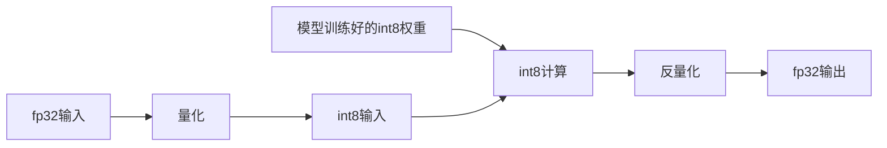
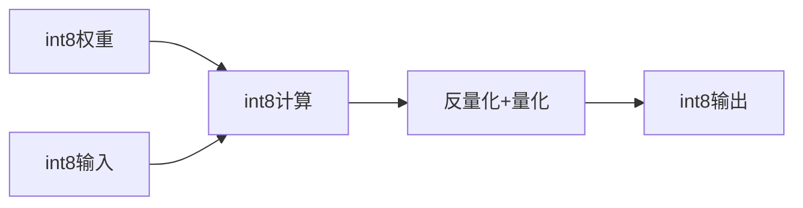
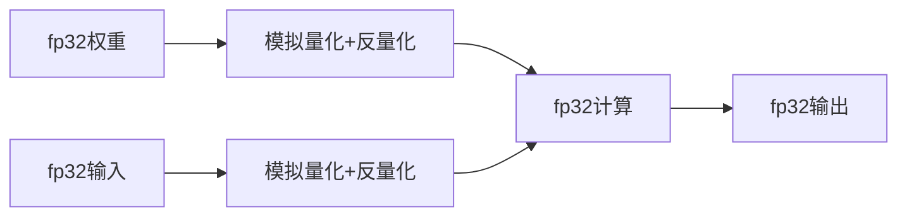

    <h1>阅读笔记</h1>

### 基础知识

#### 概念:

**量化**：把Float类型(FP32,FP16)的模型参数和激活值，用整数(Int8,Int4)来代替，同时尽可能减少量化后模型推理的误差
$$
x1_f \to quant \to x1_q
$$

**反量化**:把量化后的结果转化为浮点结果
$$
x1_q\to dequant \to x2_f
$$

**量化映射**:通用公式为:$r = S(q-Z)$,其中r表示量化前数据的真实值，q表示量化后的数值，Z表示零点

**对称量化**:

在量化前后保持零点一致:
$$
S = \frac{|r_{max}|}{|q_{max}|}\\
q = Round(\frac{r}{S})
$$
其中，Round表示取整。

对称量化是非饱和量化，即量化后的数据是非饱和的，有一部分区域不存在量化的数据，但是计算量小

**非对称量化**：

非对称量化需要一个偏移量Z来完成零点的映射，即量化前后零点不一致。
$$
S = \frac{r_{max} - r_{min}}{q_{max} - q_{min}}\\
Z = q_{max} - Round(\frac{r_{max}}{S})\\
q = Round(\frac{r}{S}+Z)
$$
非对称量化引入了偏移量，增大了计算，但是量化后的数据饱和，量化前的最小/大值对应量化后的最小/大值

**神经网络量化**：

首先解释一下为什么量化对神经网络精度影响不大：

1. 权重以及输入都会经过Normalization，基本数值范围都不大
2. 激活函数，数值影响会被平滑
3. 在大模型中，绝大多数的网络都是进行分类，最后都是概率值，只要最后某种类别的概率高于其他类别就可以，无需绝对数值

对于神经网路的量化，是针对每一层而言的，每一层进行量化计算，每一层输出时进行反量化

**训练后动态量化(PTQ)**：

其大致流程如下：

首先将训练好的模型权重量化为int8，并保存量化参数，然后在模型推理时，对每一层输入的fp32激活值，动态进行量化为int8；在每一层对量化后的int8权重和int8激活值进行计算。最后在输出时将结果反量化为fp32，将fp32的激活值传入到下一层。

```mermaid
flowchart LR
	A[模型训练好的int8权重] --> B[int8计算]
	C[fp32输入]--> D[量化]
	D --> E[int8输入]
	E --> B
	B --> F[反量化]
	F --> G[fp32输出]
```

训练后动态量化的问题:

1. 每一次推理每一层都要对输入统计量化参数，耗时
2. 每一层计算完都要转化为fp32,存入显存，占用显存带宽

**训练后静态量化(PTQ)**：

静态量化是动态量化的两个问题的优化。

<b>Q:</b> 每一次推理每一层都要对输入统计量化参数，耗时

对于这个问题可以采用有代表性的输入数据跑一遍整个网络，通过统计得到每层大概的量化参数

<b>Q:</b> 每一层计算完都转化为fp32，存入显存，占用显存带宽

对于这个问题，这一层的输出是下一层的输入，下一层还要量化，不如在这一层直接量化好再传给下一层

流程如下:

首先将训练好的模型权重量化为int8，并保存量化参数。接下来进行**校准**，用一些有代表性的数据进行模型推理，用这些数据在神经网络每一层产生的激活值估算出激活值的量化参数。这样就不用推理时每次根据实际激活值计算量化参数。在每一层对量化后的int8权重和int8激活值进行计算。**在每一层输出时将结果反量化为fp32，同时根据校准产生的激活值量化参数，把激活值量化为int8，把量化参数放入量化后的激活值中。**最后，将int8的激活值和它的量化参数传入到下一层

```mermaid
flowchart LR
A[int8权重] --> B[int8计算]
C[int8输入] --> B
B --> D[反量化+量化]
D --> E[int8输出]
```

**量化感知训练（QAT）**

<b>Q:</b> 精度损失问题是否可以通过神经网络来解决？

神经网络最擅长的便是减少误差，可以通过量化感知训练的方式在训练过程中就能调整参数，让它更适合量化，提高量化后模型的精度

量化感知训练的流程如下：

首先加载fp32的模型参数，输入fp32的激活值。通过**在网络里插入模拟量化节点(fake\_quantization)来分别对模型参数和激活值进行量化和反量化**。从而引入量化误差。模型在fp32精度下进行计算，计算后的激活值传入下一层

```mermaid
flowchart LR
A[fp32权重]-->B[模拟量化+反量化]
B-->C[fp32计算]
C-->D[fp32输出]
E[模拟量化+反量化]-->C
F[fp32输入]-->E
```

**Hessian矩阵(根据AdaRound论文补充)**

模型的量化前后精度损失在本质上是由于对模型权重$w_i$上加一个小的扰动$\Delta w_i$:
$$
\hat w_i = w_i + \Delta w_i
$$
而我们关心的是量化前后的损失变化，我们由泰勒展开有:
$$
L(w + \Delta w)\approx L(w) + \nabla L(w)^\top \Delta w + \frac{1}{2}\Delta w^{\top} H(w)\Delta w\\
\Delta L \approx \nabla L^{\top}\Delta w + \frac{1}{2}\Delta w^\top H\Delta w
$$
其中第一项为线性近似，由于在训练结束时梯度近似为0因此，影响不大，因此量化的损失的敏感性主要由Hessian项描述，其中H为Hessian矩阵。

下面对Hessian矩阵的一些性质以及计算做一些简单介绍

Hessian矩阵被定义为:
$$
H = [\frac{\part^2 L}{\part w_i\part w_j}]_{i,j}
$$
由于对于连续二阶可微函数，满足混合偏导数相等，因此Hession矩阵是一个对称矩阵

想要计算Hessian矩阵是困难的，这是因为这是一个$O(W^2)$的过程，但是在模型参数数量一般是M级别的，因此在实际中，我们通常采用近似计算办法。

- 对角近似

  我们只保留Hessian矩阵的对角线元素$H_{i,i}$，把非对角线元素置为0.(这个方法在很大程度可以可以方便求逆)

  

  对于神经网络中的第j个神经元的输入$a_j$对应权重为$w_{ji}$:
  $$
  \frac{\part^2 E_n}{\part w_{ji}^2} = \frac{\part^2 E_n}{\partial a_j^2}z_i^2
  $$
  其中$z_i$是上一层神经元的输出。

  而$\frac{\partial^2 E_n}{\part a_j^2}$可以通过链式法则递归计算(类似于反向传播):
  $$
  \frac{\part^2 E_n}{\part a_j^2} = \underbrace{\frac{\part}{\part a_j}[h'(a_j)\sum_{k}w_{kj}\frac{\part E_n}{\part a_k}]}_{链式法则}=h'(a_j)^2 \sum_{k,k'}w_{kj}w_{k'j}\frac{\part^2 E_n}{\part w_k\part w_{k'}} + h''(a_j)\sum_k w_{kj}\frac{\part E_n}{\part a_n}
  $$
  忽略二阶导中的非对角线项$k\neq k'$:
  $$
  \frac{\part^2 E_n}{\part a_j^2}\approx \underbrace{h'(a_j)^2\sum_k w_{kj}^2 \frac{\part^2 E_n}{\part a_k^2}}_{链式法则} + \underbrace{h''(a_j)\sum_{k}w_{kj}\frac{\part E_n}{\part a_k}}_{链式法则}
  $$
  从而一次反向传播便可以计算出来，时间复杂度为$O(W)$

- 外积近似

​	在神经网络应用于回归问题时，通常采用下面形式的平方和误差
$$
E = \frac{1}{2}\sum_{n=1}^N(y_n-t_n)^2
$$
​	那么Hessian矩阵可以写成如下形式:
$$
H = \nabla\nabla E = \nabla(\sum_{n=1}^N (y_n-t_n)\nabla y_n) = \sum_{n = 1}^N \nabla y_n(\nabla y_n)^\top + \sum_{n=1}^N(y_n-t)\nabla\nabla y_n
$$
​	在网络已经训练好的情况下，输出$y_n$与$t_n$接近，因此第二项可以忽略，由此我们得到了Hessian矩阵的外积近似
$$
H\approx \sum_{n=1}^N b_n b_n^\top
$$
​	其中，$b_n = \nabla y_n = \nabla a_n$(输出单元的激活函数就是恒等函数)。这种方法中的Hessian矩阵可以跟随反向传播算法在$O(W)$个步骤内高效地求出误差函数地一阶导数。再通过简单地乘法就可以在$O(W^2)$步骤内求出矩阵元素。

### 论文阅读

**AdaQuant：Accurate Post Training Quantization With Small Calibration Sets**

**总结**：本篇文章的主要贡献在于提出了一个基于小数据集（校验集）的训练后量化方法AdaQuant，AdaQuant通过提出一个block/layer-wise的损失函数，通过在校验集上的训练学习量化参数(重点包括了一个最优的权重扰动，类似于AdaRound来避免四舍五入的不足),实现了减少量化的精度损失；提出了基于PI(整数规划)的bit精度分配方案，但是并没有解释精确损失的累加合理性；提出量化对BN融合造成的统计量偏移问题，并提出了PN(Para-Normalization)来解决这个问题。并在Bert-base网络上实现了不到1%的损失(4-8bit)

<b>吐槽:</b> 这篇文章作者(符号和表达)有点混乱，得多读几遍才能理解作者想表达什么.中间bit分配假设成立存疑

在一般的Post-training 量化中，我们的优化目标可以用下式表示:
$$
\hat\Delta = \arg \min_{\Delta}||X - Q_{\Delta}(X)||^2\\
Q_{\Delta}(x) = \Delta[\frac{X}{\Delta}]
$$
其中，$Q(\cdot)$是量化方程。这种方法对所有的量化损失都是平等处罚的，但是事实上我们更应该对影响分类的量化损失进行更多的惩罚。量化感知训练可以缓解这个问题但是它存在计算开销大的问题。

基于此，作者提出了AdaQuant，其核心思想是采用一个block/layer-wise的优化误差函数:
$$
(\hat\Delta_{w}\hat\Delta_x,\hat V) = \arg\min_{\Delta_w,\Delta_x,V}||WX-Q_{\Delta_w}(W')Q_{\Delta_x}(X)||^2
$$
其中，$W' = W + V$,这里V是引入的一个连续的可学习的“补偿”张量。被量化的对象是进行补偿后的权重W':$W_q = Q_{\Delta_w}(W') = Q_{\hat\Delta_w}(W+V)$.

这里其实有点类似于AdaRound的思想了，因为AdaRound主张的是在量化时直接采用四舍五入是一个不明智地选择，因此这里采用一个补偿张量V来做这个选择

由于量化参数的得到依赖的是上一层全精度的激活值输出作为输入，因此各个网络之间互不干扰，所以可以并行处理。

但是在实际的推理过程中，网络的输入是上一层量化后的激活值（见训练后静态量化），因此，作者提出了串行版本的AdaQuant，此时它的优化误差函数为
$$
(\hat\Delta_{w_l},\hat\Delta_{x_l},\hat V_l) = \arg\min_{\Delta_{w_l},\Delta_{x_l},V_l}||W_lX_l - Q_{\Delta_{w_l}}(W_l')\cdot Q_{\Delta_{x_l}}(X_l^q)||^2\\
X^q_l = \sigma(Q_{\Delta_{w_{l-1}}}(W'_{l-1})\cdot Q_{\Delta_{x_l}}(X_{l-1}^q) )
$$
其中，$\sigma(\cdot)$是激活函数

需要注意的是，串行版本的AdaQuant得在比特分配之后进行，这是因为它的优化依赖于上一层的输入。

为了在性能和精度之间做权衡，在量化时我们往往会给不同层的网络分配不同的bit精度。AdaQuant在此思想上，提出了采用整数规划(PI)的方式。

作者将网路的bit分配描述为这样一个问题：

给定L层的神经网络。对于每一层l，我们都有需要与前一层$X_{l-1}$的激活值相乘的权重$W_l$。令$W_l^k$和$X_{l-1}^n$表示$W_l,X_{l-1}$精度为k和n位的量化版本。对于每一层i，低位宽乘法$W_l^k X_{l-1}^k$会带来$\Delta L_l^{k,n}$的准确损失和$\Delta P_{l}^{k,n}$的性能提升。

作者假设了准确损失以及性能提升是满足可加性的。

这里存疑，因为l-1层的准确损失势必会影响l层的准确损失，不能简单做加法来描述整个网络的准确性退化

那么问题可以描述为，在不超过总网络退化$\Delta L$的前提下，最大化总性能提升。我们设示性函数$I_l^{k,n}$来表示第l层是否采用k，n位量化版本（1表示使用）。问题可以被符号表示为:
$$
\max \sum_{l = 0}^{L-1}\Delta P_l\\
Subject\ to\ \sum_{l}\Delta L_{l}\leq \Delta L\\
\forall l\in \{1,\dots,L\}:\Delta P_l = \sum_{k,n}I_l^{k,n}\cdot \Delta P_{l}^{k,n},\Delta L_l = \sum_{k,n}I_{l}^{k,n}\cdot L_{l}^{k,n}\\
\forall l\in \{1,\dots,L\}:\sum_{k,n}I_l^{k,n}=1,I_l^{k,n}\in\{0,1\}
$$

BatchNormalization在部署时，通常会与前面的卷积/全连接层进行融合，这样可以减少推理时的计算量。(这是因为BN的线性变换乘$\gamma/\sqrt{\sigma^2+\epsilon}$，加$\beta-\gamma\mu/\sqrt{\sigma^2+\epsilon}$可以直接合并到权重和偏置中)

然而当网络量化后，会导致激活值的分布发生偏移，即统计量均值$\mu$和方差$\sigma^2$会偏离在全精度模型中应有的值。但是由于BN层已经被融合到了前面的层中，这个偏移无法被校准。基于此，作者采用了一个名为Para-Normalization(PN)的方法来更新BN的统计量，以补偿这种偏差。

具体而言，假设我们知道了原始的BN参数$\gamma_0,\beta_0$.然后我们初始化一个新的BN层，初始化$\mu,\sigma^2$以及BN参数$\gamma_r,\beta_r$以便重建BN，使其满足:
$$
BN_r(x) = \gamma_r \frac{x - \mu}{\sqrt{\sigma^2 + \epsilon}} + \beta_r \approx x\\
\mu = \beta_r = \beta_0;\sigma^2 = \gamma_0^2;\gamma_r = \sqrt{\gamma_0^2+\epsilon}
$$
然后在校准集上收集运行时均值和方差更新$\mu,\sigma^2$,需要注意的是$\beta_r,\gamma_r$是不变的，因为不进行反向传播。

收集到新的均值和方差后，我们重新将BN进行融合，收集到的统计数据可以按以下方式融合回当前的量化尺度：
$$
W_i' = W_i\frac{\gamma_r}{\sigma};b_i' = \frac{\gamma_r}{\sigma}(b_i - \mu) + \beta_r;\Delta_{w_i}' = \frac{\gamma_r}{\sigma}\Delta_{w_i}
$$
**AdaRound:**Up or Down? Adaptive Rounding for Post-Training Quantization

**总结**:本篇文章作者首先从数学角度证明了在模型量化过程中，直接将浮点数进行四舍五入round到最近定点数的方法并不是精度最优的。并且通过了一个简单的实验验证了猜想，随后基于此作者进行一系列的数学推导和数学近似推导除了最终的优化目标:最小化由于量化在预激活值中引入的均方误差，从而提出了自适应的Round方法:AdaRound.这种方法在进行量化时，自适应地决定将浮点值转到最近右定点还是左定点值。AdaRound可以在不需要QAT or finetune的情况下仅使用少量无标签的校准数据在精度上达到SOTA，甚至4bit量化也可以保留较好的精度。

    <b>个人评价</b>:这篇文章的行文流惯，公式推导顶级，从完全理论的方式推导出了大部分量化论文中量化目标函数。

首先作者将量化过程定义为了一个对预训练模型权重w的微小扰动$\Delta w$.我们的目标为最小化这个扰动对损失函数$L(w)$造成的影响，即最小化$E[L(w+\Delta w)-L(w)]$,为了近似这个损失，采用了二阶泰勒展开有:
$$
L(w + \Delta w)\approx L(w) + \nabla L(w)^\top \Delta w + \frac{1}{2}\Delta w^{\top} H(w)\Delta w\\
\Delta L \approx \nabla L^{\top}\Delta w + \frac{1}{2}\Delta w^\top H\Delta w
$$
由于模型经过预训练损失函数的梯度很小，可以忽略，而高阶项只要扰动$\Delta w$不是特别大，二阶近似往往就是准确的。对于4-bit或更高精度而言这个是成立的。

因此我们可以认为影响模型精度的主要是$\Delta w$以及损失函数的曲率$H(w)$相关。

令$\Delta w^\top = [\Delta w_1,\Delta w_2]$,$H^{(w)} = \begin{bmatrix}1 & 0.5\\0.5 &1\end{bmatrix} $,那么由此我们可以计算出，量化导致的损失为:
$$
\Delta w^\top H^{(w)}\Delta w = \Delta w_1^2 + \Delta w_2^2 + \Delta w_1\Delta w_2
$$
对于对角线项$\Delta w_1^2,\Delta w_2^2$而言四舍五入是最优的，最小化了误差，但是对于非对角线项$\Delta w_1\Delta w_2$采用四舍五入就不一定最优了。例如若二者符号取反乘积为负就可以抵消一部分损失的增量。

因此从理论上分析出了四舍五入方法的局限性。后续也从实验上进行了论证，作者采用四舍五入，全部向上，全部向下，随机舍入进行比较，发现在随机舍入中存在比四舍五入高出10%的取舍法，说明在取舍办法中，存在更优的方法。

这个取舍办法的选取可以通过如下问题描述。

假设每层权重量化，量化后的权重为$\hat w_i^{(l)}$
$$
\hat w_i^{(l)}\in \{w_i^{(l),floor},w_i^{(l),ceil}\}
$$
$\Delta w_i^{(l)} = w^{(l)} - \hat w_i^{(l)}$,由此，最优的舍入过程可以描述为以下二元优化问题:
$$
\arg \min_{\Delta w} \mathbb{E}[L(x,y,w+\Delta w) - L(x,y,w)]
$$
直接对这个式子进行优化并不现实，因为，每次调整$\Delta w$都需要进行一次前向传播，计算成本太高，我们采用前面理论分析时的泰勒展开近似。此外，忽略属于不同层之间权重的交互。优化目标近似为：
$$
\arg \min_{\Delta w^{(l)}} \mathbb{E}[\Delta w^{(l)}H^{(w^{(l)})}\Delta w^{(l)}] 
$$
但是这个优化过程受限于Hessian矩阵的计算困难以及问题本身是一个NP-Hard问题。因此无法将这个作为最终的优化目标。

我们从Hessian矩阵计算的复杂性来分析
$$
\frac{\part^2 L}{\part W^{(l)}_{i,j}\part W^{(l)}_{m,o}} = \frac{\part}{\part W_{m,o}^{(l)}}[\frac{\part L}{\part z_i^{(l)}}\cdot x_j^{(l-1)}] = \frac{\part^2 L}{\part z^{(l)}_i\part z_m^{(l)}}\cdot x_j^{(l-1)}x_i^{(l-1)}
$$
写作矩阵的形式
$$
H(w^{(l)}) = \mathbb{E}[x^{(l-1)} x^{(l-1)\top}⊗ \nabla^2_{z^{(l)}}L]
$$
其中⊗为Kronecker积。由此看出Hessian矩阵的复杂性主要来于二阶导的求取，它需要通过网路的后续层反向传播二阶导数(见对角近似)。

为了解决这个问题，我们采用Hessian矩阵的对角近似，即将其近似为对角矩阵，记作$diag(\Delta^2_{z^{(l)}}L)$。
$$
H(w^{(l)}) = \mathbb{E}[x^{(l-1)} x^{(l-1)\top}⊗ diag(\nabla^2_{z^{(l)}}L)]
$$
将这个近似带入优化方程中有：
$$
\arg \min_{\Delta W_{k,:}^{(l)}} \mathbb{E}[\nabla^2_{z^{(l)}}L_{k,k}\cdot \Delta W_{k,:}^{(l)}x^{(l-1)}x^{(l-1)\top}\Delta W_{k,:}^{(l)\top}]\\
=\arg\min_{\Delta W_{k,:}^{(l)}} \Delta W_{k,:}^{(l)}\mathbb{E}[x^{(l-1)}x^{(l-1)\top}]\Delta W_{k,:}^{(l)\top}\\
=\arg \min_{\Delta W_{k,:}^{(l)}} \mathbb{E}[(\Delta W_{k,:}^{(l)}x^{(l-1)})^2]
$$
这里是认为$\nabla^2_{z^{(l)}}L_{i,i}$是一个与输入样本数据无关的常量结果。

由此我们推导出，我们只要最小化由于量化而在激活函数$z^{(l)}$中引入的均方误差。这与大部分量化的论文中的结论一致（如AdaQuant）

想要通过直接求解上面的优化方程仍然是一件困难的事情，因为它是NP-Hard的，因此作者将优化目标放宽为如下形式
$$
\arg \min_{V}||Wx-\hat Wx||^2_{F}+\lambda f_{reg}(V)
$$
其中$||\cdot||^2_F$为F范数，$\hat W$为优化的软量化权重
$$
\hat W = s\cdot clip([\frac{W}{s}] + h(V),n,p)
$$
$h(V_{i,j})$可以是任何在0和1之间取值的可微函数，$f_{reg}(V)$是一个可微正则项，用于鼓励$h(V_{i,j})$收敛到0或1.

但是这个方法存在一个缺陷，无法避免量化误差的不断积累且没有考虑到激活函数，所以做了进一步优化
$$
\arg \min_{V}||f_a(Wx)-f_a(\hat W\hat x)||_F^2 + \lambda f_{reg}(V)
$$
其中$fa(\cdot)$为激活函数$\hat x$为当前层的反量化输入，x为当前层的浮点输入 
